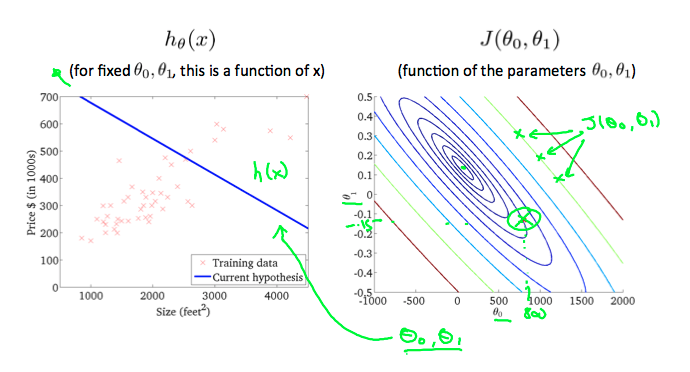
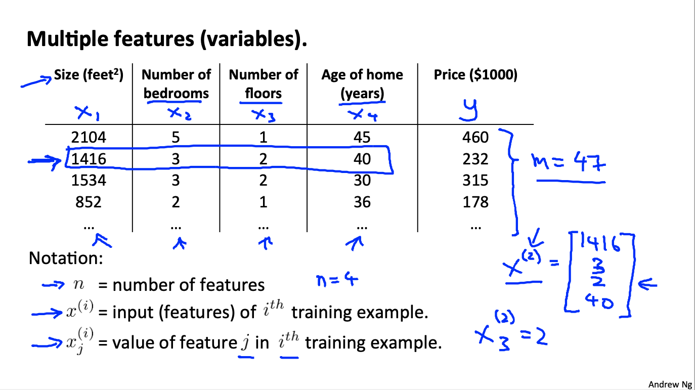
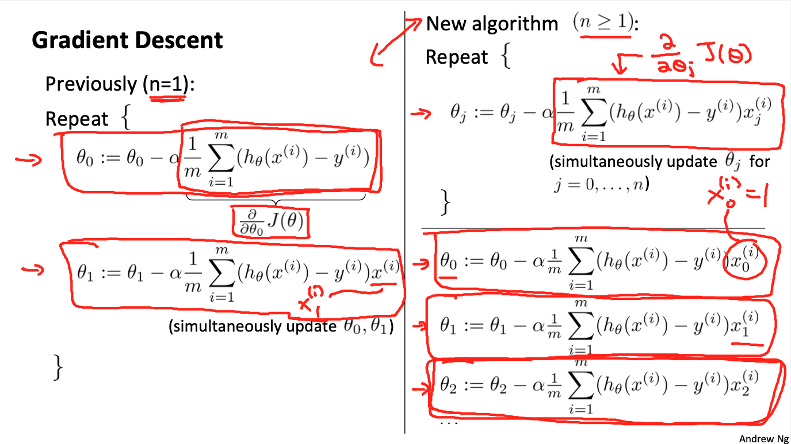

# Mechine Learning: Introduction and Linear Regression

These are my notes on the Coursera course by Andrew Ng ["Machine Learning"](https://www.coursera.org/learn/machine-learning).

For setup and general information, please look at `../README.md`.

This file my notes related to **linear regression**.

Overview of contents:

1. Introduction
   - What is Machine Learning?
   - Supervised Learning
   - Unsupervised Learning
2. Linear Regression with One Variable: Model ans Cost Function
   - Linear Regression Model
   - Cost Function
   - Contour Plots of the Cost Function
3. Linear Regression: Parameter Learning
    - Gradient Descent
    - Gradient Descent for Linear Regression
4. Linear Algebra Review
5. Linear Regression with Multiple Variables
   - Multivariate Linear Regression
     - Multiple Features
     - Gradient Descent for Multiple Features
     - Feature Scaling
     - Learning Rate: How to Choose it
     - Polynomial Regression
   - Computing Parameters Analytically
6. Octave/Matlab Tutorial

## 1. Introduction

Machine Learning is part Artificial Intelligence.
It is used in application where machines performed actions that were not specifically programmed; they can do that because they learn from past experiences or from the data they have available.

Some applications: Computer Vision, Natural Language Processing, Recommender Systems, Spam Detection, etc.

### 1.1 What is Machine Learning?

Two popular definitions:

- Arthur Samuel (1959): field of study that gives computers the ability to learn without being specifically programmed for that.
- Tom Mitchell (1998): a computer program is said to learn from experience E with respecto som task T and some performance measure P, it its performance P on T improves with experience E.

Types of Machine Learning:

- Supervised Learning: labelled data
- Unsupervised Learning: unlabelled data
- Other: Reinforcement Learning (action-reward), Recommender Systems

### 1.2 Supervised Learning

In supervised learning we have labelled data, i.e., there is a clear relationship between the input and the output data, or in other words, given an input sample we know its response, and we'd like to use that to build predictive models.

Two major supervised learning methods are used:

- Regression: we have continuous output; example: house price prediction based on flat area
- Classification: we have a discrete output, the probability of a class; example: classify if a tumor is benign according to multiple features

### 1.3 Unsupervised Learning

Unsupervised learning algorithms find structure in the data, which is usually unlabelled.

Some notable unsupervised learning methods:

- Clustering: group samples consisting of multiple features in clusters that share similar or related feature distributions. Examples:
  - Genomic groups based on gene expressions of individuals
  - Data center computer clusters
  - Market segmentation
- Dimensionality Reduction
- The Cocktail-party problem: two people speaking simultaneously, two microphones hear the speeches from different locations; the unsupervised learning algorithm is able to separate both speeches after finding structure (i.e., identifying individual voices).

## 2. Linear Regression with One Variable: Model and Cost Function

We start with the example of predicting house prices based on the square feet of each of them.
We have a dataset for training consisting of:
- `m` number of training samples
- `x`: an input variable with `n` features; e.g.: x = square feet
- `y`: output or target variable; e.g.: price in 1000's of USD

The `i`-th training sample is notes as $(x^{(i)},y^{(i)})$.

### 2.1 Linear Regression Model

We build our hypothesis model $h()$ which, taken a new sample $x$ predicts the target/outcome: $\hat{y} = h(x)$.

For **linear regression, the hypothesis model** is a linear function; for the univariate case, we have:

$\hat{y} = h_{\theta}(x) = \theta_0 + \theta_1 x$.

```
hat(y) = h(x) = t0 + t1*x
```

### 2.2 Cost Function

We would like to detect the value of those $\theta_j$.
For that we build a cost function parametrized in those $\theta_j$ **parameters** and minimize it.

The **Cost Function** is the total error between the predicted target and the actual target, for each sample $i$:

$J(\theta_0,\theta_1) = \frac{1}{2 m} \sum_{i=1}^{m}(h_{\theta}(x^{(i)}) - y^{(i)})^2$

```
J(t0,t1) = (1/2m) * sum((h(x[:,i])-y[i]))^2)
```

This cost function is the **mean squared error**; we find the $\theta$ parameters that minimize it:

$\theta_0, \theta_1 \leftarrow \min_{\theta_0,\theta_1} J(\theta_0,\theta_1)$

```
t0,t1 <- min(J(t0,t1))
```

One option for minimization is to compute the derivative and equal it to 0. Note that the factor $1/2$ is for convenience, since it is cancelled when the cost function (squared) is derived.

Important intuition note: Have all the time present that The cost function $J(\theta)$ is function of the parameters! We need to *image how $J$ varies when the $\theta$ parameters are modified*. In other words, $J(\theta)$ is defined in the parameter space ($\theta = (\theta_0,\theta_1)$); in contrast, our data is defined in feature space ($x$).

### 2.3 Contour Plots of the Cost Function

If we have linear regression model with one feature ($x$), it has a $J(\theta)$ cost function with two parameters $\theta = (\theta_0,\theta_1)$, which will be a 2D quadratic surface; if projected on the parameter plane, we have a contour plot:

- Each isoline with a given $J = const.$ value is a contour; note that different lines ($\theta$) in feature space ($x$) can have the same cost $J$: these are the contour points.
- As we move on the contour plot to the minimum, the line on the feature space fits our data better.



Our goal is to find an algorithm that is able to wander on the $J$ surface to approach it sminimum. That's **gradient descent**.

Of course, the $J$ function can be visualized in 1D or 2D only if the number of parameters are 1 or 2, respectively.

## 3. Linear Regression: Parameter Learning

### 3.1 Gradient Descent

Gradient descent can be used to minimize any function with many parameters, not only linear regression.

Given $J(\theta=(\theta_0,\theta_1,...,\theta_n))$,
we want $\theta$ which minimizes $J$:
$\min_{\theta} J(\theta)$.

Gradient descent does the following:
- Start with some $\theta=(\theta_0,\theta_1,...,\theta_n)$
- Move slowly in the direction of maximum decrease of $J$, which is the opposite direction of the gradient of $J$! That is called the steepest descent.

And that's implemented as follows:

$\theta_j \leftarrow \theta_j - \alpha*\frac{\partial}{\partial \theta_j} J(\theta_0,\theta_1)$ for $j=0,1$

```
tj <- tj - alpha*derivative(J(t0,t1),tj); j = 0,1
```

The **learning rate** $\alpha$ is a *small* coefficient which decreases our step size so that we don't land on undesired spots (overshooting); intuitively, large $\alpha$ values yield too large steps that might make us further away from the minimum.

All parameters $\theta_j$ need to be updated simultaneously:

```
temp0 = t0 - alpha*derivative(J,t0)
temp1 = t1 - alpha*derivative(J,t1)
t0 = temp0
t1 = temp1
```

Note that:
- If we are in a local minimum, the derivative is 0, thus, parameters remain unchanged, reached that point.
- Indeed, for the general case, the gradient descent algorithm is susceptible to falling into local optima.
- As gradient descent runs, we should have smaller gradient values, thus smaller steps.
- A fixed `alpha` value leads also to optima, we don't need to change it really.

### 3.2 Gradient Descent for Linear Regression

The only key term to remains to be obtained is the partial derivative.

Given:

$J(\theta_0,\theta_1) = \frac{1}{2 m} \sum_{i=1}^{m}(h_{\theta}(x^{(i)}) - y^{(i)})^2$

$J(\theta_0,\theta_1) = \frac{1}{2 m} \sum_{i=1}^{m}(\theta_0 + \theta_1 x^{(i)} - y^{(i)})^2$

```
J(t0,t1) = (1/2m) * sum((h(x[:,i]) - y[i])^2)
J(t0,t1) = (1/2m) * sum((t0+t1*x[i] - y[i])^2)
```

We can easily compute:

$\frac{\partial}{\partial \theta_0} J(\theta_0,\theta_1) = \frac{1}{m} \sum_{i=1}^{m}(\theta_0 + \theta_1 x^{(i)} - y^{(i)})$

$\frac{\partial}{\partial \theta_1} J(\theta_0,\theta_1) = \frac{1}{m} \sum_{i=1}^{m}(\theta_0 + \theta_1 x^{(i)} - y^{(i)})x^{(i)}$

```
derivative(J(t0,t1),t0) = (1/m) * sum(t0 + t1*x[i] - y[i])
derivative(J(t0,t1),t1) = (1/m) * sum((t0 + t1*x[i] - y[i])*x[i])
```

Now, we could simply plug these terms to our algorithm!

Even though in the general case the cost function might have many local optima, for the linear regression we will have a unique optimum. That is so because the cost function for linear regression is **convex**.

Gradient descent can be:

- **Batch gradient descent**: all $m$ samples are taken into consideration to compute the gradient; in other words, what we have done above. It is considered to be an epoch when a single derivative computation with all samples is done.
- **Stochastic gradient descent**: a unique random sample is taken into consideration to computer the gradient; that is common when processing the gradient of all samples is very expensive, e.g., with convolutional neural networks that work on images. It is considered to be an epoch when all samples have been independently processed.
- **Mini-batch gradient descent**: mini-batches of samples are used instead of all $m$ samples. That is something between the two previous approaches. The term `batch_size` commonly used in deep learning refers to the size of that mini-batch. If `batch_size = 1`, we assume we have stochastic gradient descent.

**Important remark**: It is actually possible to obtain the normal equations of the linear regression without the need of running the gradient descent. However, gradient descent is applied usually for large datasets, because it is more stable. Additionally, gradient descent is necessary when the closed form of $J$ is unknown.

## 4. Linear Algebra Review

I will not extensively make notes in this section, it is ver basic algebra.

Some Octave/Matlab code is shown. In order to install the Octave kernel for Jupyter:

```bash
brew install octave
conda config --add channels conda-forge
conda install -c conda-forge octave_kernel
# shift-tab doc
conda install texinfo
```

See the notebook `01_0_LinearAlgebra.ipynb`.

Covered topics and notation:
- Matrices (n rows x m columns), vectors (n x 1 rows)
  - A_ij: element in row i and column j from matrix A
- Addition and Scalar Multiplication
- Matrix Vector Multiplication
  - Linear models can be written in matrix notation: $h = X \theta$
- Matrix Matrix Multiplication
- Matrix Multiplication Properties
   - Non-commutative: $A \times B \neq B \times A$
   - Associative: $(A \times B) \times C = A \times (B \times C)$
   - Identity matrix: $I \times A = A$
- Inverse and Transpose
  - Only square matrices can be inverted.
  - (Square) Matrices that cannot be inverted are called singular.

## 5. Linear Regression with Multiple Variables

### 5.1 Multivariate Linear Regression

#### 5.1.1 Multiple Features

Instead of having a unique feature (e.g., in the house price prediction example: square feet), now we have several features and build a vector $x$ of `n` features:

$x = [x_0, x_1, ..., x_{n}]^{T}$, size `(n+1)x1`

```
x = [x0, x1, ..., xn]^T, size (n+1)x1
```

Notation:

- `n`: number of features
- `m`: number of samples
- $x^{(i)}$: sample $i$ of a total of `m`: `x[:,i]`
- $x^{(i)}_j$: feature $j$ of the complete feature vector consisting of `n` unique features: `x[j,i]`



The hypothesis/model formula is updated:

$h_{\theta}(x) = \theta_0 + \theta_1 x_1 + \theta_2 x_2 + \theta_3 x_3 + \theta_4 x_4$

```
h(x) = t0 + t1*x1 + t2*x2 + t3*x3 + t4*x4
```

By convetion: $x_0 = 1$, and it is associated to the intercept parameters $\theta_0$.

Then, in matrix/vector notation:

$h_{\theta}(x) = \theta^{T} x$,

being

$\theta = [\theta_0,\theta_1,\theta_2,\theta_3,\theta_4]^{T}$, size `(n+1)x1`

$x = [1,x_1,x_2,x_3,x_4]^{T}$, size `(n+1)x1`

Note that both $\theta$ and $x$ are column vectors and that $\theta$ is transposed for the scalar product between vectors.

#### 5.1.2 Gradient Descent for Multiple Features

Recall:

$\theta_j \leftarrow \theta_j - \alpha*\frac{\partial}{\partial \theta_j} J(\theta_0,\theta_1)$ for $j=0,1$

```
tj <- tj - alpha*derivative(J(t0,t1),tj); j = 0,1
```

Expanding for $j = 0, ..., n$

$h_{\theta}(x) = \theta^{T} x$

$\theta_j \leftarrow \theta_j - \alpha*\frac{1}{m} \sum_{i=1}^{m}{(\theta^{T} x^{(i)} - y^{(i)})x^{(i)}_j}$ for $j=0,...,n$

```
tj <- tj - alpha*(1/m)*sum((dot(t[:],x[:,i]) - y[:])*x[j,i])

t0 <- t0 - alpha*(1/m)*sum((dot(t[:],x[:,i]) - y[:])*x[0,i]), x[0,i] = 1

t1 <- t1 - alpha*(1/m)*sum((dot(t[:],x[:,i]) - y[:])*x[1,i])

t2 <- t2 - alpha*(1/m)*sum((dot(t[:],x[:,i]) - y[:])*x[2,i])

...

```



#### 5.1.3 Feature Scaling

When we have features that have different sizes or scaling (e.g., square feet and number of bedrooms), the contours of the cost function will tend to be narrow ellipses, being the axis of the smallest scaled feature the most narrow one.
As a result, the gradient descent algorithm oscillates and has a slow convergence, because it bounces between the narrow isolines.

A solution is to scale the features so that they lie in the ranges similar to `[0,1]`. Not every feature needs to be exactly in the same range, it is enough if they are in similar ranges.
It is also common to perform **mean normalization**, i.e., we subtract the feature mean so that the scaled has mean close to `0`, for instance mapping to a range close to `[-1,1]`.
Some possible scalings:

- `x <- x / max(x)`, approx. `[0,1]`
- `x <- (x - mean(x)) / (max(x)-min(x))`, approx. `[-0.5,0.5]`
- `x <- (x - mean(x)) / std(x)`, approx. `[-3,3]`, if data normally distributed (99.7% of data in +-3 std.)

All features (except $x_0 = 1$) are scaled with their own `mean`, `max`, `min`, `std`, etc.

Note that the scaling is often performed by dividing with a value that represents the range or span of the variable distribution.

#### 5.1.4 Learning Rate: How to Choose Its

Typical learning rates are `0.001`, `0.003`, `0.01`, , `0.03`, `0.1`, `0.3`, `1.0`.
Note the increase `3x` in each step (a rule of thumb).

To check whether the learning rate value is correct, we need to check the evolution of the cost function in the first 100 iterations, approximately; it has been proven that $J$ should decrease for every iteration, if chosen correctly. We can have these scenarios:
- If $J$ decreases with a steep slope initially, `alpha` is correct.
- If $J$ decreases slowly, `alpha` is too small and we are taking very small optimization steps. We need to slightly increase `alpha`.
- If $J$ increases or oscillates (i.e., it is not converging), `alpha` is too big and we are **overshooting**. Basically, we jump from one wall of the valley to the one in front and we start moving outwards. We need to decrease `alpha`.

If `alpha` is optimum, we will have a steep descent at the beginning and we are going to converge to a $J$ value. It is possible to perform an automatic convergence test, for instance if $\Delta J < 0.001$, stop. However, we might have noise in the evolution of $J$ and sometimes is better to plot $J$ and manually stop the training, if we see $J$ has converged.

#### 5.1.5 Polynomial Regression

