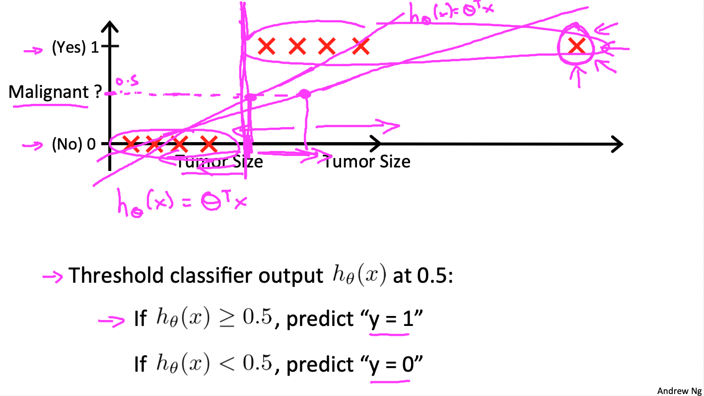
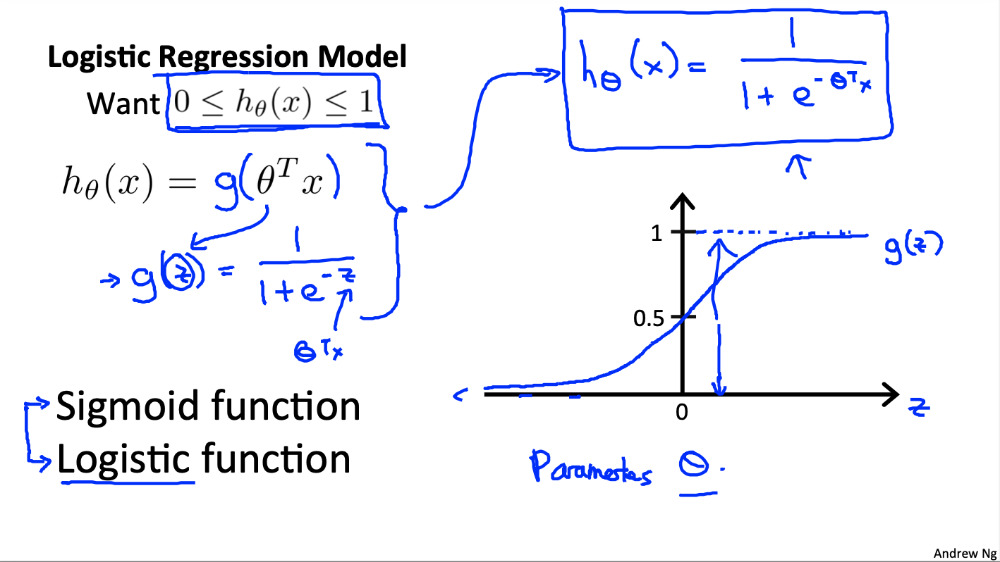
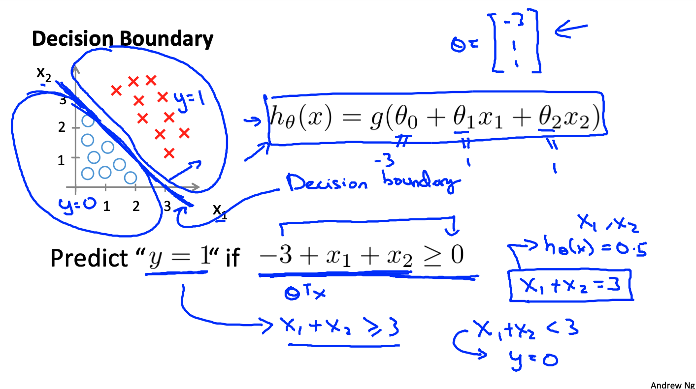
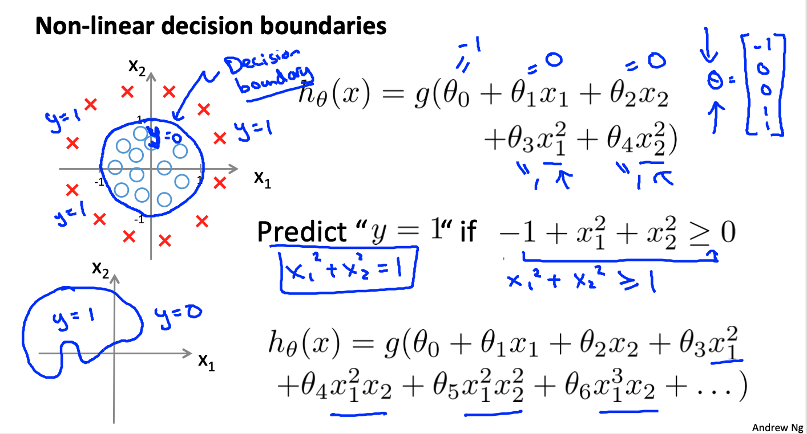
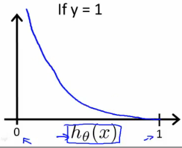
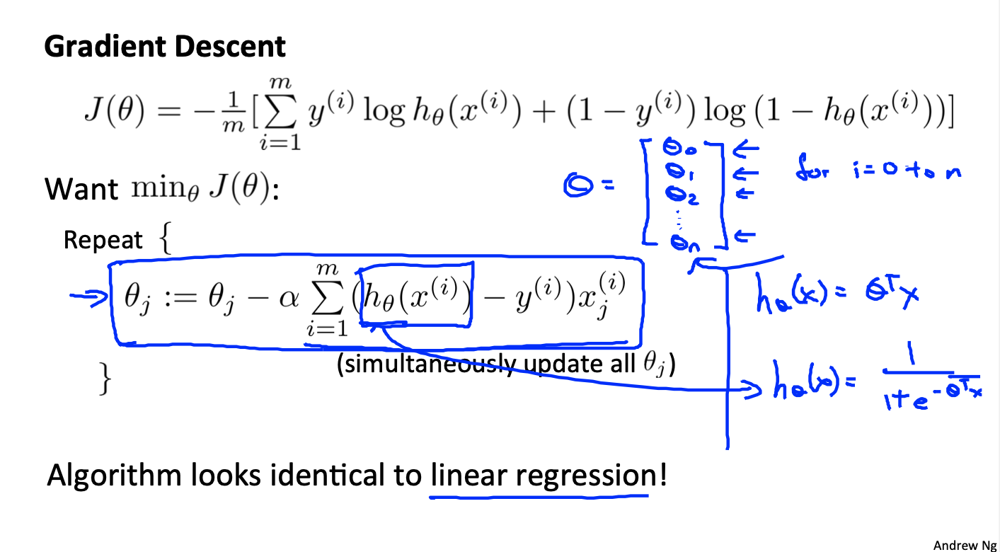
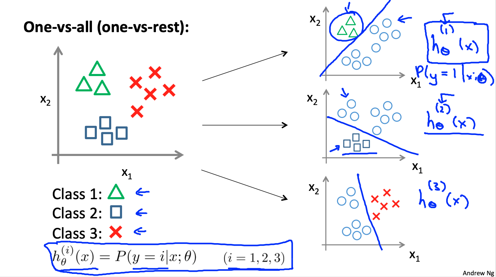
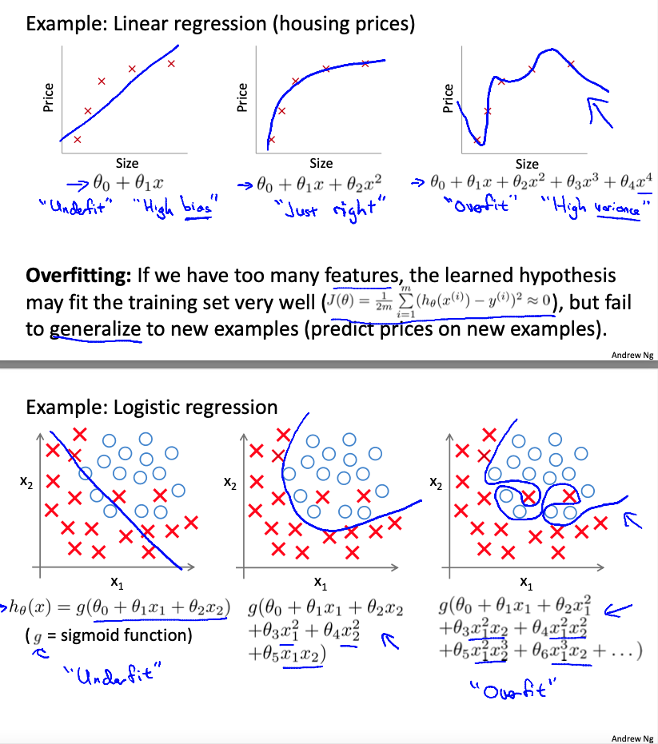

# Mechine Learning: Logistic Regression

These are my notes on the Coursera course by Andrew Ng ["Machine Learning"](https://www.coursera.org/learn/machine-learning).

For setup and general information, please look at `../README.md`.

This file my notes related to **logistic regression**.

Note that Latex formulae are not always rendered in Markdown readers; for instance, they are not rendered on Github, but they are on VS Code with the Markup All In One plugin.
Therefore, I provide a pseudocode of the most important equations.
An alternative would be to use Asciidoc, but rendering of equations is not straightforward either.

Overview of contents:

1. Classification and Representation
   - 1.1 Classification
   - 1.2 Hypothesis Representation: Which is the Form of $h$ in Classification?
   - 1.3 Decision Boundary
2. Logistic Regression Model
   - 2.1 Cost Function
   - 2.2 Compact Cost Function and Gradient Descent
   - 2.3 Advanced Optimization
3. Multi-class Classification: One vs. All
4. Solving the Problem of Overfitting
   - 4.1 The Problem of Overfitting
   - 4.2 Cost Function with Regularization
   - 4.3 Regularized Linear Regression: Gradient Descent and Normal Equations
   - 4.4 Regularized Logistic Regression
5. Exercise 2 (Week 3)
   - Octave code summary
   - Python implementation notes


## 1. Classification and Representation

### 1.1 Classification

Examples of binary classification:
- Is email spam or not?
- Is transaction fraudulent or not?
- Is tumor benign or malignant?

The target or outcome is $y \in {0,1}$; if we have a multi-class classification, $y \in {0,1, 2, 3, ...}$.

One (very bad) solution could consist on applying linear regression to our problem: 
- we plot points in $(x,y)$
- we find the line $h(x)$
- and we define our threshold at the $x_t$ which yields $h(x_t) = 0.5$. Values with $x < x_t$ belong to one class, the rest to the other.

However, that has several issues:
- If a sample far away appears, our line is inclined and the threshold moved, leading to potential wrong classifications
- $h(x)$ might predict values outside from $[0,1]$, which does not make sense



A valid solution is the **logistic regression**, which is the basis for **classification**. It assures that $h(x) \in (0,1)$.

### 1.2 Hypothesis Representation: Which is the Form of $h$ in Classification?

Logistic regression could be called also *sigmoid regression for classification*.
The linear regression equation is passed to the sigmoid function so that $h(x) \in (0,1)$; that is what the sigmoid function does by definition: input values $z \in (-\inf, \inf)$ are mapped to $(0, 1)$, having asymptotes at $y = 0$ and $y = 1$.

$h(x) = g(\theta^T x)$

$g(z) = \frac{1}{1 + e^{-z}}$

```
h(x) = g(t * x)
g(z) = 1 / (1 + exp(-z))
```

We interpret $\hat{y} = h(x)$ to be the probability of $x$ causing $y = 1$.
Formally: $\hat{y} = h(x) = P(y = 1 | x; \theta)$, that is: the probability of $y = 1$ given $x$ and parameter $\theta$.

Intuitively, $P(y = 0 | x; \theta) = 1 - P(y = 1 | x; \theta)$.



### 1.3 Decision Boundary

The decision boundary is the $z = \theta^T x$ equation before passing it to the sigmoid function.

Depending on the value of $\hat{y} = h(x)$ we choose one class ($y = 0$) or the other ($y = 1$). The threshold is set for $\hat{y} = h(x) = 0.5$, thus:

$\hat{y} = h(x) = \frac{1}{1 + e^{-\theta^T x}}= 0.5 \rightarrow \theta^T x =0 $

In other words: **the decision boundary in feature space is defined by**

$\theta^T x = 0$

From here, we conclude:

$\theta^T x >= 0 \rightarrow y = 1$
$\theta^T x < 0 \rightarrow y = 0$

Our goal is to fit the parameters $\theta$ to best represent that boundary.

In a simple linear case, the decision boundary is a line or a (hyperplane) that divides the feature space in two half-spaces.
Whenever we have a new sample $x$, we evaluate it with the decision boundary equation: if it yields positive, it belongs to the $y = 1$ class.



But we can also have polynomial regressions with the same formulae.
In that case, the boundaries start taking non-linear shapes: circles or hyper-spheres, ellipsoids, or any blobby shape (even non-convex).
Note that if they are closed, the contain samples associated with $y = 1$.



## 2. Logistic Regression Model

### 2.1 Cost Function

We define the cost or objective function to optimally fit the parameters. Let's denote that cost function $J(\theta)$ `= (1/m) * sum(cost(h(x),y))`.

Recap:

- Feature vector of size `n+1`: $x = [x_0, x_1, ..., x_n]^T$ with $x_0 = 1$

  `x = [x_0, x_1, ..., x_n]^T, x_0 = 1`

- Training samples `m`: $(x^(1),y^(1)), (x^(2),y^(2)), ..., (x^(m),y^(m))$, with $y \in {0,1}$

  `(x^(1),y^(1)), (x^(2),y^(2)), ..., (x^(m),y^(m))`, `y in {0,1}`

- Model: $\hat{y} = h(x) = g(\theta^T x) = \frac{1}{1 + e^{-\theta^T x}}$

  ```
  h(x) = g(t * x)
  g(z) = 1 / (1 + exp(-z))
  ```

In linear regression we use the cost function $J(\theta)$ defined as the mean of the sum of squares of all errors of predictions with respect to their associated ground truth. Now, we cannot use the same cost function, because non-linear sigmoid function in the prediction model would make that cost function $J$ non-convex. Non-convex functions have local minima or valleys; due to that, gradient descent gets stuck and no optimum is found.

Instead of squared errors, we use the logarithmic function, which does not have this problem. For better understanding, instead of using the `y` truth in the cost function, the cost function is split into two different equations, depending on the value of `y`; however, we see in the following section that we can represent the cost function in a single line with the `y` in it. The **cost of one sample** `cost(h(x),y)` in two equations is:

```
cost(h(x),y) = -log(h(x)), if y = 1
cost(h(x),y) = -log(1 - h(x)), if y = 0
```

And the **total cost** is:

```
J = (1/m) * sum(cost(h(x),y))
```

Note that `cost(h(x),y)`
- goes to `0` if `h -> y`,
- but it goes to `inf` if `h` points in the opposite direction as `y` (i.e., `y = 0, h -> 1` and `y = 1, h -> 0`)
- The `-` sign is just for putting the logarithm function upside down, don't get confused by it...




### 2.2 Compact Cost Function and Gradient Descent

The previous cost function in two parts can be rewritten in a compact way.

Two equations:

```
cost(h(x),y) = -log(h(x)), if y = 1
cost(h(x),y) = -log(1 - h(x)), if y = 0
```

Equivalent in one equation (non matter which `y` value):

```
cost(h(x),y) = -y*log(h(x)) - (1 - y)*log(1 - h(x))
```

Note that
- if `y = 1` the second term cancels and the equation becomes the first of the pair above
- if `y = 0` the first term cancels and the equation becomes the second of the pair above

In summary, the **total cost function** is (minus brought to the front):

$J(\theta) = \frac{1}{m} \sum_{i=1}^{m} \textrm{cost}(h(x^{(i)}),y^{(i)})$

$J(\theta) = - \frac{1}{m} \sum_{i=1}^{m} y^{(i)}\log ( h(x^{(i)}) ) + (1 - y^{(i)}) \log (1 - h(x^{(i)}))$

```
J = -(1/m) * sum(y*log(h(x)) + (1 - y)*log(1 - h(x)))
```

This cost function has some nice properties:
- It can be derived from statistics using the principle of the **maximum likelihood estimation**.
- It is **convex**, so we can safely use the gradient descent with it.

The **gradient descent** requires to compute the derivative of the cost function, which has the same form as in linear regression!

$\delta = \frac{\partial J (\theta)}{\partial \theta_j} = \frac{1}{m} \sum_{i = 1}^{m} (h(x^{(i)})- y^{(i)})x_j^{(i)}$

```
delta = dJ/dtj = derivative(J,tj) = (1/m) * sum((h(x)-y)*x_j)
```

And the update formula is the same; given the learning rate `alpha`:

```
Repeat:
  compute delta(t)
  t = [t_j]
  t_j (new) <- t_j (previous) - alpha * delta
```

In vectorized form

```
theta = theta - (alpha/m)*X'*(g(X*theta)-y)
```



**Important notes**:
- Even though the derivative of the cost function seems to have the same form, note that $h$ is different now! In linear regression $h = \theta^T x$, in logistic regression we apply the sigmoid function $h = g(\theta^T x)$.
- Feature scaling applies here too for accelerating and improving the gradient descent!

### 2.3 Advanced Optimization

Gradient descent is one optimization algorithm, but it is not the only one. In fact, for complex problems, other approaches have been shown to be faster and more robust, such as:
- [The conjugate gradient method](https://en.wikipedia.org/wiki/Conjugate_gradient_method)
- [BFGS](https://en.wikipedia.org/wiki/Broyden–Fletcher–Goldfarb–Shanno_algorithm)
- [L-BFGS](https://en.wikipedia.org/wiki/Limited-memory_BFGS)

These algorithms are more efficient and often do not require choosinh `alpha`. However, they are also much more complex to understand and implement; therefore, we should use efficient libraries. They often require to have the (1) cost function value `J` and its (2) derivative vector or gradient for any parameter set; therefore, although the gradient descent only requires the gradient, both values are computed in the `costFunction`. In the case of logistic regression, that would be:

```octave
function [jVal, jGrad] = costFunction(theta)
  jVal = ... % J(theta) = J = -(1/m) * sum(y*log(h(x)) + (1 - y)*log(1 - h(x)))
  jGrad = zeros(m)
  jGrad(1) = ... % dJ / dt0 = (1/m) * sum((h(x)-y))
  jGrad(2) = ... % dJ / dt1 = (1/m) * sum((h(x)-y)*x_1)
  ...
```

Then, we pass the pointer to our `costFunction` in the chosen optimization algorithm, such as:

```octave
options = optimset('GradObj', 'on', 'MaxIter', 400);
initial_theta = zeros(3,1);
[optTheta, functionVal, exitFlag] = fminunc(@(t)(costFunction(t, X, y)), initial_theta, options);
```

**Important note**: the derivative vector is called gradient.

## 3. Multi-class Classification: One vs. All

While in a binary classification problem we work with only two classes $y = {0,1}$, in the multi-class classification problem we have several $q$ classes $y=\{1,2,...,k,...,q\}$ for which we predict their probabilities $h^{(k)}(x)$:

```
y in [1,2,...,k,...,q]
h(1,x) = P(y = 1 | x; theta)
h(2,x) = P(y = 2 | x; theta)
...
h(k,x) = P(y = k | x; theta)
...
h(q,x) = P(y = q | x; theta)
```

The logistic regression is a binary classification method.
One way to use it in a multi-class classification problem is to apply the **One vs. All** or **One vs. Rest** method: We create `q` artificial datasets where in each of them a class `k` is opposing to the rest of the classes, i.e., the rest of the samples belong to one class (rest). The training yields $h^{(k)}(x)$ or `h(k,x)`. Altogether we have `q` prediction functions `h`, one for each of the classes against the rest.




During inference, a sample is evaluated by all prediction functions and the class identifier associated with the highest prediction `h` is selected as our class prediction:

$\argmax_k{\{h^{(k)}(x)\}}$

```
prediction = argmax(h(1,x), h(2,x), ..., h(k,x), ..., h(q,x))
```

## 4. Solving the Problem of Overfitting

When our model fits the noise of the dataset, we say we have **overfitting**.
With overfitting, predictions are not reliable.
An approach to address overfitting consists in using **regularization**.

### 4.1 The Problem of Overfitting

Overfitting happens when we have too much features/parameters, i.e., the dimension of our model is too large (e.g., we have high degree polynomials with many curves and holes). As a consequence, the model tries to fit every sample in the dataset, the cost function becomes almost `0`, but the model fails to generalize with new samples.

The opposite of overfitting is underfitting: the model is too simplistic to fit our dataset reliably. The cost function is high and the model does not generalize well either.

Nomenclature:
- **Overfitting** is also called **high variance**. Variance relates to change; in this case, we capture all minimal changes.
- **Underfitting** is also called **high bias**. Bias means "preconception"; in this case our preconception is that the model is simplistic.



Approaches to reduce overfitting:

1. Reduce the number of features
   - Manually select which features we want to to keep.
   - Use a model selection algorithm, which select useful features (studied later in the course).
2. Regularization
   - Keep all the features, but reduce the magnitude of parameters $\theta_j$.
   - Regularization works well when we have a lot of slightly useful features.

### 4.2 Cost Function with Regularization

If we have a dataset which can be well modelled with a quadratic function (polynomial of degree 2) but we choose a model a model with degree 4, we might end with a curvy function that overfits our dataset.

```
h = t0 + t1*x + t2*x^2 + t3*x^3 + t4*x^4
```

To prevent that, we want to have small parameters of highest degrees: `t3, t4 -> 0`; that way, our model would resemble a quadratic function with small higher degree components that add minor effects.

That is the intuition behind **regularization**: we add the parameters to the cost function so that their value remains small while still fitting the dataset the best as possible. In other words, **we penalize large values of parameters**. For the linear regression:

$$ J(\theta) = \frac{1}{2 m} (\sum_{i = 1}^{m}{(h(x^{(i)})-y^{(i)})^2 + \lambda \sum_{j = 1}^{n}{\theta_{j}^{2}}})$$

```
J = (1/(2m)) * (sum(i=1:m,(h(x_i)-y_i)^2) + lambda*sum(j=1:n,theta_j^2))
```

Note that by convention the intercept parameter `theta_0` is not considered in the regularization; although using it would not affect so much.

The cost function has now two terms
1. The first one tries to fit the parmeters the best possible way so that the dataset is optimally represented (smallest deviation from samples)
2. The second tries to keep the parameter values small, which prevents overfitting. Large parameter values increase the cost, so they are penalized.

The choice of the **regularization parameter** `lambda` affects the result:
- if we take too large values for `lambda` and our parameters are going to be very small; as a consequence, we will have a biased model reduced to a flat horizontal line, i.e., too simplistic;
- if we take `lambda -> 0`, we might end up with overfitting, i.e., we are cancelling the second term.

### 4.3 Regularized Linear Regression: Gradient Descent and Normal Equations

The paramater update equation for linear regression following gradient descent is:

$\theta_j \leftarrow \theta_j - \alpha \frac{\partial}{\partial \theta_j} J(\theta)$, for $j = 0, ..., n$

```
tj <- tj - alpha*derivative(J(t),tj); j = 0:n
```

Adding the regularization term and to the cost and deriving it, we obtain:

$\theta_j \leftarrow \theta_j - \alpha[\frac{1}{m} \sum_{i=1}^{m}{(h(x^{(i)}) - y^{(i)})x^{(i)}_j} + \frac{\lambda}{m} \theta_j]$
for $j=1,...,n$

Note that $\theta_0$ is usually not considered for regularization, thus implement in practice the equation as follows:

```
t0 <- t0 - (alpha*/m)*sum(h(x[:,i]) - y[:])

tj <- tj - (alpha*/m)*(sum((h(x[:,i]) - y[:])*x[j,i]) + lambda*theta[j])

t1 <- t1 - (alpha*/m)*(sum((h(x[:,i]) - y[:])*x[1,i]) + lambda*theta[1])

t2 <- t2 - (alpha*/m)*(sum((h(x[:,i]) - y[:])*x[2,i]) + lambda*theta[2])

(with h(x[:,i]) = dot(t[:],x[:,i]))
...
```

Note that `j = 0` is treated differently, bacause `theta_0` is not considered for regularization and `x_0 = 1`.

The step formula can be rewritten as follows:

$\theta_j \leftarrow \theta_j (1 - \frac{\alpha \lambda}{m}) - \frac{\alpha}{m} \sum_{i=1}^{m}{(h(x^{(i)}) - y^{(i)})x^{(i)}_j}$

Interpretation:
- The first term `1 - alpha*lambda/m` should be `< 1` but almost `1`, that is `0.99...`; the intuition is that we shrink the `theta` step by step.
- The second term is the step we need to take to minimize the cost function; that might indeed increase `theta`, but we decrease it in the next iteration again! Notice it is the same term as before; we just added the term to shrink `theta`.

#### Normal Equation with Regularization


$\theta = (X^TX + \lambda H)^{-1}X^Ty$

$H = I$  = `eye(n+1,n+1)`,
but setting `H(0,0,) = 0`, because `theta_0` is not considered for regularization.
That is, $H$ is the identity matrix but with the `H(0,0)` element is set to `0`.

```
t = pinv(transpose(X)*X + lambda*H)*transpose(X)*y
```

If `m < n`, then $X^TX$ is not invertible; however, $X^TX + \lambda H$ is invertible even with `m < n`!

### 4.4 Regularized Logistic Regression

The cost function of logistic regression with regularization is

$$ J(\theta) = -\frac{1}{m} [\sum_{i = 1}^{m}{y^{(i)}\log(h(x^{(i)}) + (1-y^{(i)})\log(1-h(x^{(i)}))] + \frac{\lambda}{2m} \sum_{j = 1}^{n}{\theta_{j}^{2}}}$$

It turns out that end up with the same parameter update formula for gradient descent, but the `h(x)` function is obviously different:

$\theta_j \leftarrow \theta_j - \alpha \frac{\partial}{\partial \theta_j} J(\theta)$

$\theta_j \leftarrow \theta_j - \alpha[\frac{1}{m} \sum_{i=1}^{m}{(h(x^{(i)}) - y^{(i)})x^{(i)}_j} + \frac{\lambda}{m} \theta_j]$
for $j=1,...,n$

```
t0 <- t0 - (alpha*/m)*sum(h(x[:,i]) - y[:])

tj <- tj - (alpha*/m)*(sum((h(x[:,i]) - y[:])*x[j,i]) + lambda*theta[j])

t1 <- t1 - (alpha*/m)*(sum((h(x[:,i]) - y[:])*x[1,i]) + lambda*theta[1])

t2 <- t2 - (alpha*/m)*(sum((h(x[:,i]) - y[:])*x[2,i]) + lambda*theta[2])

(with h(x[:,i]) = 1 / (1 + exp(-dot(t[:],x[:,i]))))
...
```

We can use that also with advanced optimization methods; we just need to define a `costFunction` that returns the cost and its gradient with the regularization term.

## 5. Exercise 2 (Week 3)

### 5.1 Workflow

Files provided by Coursera, located under `../exercises/ex1-ex8-octave/ex2`

- `ex2.m` - Octave/MATLAB script that steps you through the exercise
- `ex2_reg.m` - Octave/MATLAB script for the later parts of the exercise
- `ex2data1.txt` - Training set for the first half of the exercise
- `ex2data2.txt` - Training set for the second half of the exercise
- `submit.m` - Submission script that sends your solutions to our servers
- `mapFeature.m` - Function to generate polynomial features
- `plotDecisionBoundary.m` - Function to plot classifier’s decision boundary

Files to complete:
- `plotData.m` - Function to plot 2D classification data
- `sigmoid.m` - Sigmoid Function
- `costFunction.m` - Logistic Regression Cost Function
- `predict.m` - Logistic Regression Prediction Function
- `costFunctionReg.m` - Regularized Logistic Regression Cost

Workflow:
- Download latest Octave version of exercise from Coursera
- Complete code in exercise files following `ex2.pdf`
- Whenever an exercise part is finished
  - Check it with `ex2` or `ex2_reg` in Octave terminal
  - Create a submission token on Coursera (exercise submission page, it lasts 30 minutes)
  - Execute `submit` in Octave terminal
  - Introduce email and token
  - Results appear

### 5.2 Exercises

I completed the official exercises in Octave:

`../exercises/ex1-ex8-octave/ex2`

However, I forked also a python version of the exercises that can be used for submission also!

`~/git_repositories/ml-coursera-python-assignments`

[ml-coursera-python-assignments](https://github.com/mxagar/ml-coursera-python-assignments)

There are two execises:

1. Exercise 1 - Logistic Regression: Build classification model of student admision based on the score of two exams; we have a dataset of 100 applicants, each one with their 2 scores and the label whether they were admited (y = 1) or not.
2. Exercise 2 - Regularized Logistic Regression: Microchips are acccepted or rejected depending on their results of two tests.

Files provided by Coursera, located under `../exercises/ex1-ex8-octave/ex2`

- `ex2.m` - Octave/MATLAB script that steps you through the exercise
- `ex2_reg.m` - Octave/MATLAB script for the later parts of the exercise
- `ex2data1.txt` - Training set for the first half of the exercise
- `ex2data2.txt` - Training set for the second half of the exercise
- `submit.m` - Submission script that sends your solutions to our servers
- `mapFeature.m` - Function to generate polynomial features
- `plotDecisionBoundary.m` - Function to plot classifier’s decision boundary

Files to complete:
- `plotData.m` - Function to plot 2D classification data
- `sigmoid.m` - Sigmoid Function
- `costFunction.m` - Logistic Regression Cost Function
- `predict.m` - Logistic Regression Prediction Function
- `costFunctionReg.m` - Regularized Logistic Regression Cost

Workflow:
- Download latest Octave version of exercise from Coursera
- Complete code in exercise files following `ex2.pdf`
- Whenever an exercise part is finished
  - Check it with `ex2` or `ex2_reg` in Octave terminal
  - Create a submission token on Coursera (exercise submission page, it lasts 30 minutes)
  - Execute `submit` in Octave terminal (**Watch out: I had to modify it to add the path of ex1/lib instead of ex2/lib**)
  - Introduce email and token
  - Results appear

**Overview of contents:**

0. Setup: `gnuplot`
1. Exercise 1: Logistic Regression
    - 1.1 Visualizing the Data: `plotData.m`
    - 1.2. Sigmoid Function: `sigmoid.m`
    - 1.3. Cost Function and Gradient: `costFunction.m`
      - 1.3.1 Python Notes: Vectors and Matrices with `numpy`
    - 1.4. Optimization
        - 4.1 Gradient Descent: It does not work right away
        - 4.2 Advanced Optimization with `fminfunc`
        - 4.3 Python Notes: `scipy.optimize`
    - 1.5. Prediction: `predict.m`
2. Exercise 2: Regularized Logistic Regression
    - 2.1 Visualizing the Data
    - 2.2 Feature Mapping: Polynomial Logistic Regression
    - 2.3 Cost Function and Gradient with Regularization: `costFunctionReg.m`
    - 2.4 Plotting the Nonlinear Decision Boundary: `plotDecisionBoundary.m`
    - 2.5 Trying Different Regularization Parameters `lambda`
    - 2.6 Python Notes: Mapping Features & Plotting Nonlinear Decision Boundaries


Summary of the code in

`../exercises/ex1-ex8-octave/ex2/ML_Coursera_Ex_2_Logistic_Regression.ipynb`

(**Note: look at final notes on python implementation!**)

```octave

graphics_toolkit ("gnuplot");
%plot -b inline:gnuplot

%%% -- 1. Exercise 1: Logistic Regression

%% -- 1.1. Visualizing the Data: plotData.m

data = load('ex2data1.txt');       % read comma separated data
X = data(:, 1:2); y = data(:, 3);

function plotData(X, y)
    figure; hold on;
    pos = find(y == 1);
    neg = find(y == 0);
    plot(X(pos, 1), X(pos, 2), 'k+','LineWidth', 2, 'MarkerSize', 7);
    plot(X(neg, 1), X(neg, 2), 'ko', 'MarkerFaceColor', 'y', 'MarkerSize', 7);
    legend('Accepted','Not accepted')
    hold off;
end

%% -- 1.2. Sigmoid Function: sigmoid.m

function g = sigmoid(z)
    g = zeros(size(z));
    g = 1.0 ./ (1 .+ exp(-z));
end

%% -- 1.3. Cost Function and Gradient: costFunction.m

function [J, grad] = costFunction(theta, X, y)
    m = length(y); % number of training examples
    J = 0;
    grad = zeros(size(theta));

    %h = 1.0 ./ (1 .+ exp(-X*theta)); % X*theta is mx1 -> h = sigmoid(X*theta) is mx1
    h = sigmoid(X*theta); % X*theta is mx1 -> h = sigmoid(X*theta) is mx1
    J = (-1.0/m)*(y'*log(h) + (1.-y)'*log(1.-h));
    e = (h-y); % m x 1
    grad = (1.0/m)*e'*X; % 1 x (n+1)
end

%% -- 1.4. Advanced Optimization with fminfunc

data = load('ex2data1.txt');
X = data(:, 1:2); y = data(:, 3);
[m, n] = size(X);
X = [ones(m, 1) X];

% Options:
% GradObj on: our function returns cost and gradient
% MaxIter: maximum iterations
% @(t)(costFunction(t, X, y)): function with parameter t -> the value of t for min costFunction will be found
% initialTheta: initial value of t
options = optimset('GradObj', 'on', 'MaxIter', 400);
initial_theta = zeros(3,1);
[optTheta, functionVal, exitFlag] = fminunc(@(t)(costFunction(t, X, y)), initial_theta, options);

% Boundary : theta^T*X = 0
% t0 + t1*x1 + t2*x2 = 0 -> x2 = (-1/t2)*(t0 + t1*x1)
x1 = 30:0.1:100;
x2 = (-1.0/optTheta(3))*(optTheta(1) + optTheta(2)*x1);

plotData(X(:,2:size(X,2)),y)
hold on;
plot(x1, x2, 'b-')

%% -- 1.5. Prediction: predict.m

% Student with 45 in exam 1, 85 in exam 2 -> predict whether he/she passes
x = [1 45 85];
h = sigmoid(x*optTheta) % if h > 0.5 -> y_hat = 1

p = sigmoid(X*optTheta);
y_hat = p >= 0.5;

% Accuracy of training
mean(y == y_hat)

%%% -- Exercise 2: Regularized Logistic Regression

%% -- 2.1 Visualizing the Data

data = load('ex2data2.txt');
X = data(:, 1:2); y = data(:, 3);
plotData(X,y)

%% -- 2.2 Feature Mapping: Polynomial Logistic Regression

% Util file from the exercise kit
% [X1, X2] transformed into a 28-dimensional feature array!
% This allows for non-linear decision boundaries
% but overfitting risk arises!
function out = mapFeature(X1, X2)
    % MAPFEATURE Feature mapping function to polynomial features
    %
    %   MAPFEATURE(X1, X2) maps the two input features
    %   to quadratic features used in the regularization exercise.
    %
    %   Returns a new feature array with more features, comprising of 
    %   X1, X2, X1.^2, X1*X2, X2.^2, X1.^3, ... , X1*X2.^5, X2.^6
    %
    %   Inputs X1, X2 must be the same size
    %
    degree = 6;
    out = ones(size(X1(:,1)));
    for i = 1:degree
        for j = 0:i
            out(:, end+1) = (X1.^(i-j)).*(X2.^j);
        end
    end
end

%% -- 2.3 Cost Function and Gradient with Regularization: costFunctionReg.m

function [J, grad] = costFunctionReg(theta, X, y, lambda)
    m = length(y); % number of training examples
    n = length(theta) - 1;
    J = 0;
    grad = zeros(size(theta));

    %h = 1.0 ./ (1 .+ exp(-X*theta)); % X*theta is mx1 -> h = sigmoid(X*theta) is mx1
    h = sigmoid(X*theta); % X*theta is mx1 -> h = sigmoid(X*theta) is mx1
    J = (-1.0/m)*(y'*log(h) + (1.-y)'*log(1.-h));
    e = (h-y); % m x 1
    grad = (1.0/m)*e'*X; % 1 x (n+1)
    
    % Regularization terms
    % Cost    
    % theta'*theta, but without theta_0
    J = J + (0.5*lambda/m)*theta(2:(n+1))'*theta(2:(n+1));
    % Gradient
    t = (lambda/m)*theta'; % 1 x (n+1)
    t(1) = 0; % remove theta_0
    grad = grad + t;
end

data = load('ex2data2.txt');
X = data(:, 1:2); y = data(:, 3);

X = mapFeature(X(:,1), X(:,2));

% Initialize fitting parameters
initial_theta = zeros(size(X, 2), 1);

% Set regularization parameter lambda to 1
lambda = 1;

% Compute and display initial cost and gradient for regularized logistic
% regression
[cost, grad] = costFunctionReg(initial_theta, X, y, lambda);

%% -- 2.4 Plotting the Nonlinear Decision Boundary: plotDecisionBoundary.m

% This a utility function provided in the course
% It is interesting to have it since curvy contours are ploted
% if nonlinear decision boundaries are created,
% i.e., when we have more than two features.


function plotDecisionBoundary(theta, X, y)
%PLOTDECISIONBOUNDARY Plots the data points X and y into a new figure with
%the decision boundary defined by theta
%   PLOTDECISIONBOUNDARY(theta, X,y) plots the data points with + for the 
%   positive examples and o for the negative examples. X is assumed to be 
%   a either 
%   1) Mx3 matrix, where the first column is an all-ones column for the 
%      intercept.
%   2) MxN, N>3 matrix, where the first column is all-ones

% Plot Data
plotData(X(:,2:3), y);
hold on

if size(X, 2) <= 3
    % Only need 2 points to define a line, so choose two endpoints
    plot_x = [min(X(:,2))-2,  max(X(:,2))+2];

    % Calculate the decision boundary line
    plot_y = (-1./theta(3)).*(theta(2).*plot_x + theta(1));

    % Plot, and adjust axes for better viewing
    plot(plot_x, plot_y)
    
    % Legend, specific for the exercise
    legend('Admitted', 'Not admitted', 'Decision Boundary')
    axis([30, 100, 30, 100])
else
    % Here is the grid range
    u = linspace(-1, 1.5, 50);
    v = linspace(-1, 1.5, 50);

    z = zeros(length(u), length(v));
    % Evaluate z = theta*x over the grid
    for i = 1:length(u)
        for j = 1:length(v)
            z(i,j) = mapFeature(u(i), v(j))*theta;
        end
    end
    z = z'; % important to transpose z before calling contour

    % Plot z = 0
    % Notice you need to specify the range [0, 0]
    contour(u, v, z, [0, 0], 'LineWidth', 2)
end
hold off

end

%% -- Optimize & Plot

data = load('ex2data2.txt');
X = data(:, 1:2); y = data(:, 3);

X = mapFeature(X(:,1), X(:,2));

% Initialize fitting parameters
initial_theta = zeros(size(X, 2), 1);

% Set regularization parameter lambda to 1 (you should vary this)
lambda = 1;

% Set Options
options = optimset('GradObj', 'on', 'MaxIter', 400);

% Optimize
[theta, J, exit_flag] = fminunc(@(t)(costFunctionReg(t, X, y, lambda)), initial_theta, options);

plotDecisionBoundary(theta, X, y)

```

The following section provides some notes on the python implementation:


```python

########
# Working with Vector and Matrices
# The implementation with python would be done using `numpy`.
# The following are some particular properties of `numpy` we should bear in mind

import numpy as np

# Array / vector: no rows/columns, just length!
x = np.array([1, 2, 3])

# Matrix
np.array([[1, 2, 3], [4, 5, 6]])

# Scalar product between vectors
np.dot(x, x)

# Matrix multiplication
# X: m x n
# y: vector length m
np.dot(y, X) # y considered 1 x m
np.dot(X, y) # y considered m x 1

# Vectors can be promoted to matrices
y = np.array([1, 2, 3]) # length 3
y[None, :] # 1 x 3
y[:, None] # 3 x 1

# Get matrix sizes
m, n = X.shape

# Extend matrix with a column of ones
X = np.concatenate([np.ones((m, 1)), X], axis=1)


########
# It seems that we need to use an advanced optimization method if we want to compute the parameters of logistic regression.
# In python that can be done with `scipy.optimize`.
# See the python eercise repository for more information.
# A brief summary of the code would be the following:

from scipy import optimize

def costFunction(theta, X, y):
    m = y.size  # number of training examples
    J = 0
    grad = np.zeros(theta.shape)
    # IMPLEMENTATION ...
    return J, grad

options= {'maxiter': 400}
# Truncated Newton algorithm (TNC) is equivalent to MATLAB's fminunc
# See https://stackoverflow.com/questions/18801002/fminunc-alternate-in-numpy
# jac=True: Jacobian / Gradient returned
res = optimize.minimize(costFunction,
                        initial_theta,
                        (X, y),
                        jac=True,
                        method='TNC',
                        options=options)
cost = res.fun
theta = res.x

########
# The following is the translation of the above functions `mapFeature()` and `plotDecisionBoundary()` to python.
# The code is from [ml-coursera-python-assignments](https://github.com/mxagar/ml-coursera-python-assignments),
# forked from dibgerge's repository on Github.

import numpy as np
from matplotlib import pyplot

def mapFeature(X1, X2, degree=6):
    """
    Maps the two input features to quadratic features used in the regularization exercise.

    Returns a new feature array with more features, comprising of
    X1, X2, X1.^2, X2.^2, X1*X2, X1*X2.^2, etc..

    Parameters
    ----------
    X1 : array_like
        A vector of shape (m, 1), containing one feature for all examples.

    X2 : array_like
        A vector of shape (m, 1), containing a second feature for all examples.
        Inputs X1, X2 must be the same size.

    degree: int, optional
        The polynomial degree.

    Returns
    -------
    : array_like
        A matrix of of m rows, and columns depend on the degree of polynomial.
    """
    if X1.ndim > 0:
        out = [np.ones(X1.shape[0])]
    else:
        out = [np.ones(1)]

    for i in range(1, degree + 1):
        for j in range(i + 1):
            out.append((X1 ** (i - j)) * (X2 ** j))

    if X1.ndim > 0:
        return np.stack(out, axis=1)
    else:
        return np.array(out)


def plotDecisionBoundary(plotData, theta, X, y):
    """
    Plots the data points X and y into a new figure with the decision boundary defined by theta.
    Plots the data points with * for the positive examples and o for  the negative examples.

    Parameters
    ----------
    plotData : func
        A function reference for plotting the X, y data.

    theta : array_like
        Parameters for logistic regression. A vector of shape (n+1, ).

    X : array_like
        The input dataset. X is assumed to be  a either:
            1) Mx3 matrix, where the first column is an all ones column for the intercept.
            2) MxN, N>3 matrix, where the first column is all ones.

    y : array_like
        Vector of data labels of shape (m, ).
    """
    # make sure theta is a numpy array
    theta = np.array(theta)

    # Plot Data (remember first column in X is the intercept)
    plotData(X[:, 1:3], y)

    if X.shape[1] <= 3:
        # Only need 2 points to define a line, so choose two endpoints
        plot_x = np.array([np.min(X[:, 1]) - 2, np.max(X[:, 1]) + 2])

        # Calculate the decision boundary line
        plot_y = (-1. / theta[2]) * (theta[1] * plot_x + theta[0])

        # Plot, and adjust axes for better viewing
        pyplot.plot(plot_x, plot_y)

        # Legend, specific for the exercise
        pyplot.legend(['Admitted', 'Not admitted', 'Decision Boundary'])
        pyplot.xlim([30, 100])
        pyplot.ylim([30, 100])
    else:
        # Here is the grid range
        u = np.linspace(-1, 1.5, 50)
        v = np.linspace(-1, 1.5, 50)

        z = np.zeros((u.size, v.size))
        # Evaluate z = theta*x over the grid
        for i, ui in enumerate(u):
            for j, vj in enumerate(v):
                z[i, j] = np.dot(mapFeature(ui, vj), theta)

        z = z.T  # important to transpose z before calling contour
        # print(z)

        # Plot z = 0
        pyplot.contour(u, v, z, levels=[0], linewidths=2, colors='g')
        pyplot.contourf(u, v, z, levels=[np.min(z), 0, np.max(z)], cmap='Greens', alpha=0.4)

```