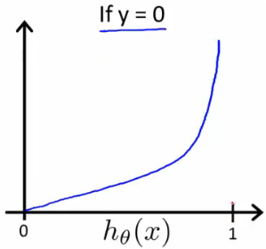

# Mechine Learning: Introduction and Linear Regression

These are my notes on the Coursera course by Andrew Ng ["Machine Learning"](https://www.coursera.org/learn/machine-learning).

For setup and general information, please look at `../README.md`.

This file my notes related to **logistic regression**.

Note that Latex formulae are not always rendered in Markdown readers; for instance, they are not rendered on Github, but they are on VS Code with the Markup All In One plugin.
Therefore, I provide a pseudocode of the most important equations.
An alternative would be to use Asciidoc, but rendering of equations is not straightforward either.

Overview of contents:

1. Classification and Representation
   - 1.1 Classification
   - 1.2 Hypothesis Representation: Which is the Form of $h$ in Classification?
   - 1.3 Decision Boundary
2. Logistic Regression Model
   - 2.1 Cost Function
   - 2.2 Compact Cost Function and Gradient Descent
   - 2.3 Advanced Optimization
3. Multiclass Classification: One vs. All


## 1. Classification and Representation

### 1.1 Classification

Examples of binary classification:
- Is email spam or not?
- Is transaction fraudulent or not?
- Is tumor benign or malignant?

The target or outcome is $y \in {0,1}$; if we have a multi-class classification, $y \in {0,1, 2, 3, ...}$.

One (very bad) solution could consist on applying linear regression to our problem: 
- we plot points in $(x,y)$
- we find the line $h(x)$
- and we define our threshold at the $x_t$ which yields $h(x_t) = 0.5$. Values with $x < x_t$ belong to one class, the rest to the other.

However, that has several issues:
- If a sample far away appears, our line is inclined and the threshold moved, leading to potential wrong classifications
- $h(x)$ might predict values outside from $[0,1]$, which does not make sense


A valid solution is the **logistic regression**, which is the basis for **classification**. It assures that $h(x) \in (0,1)$.

### 1.2 Hypothesis Representation: Which is the Form of $h$ in Classification?

Logistic regression could be called also *sigmoid regression for classification*.
The linear regression equation is passed to the sigmoid function so that $h(x) \in (0,1)$; that is what the sigmoid function does by definition: input values $z \in (-\inf, \inf)$ are mapped to $(0, 1)$, having asymptotes at $y = 0$ and $y = 1$.

$h(x) = g(\theta^T x)$

$g(z) = \frac{1}{1 + e^{-z}}$

```
h(x) = g(t * x)
g(z) = 1 / (1 + exp(-z))
```

We interpret $\hat{y} = h(x)$ to be the probability of $x$ causing $y = 1$.
Formally: $\hat{y} = h(x) = P(y = 1 | x; \theta)$, that is: the probability of $y = 1$ given $x$ and parameter $\theta$.

Intuitively, $P(y = 0 | x; \theta) = 1 - P(y = 1 | x; \theta)$.


### 1.3 Decision Boundary

The decision boundary is the $z = \theta^T x$ equation before passing it to the sigmoid function.

Depending on the value of $\hat{y} = h(x)$ we choose one class ($y = 0$) or the other ($y = 1$). The threshold is set for $\hat{y} = h(x) = 0.5$, thus:

$\hat{y} = h(x) = \frac{1}{1 + e^{-\theta^T x}}= 0.5 \rightarrow \theta^T x =0 $

In other words: **the decision boundary in feature space is defined by**

$\theta^T x = 0$

From here, we conclude:

$\theta^T x >= 0 \rightarrow y = 1$
$\theta^T x < 0 \rightarrow y = 0$

Our goal is to fit the parameters $\theta$ to best represent that boundary.

In a simple linear case, the decision boundary is a line or a (hyperplane) that divides the feature space in two half-spaces.
Whenever we have a new sample $x$, we evaluate it with the decision boundary equation: if it yields positive, it belongs to the $y = 1$ class.


But we can also have polynomial regressions with the same formulae.
In that case, the boundaries start taking non-linear shapes: circles or hyper-spheres, ellipsoids, or any blobby shape (even non-convex).
Note that if they are closed, the contain samples associated with $y = 1$.


## 2. Logistic Regression Model

### 2.1 Cost Function

We define the cost or objective function to optimally fit the parameters. Let's denote that cost function $J(\theta)$ `= (1/m) * sum(cost(h(x),y))`.

Recap:

- Feature vector of size `n+1`: $x = [x_0, x_1, ..., x_n]^T$ with $x_0 = 1$

  `x = [x_0, x_1, ..., x_n]^T, x_0 = 1`

- Training samples `m`: $(x^(1),y^(1)), (x^(2),y^(2)), ..., (x^(m),y^(m))$, with $y \in {0,1}$

  `(x^(1),y^(1)), (x^(2),y^(2)), ..., (x^(m),y^(m))`, `y in {0,1}`

- Model: $\hat{y} = h(x) = g(\theta^T x) = \frac{1}{1 + e^{-\theta^T x}}$

  ```
  h(x) = g(t * x)
  g(z) = 1 / (1 + exp(-z))
  ```

In linear regression we use the cost function $J(\theta)$ defined as the mean of the sum of squares of all errors of predictions with respect to their associated ground truth. Now, we cannot use the same cost function, because non-linear sigmoid function in the prediction model would make that cost function $J$ non-convex. Non-convex functions have local minima or valleys; due to that, gradient descent gets stuck and no optimum is found.

Instead of squared errors, we use the logarithmic function, which does not have this problem. For better understanding, instead of using the `y` truth in the cost function, the cost function is split into two different equations, depending on the value of `y`; however, we see in the following section that we can represent the cost function in a single line with the `y` in it. The **cost of one sample** `cost(h(x),y)` in two equations is:

```
cost(h(x),y) = -log(h(x)), if y = 1
cost(h(x),y) = -log(1 - h(x)), if y = 0
```

And the **total cost** is:

```
J = (1/m) * sum(cost(h(x),y))
```

Note that `cost(h(x),y)`
- goes to `0` if `h -> y`,
- but it goes to `inf` if `h` points in the opposite direction as `y` (i.e., `y = 0, h -> 1` and `y = 1, h -> 0`)
- The `-` sign is just for putting the logarithm function upside down, don't get confused by it...




### 2.2 Compact Cost Function and Gradient Descent

The previous cost function in two parts can be rewritten in a compact way.

Two equations:

```
cost(h(x),y) = -log(h(x)), if y = 1
cost(h(x),y) = -log(1 - h(x)), if y = 0
```

Equivalent in one equation (non matter which `y` value):

```
cost(h(x),y) = -y*log(h(x)) - (1 - y)*log(1 - h(x))
```

Note that
- if `y = 1` the second term cancels and the equation becomes the first of the pair above
- if `y = 0` the first term cancels and the equation becomes the second of the pair above

In summary, the **total cost function** is (minus brought to the front):

$J(\theta) = \frac{1}{m} \sum_{i=1}^{m} \textrm{cost}(h(x^{(i)}),y^{(i)})$

$J(\theta) = - \frac{1}{m} \sum_{i=1}^{m} y^{(i)}\log ( h(x^{(i)}) ) + (1 - y^{(i)}) \log (1 - h(x^{(i)}))$

```
J = -(1/m) * sum(y*log(h(x)) + (1 - y)*log(1 - h(x)))
```

This cost function has some nice properties:
- It can be derived from statistics using the principle of the **maximum likelihood estimation**.
- It is **convex**, so we can safely use the gradient descent with it.

The **gradient descent** requires to compute the derivative of the cost function, which has the same form as in linear regression!

$\delta = \frac{\partial J (\theta)}{\partial \theta_j} = \frac{1}{m} \sum_{i = 1}^{m} (h(x^{(i)})- y^{(i)})x_j^{(i)}$

```
delta = dJ/dtj = derivative(J,tj) = (1/m) * sum((h(x)-y)*x_j)
```

And the update formula is the same; given the learning rate `alpha`:

```
Repeat:
  compute delta(t)
  t = [t_j]
  t_j (new) <- t_j (previous) - alpha * delta
```

In vectorized form

```
theta = theta - (alpha/m)*X'*(g(X*theta)-y)
```


**Important notes**:
- Even though the derivative of the cost function seems to have the same form, note that $h$ is different now! In linear regression $h = \theta^T x$, in logistic regression we apply the sigmoid function $h = g(\theta^T x)$.
- Feature scaling applies here too for accelerating and improving the gradient descent!

### 2.3 Advanced Optimization

Gradient descent is one optimization algorithm, but it is not the only one. In fact, for complex problems, other approaches have been shown to be faster and more robust, such as:
- [The conjugate gradient method](https://en.wikipedia.org/wiki/Conjugate_gradient_method)
- [BFGS](https://en.wikipedia.org/wiki/Broyden–Fletcher–Goldfarb–Shanno_algorithm)
- [L-BFGS](https://en.wikipedia.org/wiki/Limited-memory_BFGS)

These algorithms are more efficient and often do not require choosinh `alpha`. However, they are also much more complex to understand and implement; therefore, we should use efficient libraries. They often require to have the (1) cost function value `J` and its (2) derivative vector or gradient for any parameter set; therefore, although the gradient descent only requires the gradient, both values are computed in the `costFunction`. In the case of logistic regression, that would be:

```octave
function [jVal, jGrad] = costFunction(theta)
  jVal = ... % J(theta) = J = -(1/m) * sum(y*log(h(x)) + (1 - y)*log(1 - h(x)))
  jGrad = zeros(m)
  jGrad(1) = ... % dJ / dt0 = (1/m) * sum((h(x)-y))
  jGrad(2) = ... % dJ / dt1 = (1/m) * sum((h(x)-y)*x_1)
  ...
```

Then, we pass the pointer to our `costFunction` in the chosen optimization algorithm, such as:

```octave
options = optimset(‘GradObj’, ‘on’, ‘MaxIter’, ‘100’);
initialTheta = zeros(2,1);
[optTheta, functionVal, exitFlag] = fminunc(@costFunction, initialTheta, options);
```

**Important note**: the derivative vector is called gradient.

## 3. Multiclass Classification: One vs. All

