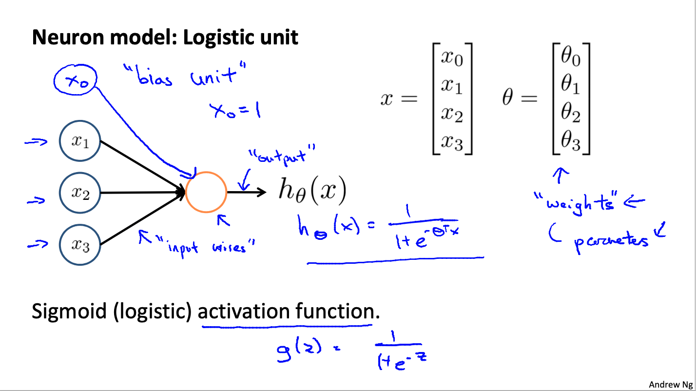
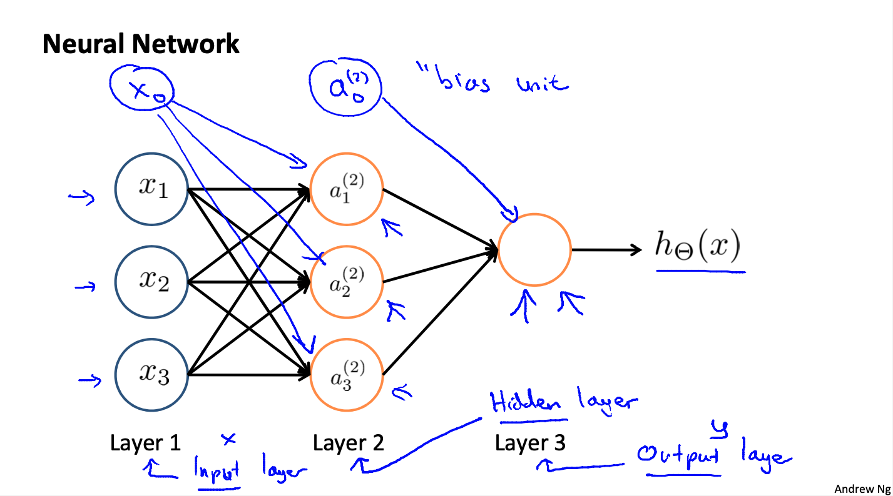
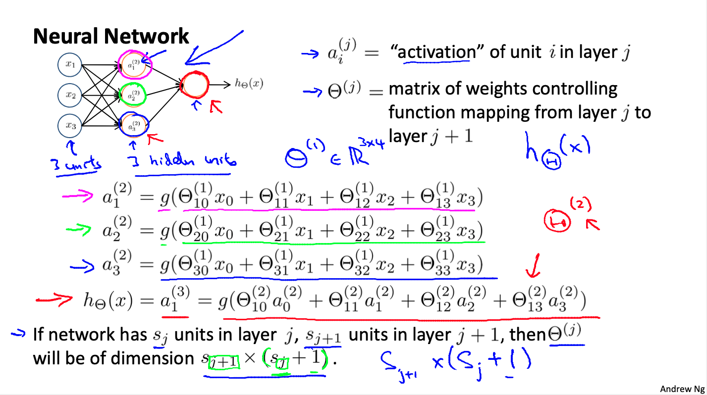
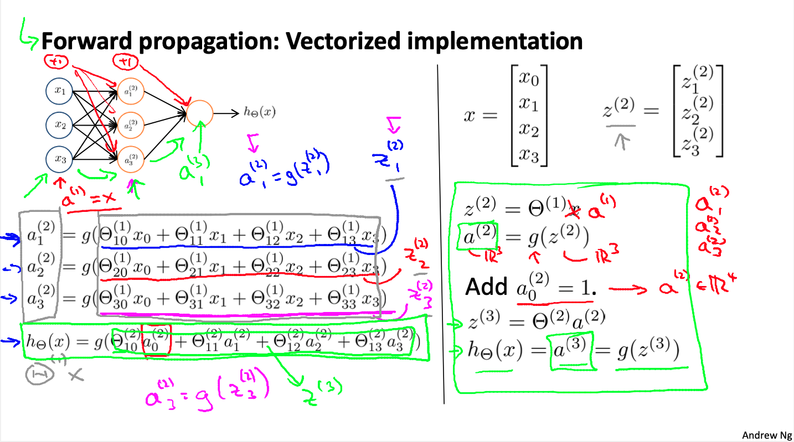
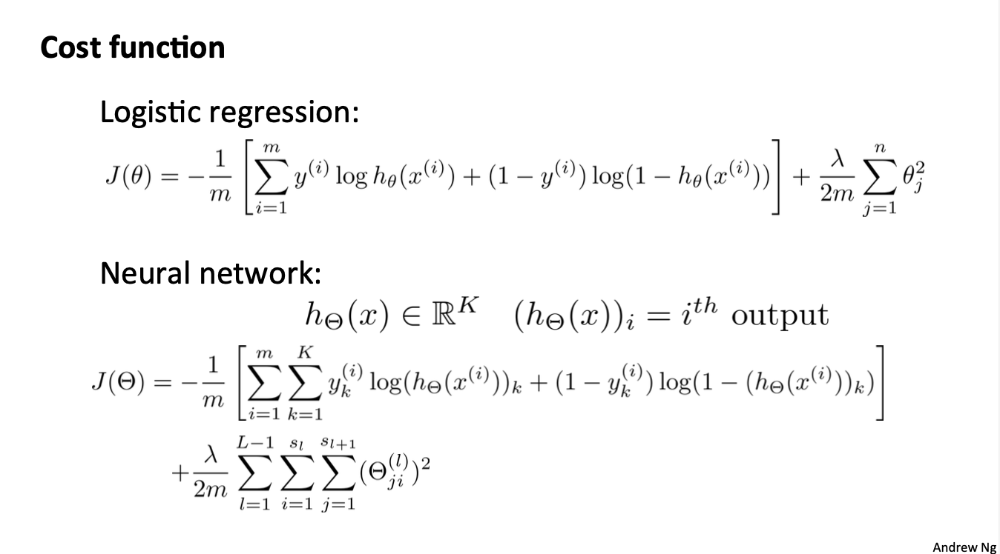
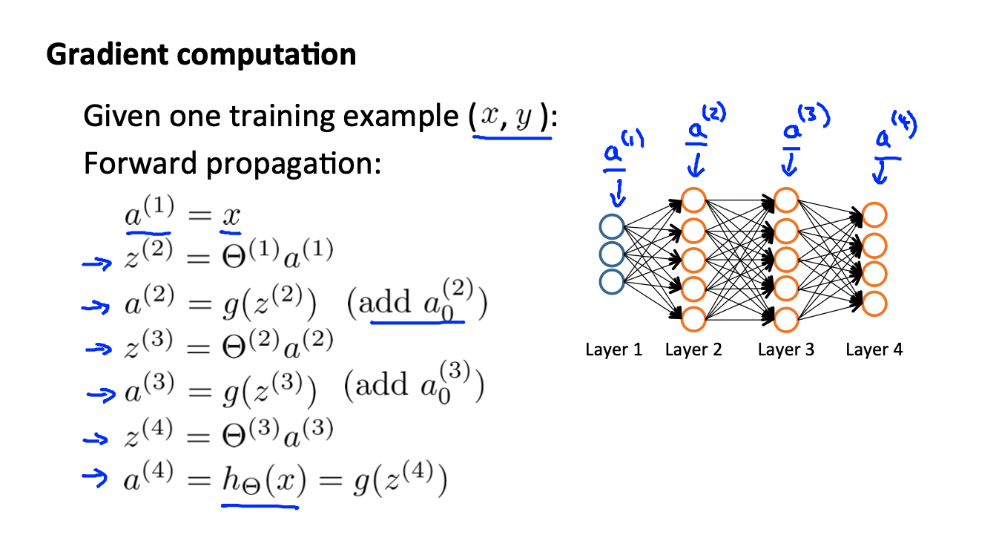
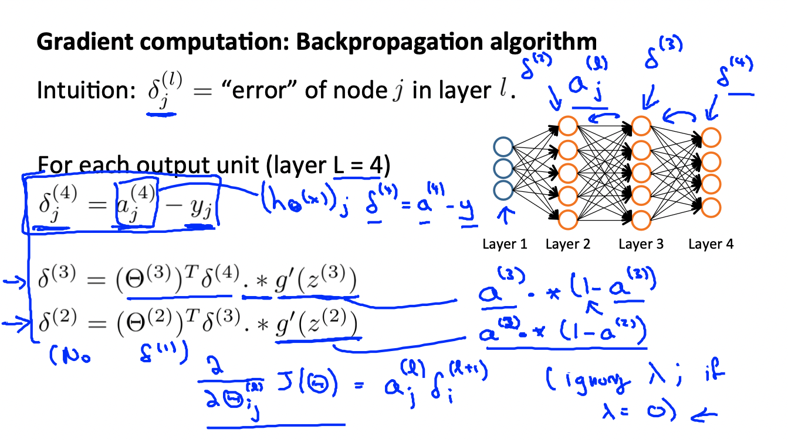
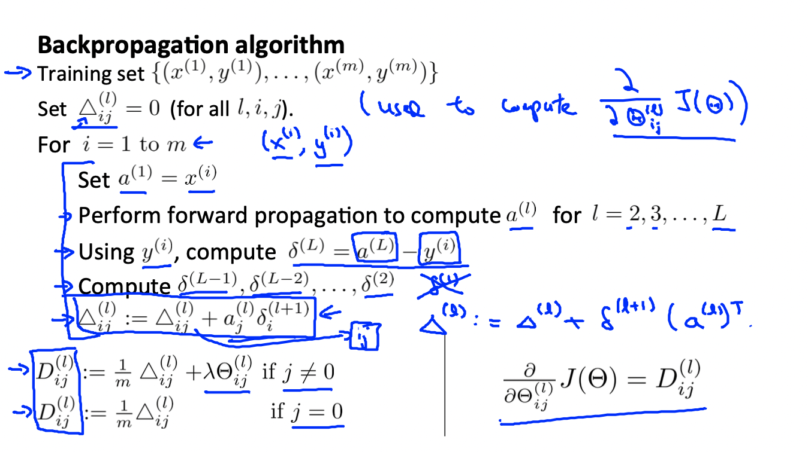
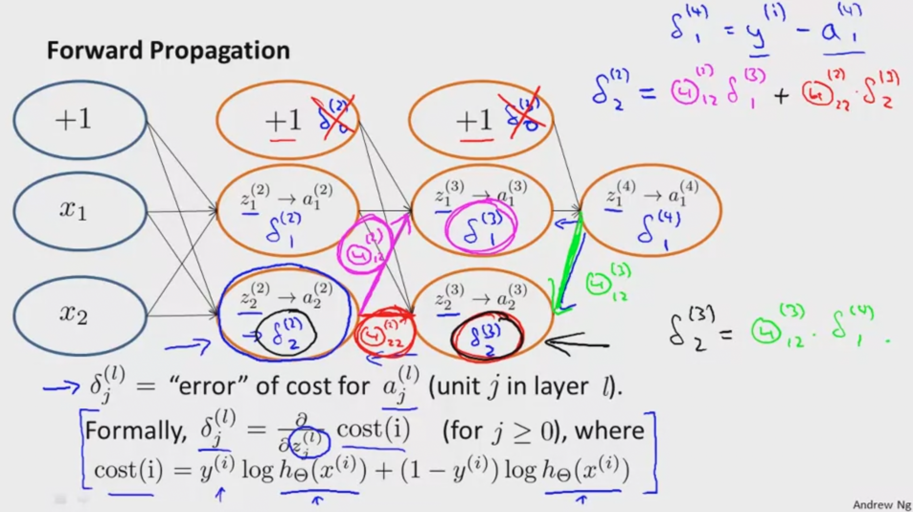

# Mechine Learning: Neural Networks

These are my notes on the Coursera course by Andrew Ng ["Machine Learning"](https://www.coursera.org/learn/machine-learning).

For setup and general information, please look at `../README.md`.

This file my notes related to **neural networks**.

Note that Latex formulae are not always rendered in Markdown readers; for instance, they are not rendered on Github, but they are on VS Code with the Markup All In One plugin.
Therefore, I provide a pseudocode of the most important equations.
An alternative would be to use Asciidoc, but rendering of equations is not straightforward either.

Overview of contents:

1. Motivations
   - 1.1 Non-Linear Hypotheses
   - 1.2 Neurons and the Brain
2. Neural Networks: Model Representation
   - 2.1 A Single Neuron: A Perceptron
   - 2.2 A Neural Network: Multi-Layered Perceptrons (MLP)
   - 2.3 Feed-Forward Propagation: Vectorized Implementation
     - Interpretation and Architecture
   - 2.4 Examples and Applications
   - 2.5 Multi-Class Classification
3. Exercise 3 (Week 4): Octave code summary
4. Neural Network: Cost Function and Backpropagation
   - 4.1 Cost Function
   - 4.2 Backpropagation Algorithm
     - Intuition of the Backpropagation
5. Neural Networks: Backpropagation in Practice
   - 5.1 Unrolling Parameters
   - 5.2 Gradient Checking
   - 5.3 Random Initialization
   - 5.4 Summary
6. Application of Neural Networks
7. Exercise 4 (Week 5): Octave code summary

## 1. Motivations

### 1.1 Non-Linear Hypotheses

Linear and logistic regression are the basis algorithms in machine learning that make possible to infer categorical or quantitative values.

However, as the complexity of the domain increases (i.e., the number of features used as independent variables), they fail because the cannot deal with **non-linearities and high dimensionalities**.

Example 1: 100 features, logistic regression with curvy decision boundaries. In order to have curvy boundaries, we need higher degree polynomials in the hypothesis model: but the number of terms in the model increases with `O(n^d)`, being `n` the original features and `d` the degree. For instance, if we want a humble quadratic degree `d = 2` (which is not able to model holes and very curvy stuff), we would require approximately `n^2/2 = 5,000` terms.

Example 2: Image classification, 50 x 50 pixels. We consider each pixel an independent variable: we have `50 x 50 = 2,500` pixels. Now, in that space, very complex decision boundaries need to be defined, so we wold require a very high degree polynomial. However, a humble quadratic degree `d = 2` leads to approximately 3 million terms -- the sizes explode even with very simplified models.

### 1.2 Neurons and the Brain

Neural re-wiring experiments with mice have been conducted: visual input was redirected to the auditory cortex and the mice learned to see with that region of the brain. Therefore, the hypothesis that there is one learning algorithm that adapts to the similar hardware pieces has arisen.

Andrew Ng provides examples related to how it is possible understand different sensory information with other senses: echolocation, haptic belts, etc.

Neurons in the brain
- They have nucleus, which processes the incoming data and sends the output signal.
- An axon: output data.
- Dendrites: input data.
- The neurons communicate with each other through small pulses of electricity called, spikes.

## 2. Neural Networks: Model Representation

### 2.1 A Single Neuron: A Perceptron

The computer representation of a neuron is a logistic unit:
- Inputs: `x_1, x_2, x_3` and bias `x_0 = 1`
- Output: `h(X) = g(theta*X) = sigmoid(theta*X) = 1 / (1 + exp(-theta*X))`

$x = [x_0 = 1, x_1, x_2, x_3]^T$
$\theta = [\theta_0, \theta_1, \theta_2, \theta_3]^T$
$h(x) = \frac{1}{1 + e^{-\theta^T x}}$

The bias unit is a constant value which is always present, like the intercept variable in linear regression. However, sometimes it is not drawn.

The sigmoid (logistic) function is one of the possible **activation functions** that map the weighted sum of the inputs to a desired output region (e.g., `[0,1]`). The activation function is applied in the neuron.

In neural networks, the `theta` parameters are called **weights** and they are the property of the input links.

A single neuron is called a **perceptron**



### 2.2 A Neural Network: Multi-Layered Perceptrons (MLP)

We connect the output of a neuron to other neurons, creating a network of layers. We distinguish:

- The input layer: the input data or variables (layer $j=1$)
- The output layer: the output signal (it can be one value or several)
- The hidden layer: all layers of neurons between the input and the output layer

Several layers of perceptrons/neurons are called a **Multi-Layer Perceptrons (MLP)**, and they constitute a neural network.



The effect is that we concatenate vector products mapped with sigmoid or activation functions.

Notation:

- $a_i^{(j)}$: activation of unit $i$ in layer $j$
  - $a$ is the output of a hidden layer neuron; $i = 1, 2, ..$ is the number of the neuron or unit (down); $j = 1, 2, ...$ is number of the layer (up)
- $\Theta^{(j)}$: matrix of weights controlling the function mapping from layer $j$ to $j+1$
  - rows: units in layer $j+1$ = $s_{j+1}$
  - columns: units in layer $j$ + 1 (bias) = $s_{j}$ + 1
  - size: $s_{j+1} \times (s_{j} + 1)$ = **new x (old + 1)**
  - $\Theta^{(1)}_3$: row vector for unit 3 in new layer 1+1 = 2.
  - $\Theta^{(1)}_{32}$: weight from old layer unit 2 to new layer unit 3, being the new layer 1+1 = 2
  - $\Theta^{(1)}_{30}$: weight from bias to new layer unit 3, being the new layer 1+1 = 2

 Therefore:

   - Each layer jump is a matrix of weights: **new x (old + 1)**.
   - Activations are the sigmoid of a dot product between a **weight matrix row and previous layer outputs / activations**.



### 2.3 Feed-Forward Propagation: Vectorized Implementation

Feed-forward is the process of passing an input ($x$) to the neural network and obtaining its output ($h(x)$). In between the input is mapped in stages to the output. Each stage is executed after a layer and consists in multiplying the previous activation/layer-output by the weight matrix between the two layers.

Summary of steps:
- We have our input: $x = [x_1, x_2, x_3, ...]^T$
- We add the bias components to its front: $x = [x_0, x_1, x_2, x_3, ...]^T$, $x_0 = 1$
- For generalization, we consider it to be the activation or output from a previous layer: $a^{(1)} = x = [x_0, x_1, x_2, x_3, ...]^T = [a^{(1)}_0, a^{(1)}_1, a^{(1)}_2, a^{(1)}_3, ...]^T$, being layer 1 the input layer. So, basically, $a^{(j)}$ is the input of layer $j$, also known as the activation of layer $j$.
- We apply the weights to the activations: $z^{(2)} = \Theta^{(1)} a^{(1)} = [z^{(2)}_0, z^{(2)}_1, z^{(2)}_2, ...]^{T}$
- We apply the sigmoid activation function to each element of the vector $z$ to obtain the activations from layer 2: $a^{(2)} = g(z^{(2)}) = [a^{(2)}_0, a^{(2)}_1, a^{(2)}_2, a^{(2)}_3, ...]^T$
- The process is repeated until we reach the output layer $k$: $h(x) = g(z^{(k)})$



Some remarks:
- $x$ is input vector and we need to insert the bias component to it: $x_0 = 1$
- We need to extend the every activation vector with the bias components in the front, too: $a^{(j)}_0 = 1$
- $a$ is the activation or output after applying the sigmoid; in the case of the input $a^{(1)} = x$
- $z^{(j+1)} = \Theta^{(j)} a^{(j)}$: dot product between weights and activations
- $a^{(j)} = g(z^{(j)})$: the activations are the result of applying the sigmoid to the $z$ vector; applying the sigmoid to a vector is the equivalent to applying the sigmoid to each of its components separately (element-wise) and assembling a new vector of equal size
- $h(x)$: the complete model; if we have $k$ layers (input layer is 1), then $h(x) = a^{(k)}= g(z^{(k)})$
- Note that if the output layer has only one unit, $\Theta$ is a row vector!

#### Interpretation and Architecture

Each layer of a neural network is a logistic regression model.
The features of the model in each layer are the outputs/activations of the previous layer.
Therefore, the neural network learns which intermediate features to generate by adjusting its weights.

By having several hidden layers, we can represent very non-linear models, which gives us a lot of flexibility.

The number of layers, their units, how they are connected and the activation functions are known as the **architecture** of the model.

### 2.4 Examples and Applications

Andrew Ng provides examples of how `AND`, `OR` and `NOT` logical functions can be implemented with a very simple perceptron. Then, these perceptrons can be combined to model the more complex logical function `XNOR` (`1` if both inputs are the same); that model uses a hidden layer. The intuition behind is that hidden layers increase the complexity of decisions.

Consider always how the sigmoid function maps the values. Note that `sigmoid(4.6) = 0.99`.


### 2.5 Multi-Class Classification

When we want to predict one of multiple classes, we use the same *one-vs-all* approach as in logistic regression. Basically, the output layer will have so many `K` units as classes `K` we want to predict, and:

- $h(x) = [h_1, h_2, ..., h_K]^T$
- If $K = 4$ and the second class is predicted: $h = [0,1,0,0]^T$

The target values or labels represented with the one-hot-encoding notation: $y$ is a column vector of size $K$ with value $1$ in the appropriate class slot, $0$ for the rest.

## 3. Exercise 3

Hand-written digits recognition with (part 1) multi-class logistic regression and (part 2) neural networks. The digits are a subset of the [MNIST dataset](http://yann.lecun.com/exdb/mnist/) by Yann LeCun. This exercise focuses on the logictic regression model for multi-class classification and on the feedforward pass of the neural network for the same dataset.

I completed the official exercises in Octave:

`../exercises/ex1-ex8-octave/ex3`

However, I forked also a python version of the exercises that can be used for submission also!

`~/git_repositories/ml-coursera-python-assignments`

[ml-coursera-python-assignments](https://github.com/mxagar/ml-coursera-python-assignments)

There are some relevant summary notes on `../02_LogisticRegression/ML_LogisticRegression.md` related to the python implementation.

Files provided by Coursera, located under `../exercises/ex1-ex8-octave/ex3`

- `ex3.m` - Octave/MATLAB script that steps you through part 1
- `ex3_nn.m` - Octave/MATLAB script that steps you through part 2
- `ex3data1.mat` - Training set of hand-written digits
- `ex3weights.mat` - Initial weights for the neural network exercise
- `submit.m` - Submission script that sends your solutions to our servers
- `displayData.m` - Function to help visualize the dataset
- `fmincg.m` - Function minimization routine (similar to `fminunc`)
- `sigmoid.m` - Sigmoid function

Files to complete:

- `lrCostFunction.m` - Logistic regression cost function
- `oneVsAll.m` - Train a one-vs-all multi-class classifier
- `predictOneVsAll.m` - Predict using a one-vs-all multi-class classifier
- `predict.m` - Neural network prediction function

Workflow:

- Download latest Octave version of exercise from Coursera
- Complete code in exercise files following `ex3.pdf`
- Whenever an exercise part is finished
  - Check it with `ex3` or `ex3_nn` in Octave terminal
  - Create a submission token on Coursera (exercise submission page, it lasts 30 minutes)
  - Execute `submit` in Octave terminal
  - Introduce email and token
  - Results appear

**Overview of contents:**

0. Setup: `gnuplot`
1. Part 1: Multi-Class Logistic Regression
    - 1.1 Dataset Loading & Visualization
    - 1.2 Vectorized Logistic Regression: `lrCostFunction.m`
    - 1.3 Regularized & Vectorized Logistic Regression: `lrCostFunction.m`
    - 1.4 One-vs-All Classification: `oneVsAll.m`
    - 1.5 One-vs-All Prediction: `predictOneVsAll.m`
2. Part 2: Neural Networks
    - 2.1 Loading the Data: Pre-Trained Weights2.1 Loading the Data: Pre-Trained Weights
    - 2.2 Feedforward Propagation and Prediction: `predict.m`2.2 Feedforward Propagation and Prediction: `predict.m`

```octave
%%%%% --- 0. Setup: `gnuplot`

graphics_toolkit ("gnuplot");
%plot -b inline:gnuplot

%%%%% --- 1. Part 1: Multi-Class Logistic Regression

%% -- 1.1 Dataset Loading & Visualization

% Load saved matrices from file
load('ex3data1.mat');
% The matrices X and y will now be in your Octave environment

% Show variables in workspace
who

% X: 5000 examples of unrolled 20x20 pixel images containing hand-written digits
% pixels contain grayscale intensities
size(X)

% y: true label for each example: 1-9, 10:0 (label 10 means digit 0)
size(y)

% Check min and max values
disp([max(X(1,:)),min(X(1,:))])
disp([max(y(:)),min(y(:))])

% Randomly select 100 data points to display
m = size(X, 1);
rand_indices = randperm(m);
num = 10; % num^2 images are visualized in a tiled canvas
sel = X(rand_indices(1:num^2), :);

% Function provided in the course
% See how sel is created
% Otherwise, the numer of tiles in the image width can be passed as param (see function)
displayData(sel);

%% -- 1.2 Vectorized Logistic Regression: `lrCostFunction.m`

function g = sig(z)
    g = 1.0 ./ (1.0 + exp(-z));
end

% X -> must be extended with bias x_0 = 1
% y -> one class vs. rest: this must be arranged
function [J, grad] = costFunction(theta, X, y, lambda)
    % Number of training examples
    m = length(y); 
    % Initialize return variables
    J = 0;
    grad = zeros(size(theta));
    % sigmoid(z): g = 1.0 ./ (1.0 + exp(-z));
    z = X*theta; % (m x n) x (n x 1) -> (m x 1)
    h = sig(z); % m x 1
    J = (-1.0/m)*(y'*log(h) + (1.-y)'*log(1.-h));
    e = (h-y); % m x 1
    grad = (1.0/m)*X'*e; % (n x m) x (m x 1) -> (n x 1)
end

%% -- 1.3 Regularized & Vectorized Logistic Regression: `lrCostFunction.m`

% X (m x (n+1)) -> must be extended with bias x_0 = 1
% y (m x 1) -> one class vs. rest: this must be arranged
function [J, grad] = costFunctionReg(theta, X, y, lambda)
    % Number of training examples
    m = length(y); 
    % Number features
    n = size(X,2);     
    % Initialize return variables
    J = 0;
    grad = zeros(size(theta));
    % sigmoid(z): g = 1.0 ./ (1.0 + exp(-z));
    z = X*theta; % (m x n) x (n x 1) -> (m x 1)
    h = sig(z); % m x 1
    J = (-1.0/m)*(y'*log(h) + (1.-y)'*log(1.-h));
    % Cost Regularization
    J = J + (0.5*lambda/m)*theta(2:n)'*theta(2:n)
    % Gradient
    e = (h-y); % m x 1
    grad = (1.0/m)*X'*e; % (n x m) x (m x 1) -> (n x 1)
    % Gradient Regularization
    reg = (lambda/m)*theta;
    reg(1) = 0;
    grad = grad + reg;
end

%% -- 1.4 One-vs-All Classification: `oneVsAll.m`

% A custom optimization function (provided) is used
% Basically one model (i.e., a set of params theta) is fitted for each class: one vs. all
function [all_theta] = fitAll(X, y, num_labels, lambda)
    %   [all_theta] = fitAll(X, y, num_labels, lambda) trains num_labels
    %   logistic regression classifiers and returns each of these classifiers
    %   in a matrix all_theta, where the i-th row of all_theta corresponds 
    %   to the classifier for label i

    % Sizes
    m = size(X, 1);
    n = size(X, 2);

    % Initialization of the return variables
    all_theta = zeros(num_labels, n + 1);

    % Add ones to the X data matrix: bias
    X = [ones(m, 1) X];

    % Hints & notes:
    % - theta(:) column vector.
    % - y == c: vector of 1's and 0's that tell you
    % - use fmincg to optimize the cost in a for loop
    %
    % Example code for fmincg:
    %
    %     % Set Initial theta
    %     initial_theta = zeros(n + 1, 1);
    %     % Set options for fminunc
    %     options = optimset('GradObj', 'on', 'MaxIter', 50);
    %     % Run fmincg to obtain the optimal theta
    %     % This function will return theta and the cost 
    %     [theta, J, iterations] = fmincg(@(t)(costFunctionReg(t, X, (y == c), lambda)), initial_theta, options);

    initial_theta = zeros(n + 1, 1);
    options = optimset('GradObj', 'on', 'MaxIter', 50);
    
    for c = 1:num_labels
        %[theta, J, iterations] = fmincg(@(t)(lrCostFunction(t, X, (y == c), lambda)), initial_theta, options);
        [theta, J, iterations] = fmincg(@(t)(costFunctionReg(t, X, (y == c), lambda)), initial_theta, options);
        %[theta, J, exit_flag] = fminunc(@(t)(costFunctionReg(t, X, y, lambda)), initial_theta, options); = fminunc(@(t)(costFunctionReg(t, X, y, lambda)), initial_theta, options);        all_theta(c,:) = theta(:)';
        all_theta(c,:) = theta(:)';
    end

end

num_labels = 10;
lambda = 0.1;

[all_theta] = fitAll(X, y, num_labels, lambda);

%% -- 1.5 One-vs-All Prediction: `predictOneVsAll.m`

function p = inferOneVsAll(all_theta, X)
    % Sizes
    m = size(X, 1); % X: m x n = examples x pixels/features
    num_labels = size(all_theta, 1); % all_theta: k x (n+1) = classes x (pixels/features + 1)
    % Initalize return variables
    p = zeros(size(X, 1), 1); % m x 
    % Add ones to the X data matrix: bias
    X = [ones(m, 1) X]; % m x (n+1)
    % Apply model
    P = X*all_theta'; % (m x (n+1)) x ((n+1) x k) -> m x k
    P = sig(P);
    [v, p] = max(P,[],2); % maximum column-value (v) and column-index (p) for each row
end

p = inferOneVsAll(all_theta, X);

% Accuracy
a = y == p;
sum(a)/length(a)

%%%%% --- 2. Part 2: Neural Networks

%% -- 2.1 Loading the Data: Pre-Trained Weights2.1 Loading the Data: Pre-Trained Weights

% Load saved matrices from file
load('ex3weights.mat');

who
% The matrices Theta1 and Theta2 will now be in your Octave environment
% Theta1 has size 25 x 401
% Theta2 has size 10 x 26

size(Theta1) # layer 1 -> layer 2
size(Theta2) # layer 2 -> layer 3

%% -- 2.2 Feedforward Propagation and Prediction: `predict.m`2.2 Feedforward Propagation and Prediction: `predict.m`

function p = infer(Theta1, Theta2, X)
    % Sizes
    m = size(X, 1);
    num_labels = size(Theta2, 1);
    % Initialize return variable: predictions
    p = zeros(size(X, 1), 1);
    % Layer 1
    a1 = [ones(size(X,1),1), X]; % 5000 x 401
    % Layer 1 -> Layer 2
    z2 = a1*Theta1'; % (5000 x 401) x (401 x 25) -> (5000 x 25)
    a2 = sig(z2);
    a2 = [ones(size(a2,1),1), a2]; % bias -> (5000 x 26)
    % Layer 2 -> Layer 3
    z3 = a2*Theta2'; % (5000 x 26) x (26 x 10) -> (5000 x 10)
    a3 = sig(z3);
    % Select class
    [v, p] = max(a3,[],2); % maximum column-value (v) and column-index (p) for each row
end

p = infer(Theta1, Theta2, X);

% Accuracy
a = y == p;
sum(a)/length(a)

```

## 4. Neural Network: Cost Function and Backpropagation

### 4.1 Cost Function

The cost function $J(\theta)$ of a neural network for classification is equivalent to the cost function of the logistic regression. However, with some notes caveats:

- The logistic regression is like a perceptron with one layer; with neural networks we have several layers. We denote the total number of layers `L` and the layer counter `l`. The number of neuron units in each layer is `s_l`: $L$, $l$, $s_l$.
- Neural networks have in general several `K` classes, thus we have `K` output prediction units that form the inference function $h(x)$ of dimension `K x 1`; each of the `K` values is `[0,1]`. The value assigned to each class `k` is denoted as $y_k$ and/or $h_k$.
- A parameter is denoted as $\theta_{ji}^{(l)}$: we need to derive the cost $J$ with respect to each of all those parameters; note that
  - $l$ is the layer number, from 1 to $L-1$ (because the last layer does not continue applying weights)
  - $j$ unit id from layer $l + 1$ (where it goes): $1 ... s_{l+1}$
  - $i$ unit id from layer $l$ (where it is coming from): $1 ... s_{l}$; do not mix it with the training example $i$!
- The regularization term takes into account all parameters $\theta_{ji}^{(l)}$, except the biases! Thus $i$ will start in the regularization term with 1.
- The cost function of neural networks is very similar to the one of the logistics regression, with the following notable differences:
  - The prediction error term is the cross-entropy formula, but errors are summed across all `K` classes in addition to across all examples `m`; in other words, the difference of each class `k = 1 ... K` is evaluated with `h_k` and `y_k` and summed for each example `i = 1 ... m`.
  - The regularization term sums the squares of all parameters or weights; for that, we need to go through each layer `l = 1 ... L-1`, and in each layer (jump) we take the `theta` values that map from the units on one side to the other side; in other words, the sweep the 2 dimensions of the `Theta_l` matrix of a layer. However, the bias weights are not considered.



### 4.2 Backpropagation

The backpropagation algorithm is used to minimize the cost function.
The idea is that we compute the gradient of the cost function propagating and differentiating the error in a backward pass.
We do that for all samples/examples and accumulate the total gradient in an epoch.

So, the steps are roughly:

1. Pick one example `(x,y)`
2. Feedforward the example to obtain `h`
3. Compute the error in the output layer: `delta^(L) = y - h`
4. Feed backward that error to obtain the error of each layer: the error of each layer is a vector of the same size as the number of units/neurons in the layer. However, note, that its not a linear map as in the feed forward: $\delta^{(l)} = ((\Theta^{(l)})^T\delta^{(l+1)}).*a^{(l)}.*(1-a^{(l)})$.
5. Compute the differentiated matrix of the error vector to obtain the error gradient, which can be shown to be `error * activation`; this is a matrix of the same size as the weight or parameter matrix.
6. Take the next example from the dataset and repeat from step 1; accumulate the error gradient in each layer by summing them example after example. When all examples have been passed, the sum over all examples of all error gradient matrices in each layer yields the final gradient.

That process is formally detailed in the following images.

**Feedforward of an example**:

Given an example `(x,y)`, we pass it through the network to get the final activation vector $a^{(L)} = h(x)$, which infers $y$.



**Error computation**:

The error of the inference is $\delta = h - y$. Note that $\delta$ is a vector and each component is related to one of the last neurons.
That error can be passed backward through the network computing the error components of the units in each layer.

That is accomplished with the following formula:

$\delta^{(l)} = ((\Theta^{(l)})^T\delta^{(l+1)}).*a^{(l)}.*(1-a^{(l)})$

With
- $.*$ is the element-wise multiplication operator
- $g'(z^{(l)}) = a^{(l)}.*(1-a^{(l)})$

Thus, starting with $\delta^{(L)} = h - y$, we compute backwards:

$\delta^{(L-1)}$, $\delta^{(L-2)}$, ..., $\delta^{(2)}$.

There is no $\delta^{(1)}$, because we cannot associate the error term with the input layer.



**Backpropagation**:

Finally, we compute the gradient of each weight/parameter. Each $\Theta^{(l)}_{i,j}$ is associated to a $\Delta^{(l)}_{i,j}$ forming a matrix of the same size:

$\Delta^{(l)}_{i,j} := \Delta^{(l)}_{i,j} + a^{(l)}_{j}\delta^{(l+1)}_{i}$

With vectorization:

$\Delta^{(l)} := \Delta^{(l)} + \delta^{(l+1)} (a^{(l)})^{T}$

Note that $\delta$ and $a$ are `s x 1`, being `s` the number of units in the respective layer.

We add the regularization term to those $\Delta^{(l)}_{i,j}$ and normalize them with the number of samples $m$; that leads to the $D^{(l)}_{i,j}$, which is the gradient of $J$ with respect to the weight $\Theta^{(l)}_{i,j}$:


$$ \frac{\partial J}{\partial\Theta^{(l)}_{i,j}} = D^{(l)}_{i,j} $$

Note: in the figure that follows, the superindex $(i)$ refers to the example, whereas the subindex $i$ refers to the number of unit in a layer, as $j$. That unfortunate notation is quite confusing.



#### Intuition of the Backpropagation

If we develop the formula for the computation of $\delta$

$\delta^{(l)} = ((\Theta^{(l)})^T\delta^{(l+1)}).*a^{(l)}.*(1-a^{(l)})$

we can see that we are actually feeding the inference error $\delta^{(L)}$ backwards in the network to obtain the error of each layer!

Look carefully at the image, but note there are some errors; corrections:

$\delta_1^{(4)} = a^{(4)}  - y^{(4)}$

$\textrm{cost}(i) = y^{(i)}\log(h(x^{(i)})) + (1 - y^{(i)})\log(1 - h(x^{(i)}))$

The most important messages are two:

1. The backpropagation of the error, e.g.: $\delta_{2}^{(2)} = \theta_{12}^{(2)}\delta_{1}^{(3)} + \theta_{22}^{(2)}\delta_{2}^{(3)}$. **I am not sure where this expression comes from - doe we get that after applying the general formula above?**
2. The $\delta$ component is the derivative of the cost with respect to the respective $z$ mapping.

Note also that the error components of the bias units can be computed (and probably are computed as a byproduct of a vectorial formulation): $\delta_0^{(l)}$; however, these values are not used later on, since the bias value remains always 1. I understand, though, that the weights associated to those biases are updated: $\theta_{i0}^{(l)}$?



## 5. Neural Networks: Backpropagation in Practice

### 5.1 Unrolling Parameters

The cost function computation yields the total cost `J` and matrix for each layer `D`, which is the derivative of the cost with respect to each weight (& bias) in that layer.
However, the minimization functions usually work with a vectorial gradient representations; therefore, the gradient and weight matrices need to be unrolled and stacks in a column vector and then re-arranged back to matrix form in each backpropagation pass.

In the following, some Octave lines show how to do that:

```octave

% Cost Function
% J: scalar
% gradient: n x 1, n parameters (weights and biases)
function [J, gradient] = costFunction(theta)

% Optimization Function
optTheta = fminunc(@costFunction, initialTheta, options)

% Unroll theta and gradient: from matrix to vector (column)
thetaVec = [ Theta1(:); Theta2(:); Theta3(:)];
DVec = [D1(:); D2(:); D3(:)];

% Re-arrange theta and gradient: from vector to matrix
% Example:
% L = 4 layers
% Theta1, D1: 10 x 11 (l = 1, s = 10, 1 bias)
% Theta2, D2: 10 x 11 (l = 2, s = 11, 1 bias)
% Theta3, D3: 1 x 11 (l = 3, s = 1, 1 bias)
Theta1 = reshape(thetaVec(1:110),10,11);
Theta2 = reshape(thetaVec(111:220),10,11);
Theta3 = reshape(thetaVec(221:231),1,11);

```

Therefore, the training/learning algorithm has these steps:

- We define the initial params/weights as matrices: `ThetaX`
- We unroll them to the vector `initialTheta`
- We call our optimization function with `initialTheta` and `costFunction(thetaVec)`
- Inside `function [J, gradient] = costFunction(thetaVec)`
  - We reshape `thetaVec` to be the matrices `ThetaX`
  - Perform feedforward + backpropagation to compute `DX` matrices and the cost `J`
  - We unroll the `DX` matrices to be the column vector `gradient`

The advantage of the matrix representation is that we can very easily perform operations with a vectorized syntax. However, optimization functions usually assume that the gradient is a vector.

### 5.2 Gradient Checking

It is easy to introduce such confusing bugs to backpropagation, that the cost function seems to be decreasing during optimization, even though it is in reality increasing. To avoid such situations, **numerical gradient checking** is very useful.

The gradient can be aproximated by computing the difference of the cost in a close neighborhood of radius `epsilon`:

```
gradApprox = (J(theta + epsilon) - J(theta - epsilon))/(2*epsilon)
```

Note that a double sided neighborhood (`+-epsilon`) is more stable than a single sided one.

We basically vectorize the `theta` weights and inflate one by one each components to obtain the cost derivative of each of the weights:

```octave

epsilon = 1e-4;
gradApprox = zeros(n,1);
for i = 1:n,
  thetaPlus = theta;
  thetaPlus(i) += epsilon;
  thetaMinus = theta;
  thetaMinus(i) -= epsilon;
  gradApprox(i) = (J(thetaPlus) - J(thetaMinus))/(2*epsilon)
end;

```

Then, we compare that `gradApprox ~ DVec`, with a difference of few decimal places; if so, our backpropagation algorithm is correct.

However, the computation of `gradApprox` must be done in a testing phase only, not during training, because it is much more expensive than computing the gradients through backpropagation. So make sure we switch it off before training!

### 5.3 Random Initialization

If the weights are initialized to zero, we end up having a weight symmetry issue:

- The activations of the hidden units end up being the same
- After an update, the weights coming out from each unit end up being the same constant; thus, again, we have equal activations in hidden layers
- Thus, as we keep training, the weights change, but all hidden units compute the same feature!
- That is a waste of resources: we have many units, but all model the same features, so we are not learning efficiently!

The solution is **symmetric breaking**: we initialize theta values each with a random number in the region `[-init_epsilon, init_epsilon]`:

```octave
Theta1 = rand(10,11) * (2 * INIT_EPSILON) - INIT_EPSILON;
Theta2 = rand(10,11) * (2 * INIT_EPSILON) - INIT_EPSILON;
Theta3 = rand(1,11) * (2 * INIT_EPSILON) - INIT_EPSILON;
```

### 5.4 Summary

Applying neural networks.

First, we need to choose an architecture, which is defined by the layers, units, and their connectivity:

- Number of input units = dimension of features $x$
- Number of output units = number of classes
- Number of hidden units per layer = usually more the better (must balance with cost of computation as it increases with more hidden units)
- Number of hidden layers: default, 1 hidden layer. If you have more than 1 hidden layer, then it is recommended that you have the same number of units in every hidden layer.

Second, we implement the training/learning algorithm:

- Implement forward propagation to get $h(x)$
- Implement the cost function
- Implement backpropagation to compute partial derivatives
- Implement gradient checking to confirm that your backpropagation works. Then disable gradient checking.

Third, we perform the training:

- Randomly initialize the weights
- Use gradient descent or a built-in optimization function to minimize the cost function with the weights in theta.

Note that in practice, we compute both the cost and its gradient in the `costFunction()`, which requires performing `feedForward()` and `backPropagation()` for each of the examples `m`. So the procedure is:

```
for i = 1:m % examples
  feedForward() -> h(x(i))
  backPropagation() -> activations(l), deltas(l) for each layer l = L, ..., 2
  accumulate gradient values from activations(l), deltas(l) for each weight & bias
```
   
## 6. Application of Neural Networks

Autonomous Driving, from the Carnegie Mellon University.
A car that learns to drive with a 3 layer network and 30x30 grayscale images.
The steering wheel angle is predicted.

Video courtesy of Dean Pomerleau; a [related video on on Youtube](https://www.youtube.com/watch?v=bdQ5rsVgPuk).

## 7. Exercise 4 (Week 5)

