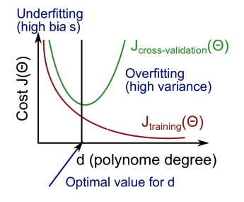
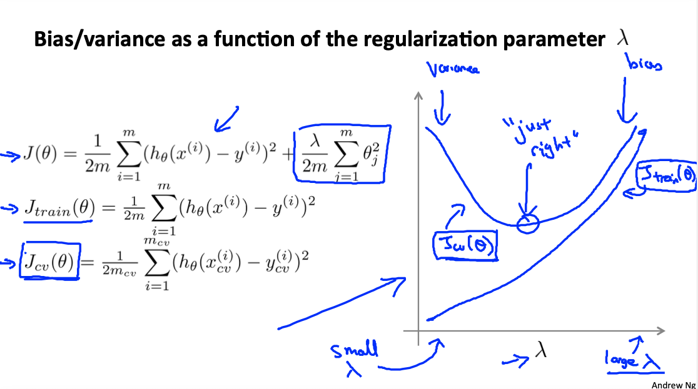
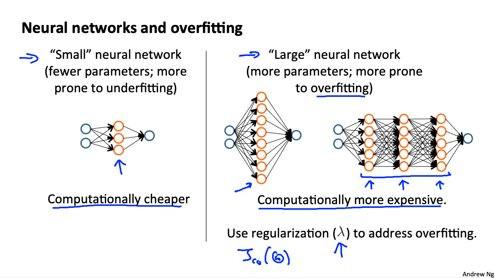
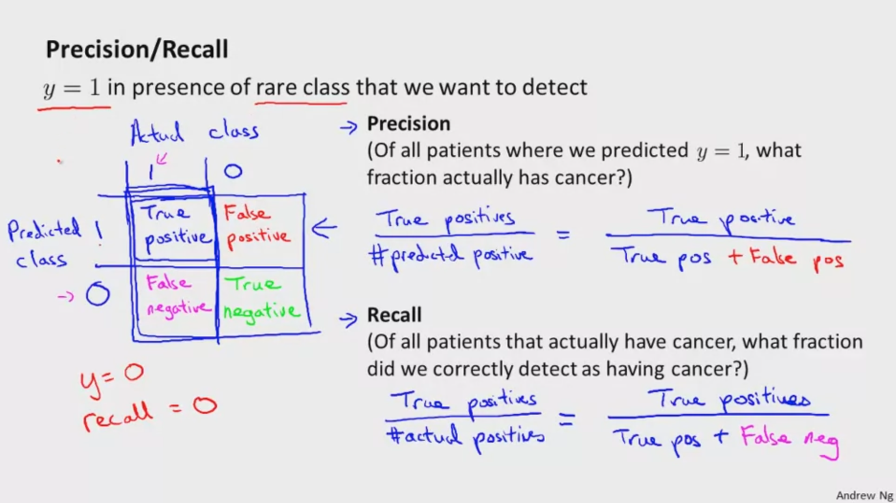

# Mechine Learning: Application Advice and System Design

These are my notes on the Coursera course by Andrew Ng ["Machine Learning"](https://www.coursera.org/learn/machine-learning).

For setup and general information, please look at `../README.md`.

This file my notes related to the topics of **application advice** and **system design**.

Note that Latex formulae are not always rendered in Markdown readers; for instance, they are not rendered on Github, but they are on VS Code with the Markup All In One plugin.
Therefore, I provide a pseudocode of the most important equations.
An alternative would be to use Asciidoc, but rendering of equations is not straightforward either.

Overview of contents:

1. Evaluating a Learning Algorithm: Train / Test / Cross-Validation Splits
   - 1.1 Evaluating a Hypothesis: Train/Test Splits
   - 1.2 Model Selection: Train/Validation/Test Splits
2. Bias vs. Variance = Underfitting vs. Overfitting
   - 2.1 Diagnosing Bias vs. Variance = Underfitting vs. Overfitting
   - 2.2 Regularization and Bias/Variance
   - 2.3 Learning Curves
   - 2.4 What Should We Do to Improve Our Model?
     - 2.4.1 Particular Case: Neural Networks
3. Exercise 5 (Week 6): Octave Code Summary

## 1. Evaluating a Learning Algorithm: Train / Test / Cross-Validation Splits

Let's consider a ML model/algorithm with its hyperparameters, e.g., linear regression. Imagine we that when we test our hypothesis on a new set of houses we get unacceptably large errors. What should we tray next? There are several options available; we should use techniques that help us which one we should choose and rule out, not just follow our gut feeling. Those techniques might be time consuming to implement, but they really pay off.

List of possible actions to consider in order to improve our model:

- Get more training examples; however, that not always helps, and it is in any case very expensive
- Try smaller sets of features
- Try getting additional features? That is not always correct.
- Try adding polynomial features?
- Try changing the regularization parameter `lambda`: increase/decrease?

**Machine Learning Diagnostics** helps choosing the actions that would work: we get insight on what is/isn't working on our model and how to improve performance.

### 1.1 Evaluating a Hypothesis: Train/Test Splits

Overfitting and underfitting are common issues in the model or hypothesis function. In particular, overfitting happens when we learn the noise and even though the loss or error of our cost function is small, we cannot generalize, because the model has learnt nonsensical holes and curves to better fit the data.

Unfortunately, we have often too many features to plot the model and see whether we have too much holes and curves which are overfitting the data.

To overcome that, we split the dataset in two sets: **training** and **test**; usual proportions are training `70%` & test `30%`, and the examples must be randomly selected (e.g., shuffle the examples and select first 70%). We note:

- `m` is decreased to the `70%` of its original value.
- `m_test`: new number for all samples taken for testing.

The training & testing procedure happens in parallel as follows:
- Learn the parameters `theta` for the train split minimizing `J`
- Compute test split error `J_test` with the learned parameter `theta`
- Repeat

Note that the formulas are basically the same, only the examples are different. However:

- Regularization is used on the train split for training, not on the test split for evaluating; in general, note that the regularization term makes sense only for the computation of the gradient, not for the evaluation of the cost/error.
- For classification cases, instead of `J_test`, the **accuracy** can be computed: `Accuracy = percentage of correct predictions`.

If we have overfitting, when `J` decreases, `J_test` will increase and `Accuracy` will decrease, because we fail to generalize!

### 1.2 Model Selection: Train/Validation/Test Splits

Model Selection consists in hyperparameter definition. Some examples:
- Regularization factor `lambda`
- Degree of model polynomial `d`

Let's consider the model polynomial degree in linear regression:

$h(x) = \theta_0 + \theta_1 x + \theta_2 x^{2} + ... \theta_d x^{d}$

Which degree $d$ yields the best results?

To answer those type of questions, the dataset is split in three parts:

- Traning (typically 60%)
- Cross-Validation (typically 20%)
- Test (typically 20%)

Then, for each split we compute the error `J`, following the same notes as in the train/test split. The procedure is as follows:

- We train/fit our models with different degrees `d`: a parameter vector `theta` is obtained for each `d`.
- We compute the cross-validation error `J_cv` for each `theta` vector associated with a `d`. We select the model with the `d` that leads to the lowest `J_cv`
- We compute the test error of that model: `J_test`

Having a separate split for model (hyper) parameter selection is essential. We cannot use the test split for doing that: we would take the model with the lowest test error and of course it would have the lowest test error; we want to select the best model (hyper) parameter and evaluate its test error!

If we are selecting model (hyper) parameters, do not use the test split for that, use the cross-validation set! **Note that we are fitting the selected (hyper) parameter (`d`, in our example) to the cross-validation set. We cannot use the same split we use for fitting for evaluating! Additionally, since we are fitting the model (hyper) parameter to the cross-validation split, we expect `J_cv < J_test` with the selected final model.**

## 2. Bias vs. Variance = Underfitting vs. Overfitting

Definition of bias and variance:

- **High bias happens when we are underfitting.**
- **High variance happens when we are overfitting.**

So don't get confused; use them as synonims! high bias = underfitting, high variance = overfitting.
### 2.1 Diagnosing Bias vs. Variance = Underfitting vs. Overfitting

Let's consider the same example as before: we are trying to choose the best degree of the linear regression polynomial: `d`. We have these two extremes:

- For low values of `d` we expect underfitting, i.e., high bias. This is linked to
  - high `J`
  - and high `J_cv` or `J_test`.
- For high values of `d` we expect overfitting, i.e., high variance. This is linked to
  - low `J`
  - high `J_cv` or `J_test`.

Where is the sweet spot? We just plot both as we increase `d`



In other words, by computing `J` and `J_cv` for different model (hyper) parameters, we know whether:

- We are underfitting (`J` high, `J_cv` high)
- We are overfitting (`J` low, `J_cv` high)
- We are just doing right (`J` low, `J_cv` low)

### 2.2 Regularization and Bias/Variance

Regularization prevents overfitting. How does it affect the bias & variance?

- High values of `lambda` cause the parameters to become very small: we fit a horizontal line = underfitting = high bias.
  - High `J_train`
  - High `J_cv`
- Low values of `lambda` do not penalize the parameters enough, so we end up with large terms of high degrees, yielding curvy models = overfitting = high variance.
  - Low `J_train`
  - High `J_cv`

This example is equivalent to the model selection relative to the degree `d`. However, with regularization, the following changes:

- We define `J_train` as an evaluation measurement, which is `J` without the regularization term; `J_train` is computed with the training split, `J_cv` with the cross-validation split and `J_test` with the test split.
- The diagrams and the low/high cases change, but they can be derived following the same logic.

The procedure for the optimal `lambda` selection is the same:

- Optimize the model with different values of `lambda` using `J`; we obtain `theta` for each `lambda`. Suggested `lambda = 0.01, 0.01*2, 0.01*2^2, 0.01*2^3`: 12 values approximately.
- Compute `J_train` and `J_cv` for each `lambda`. Pick the `lambda` with smallest `J_cv`. We have fitted `lambda` to the cross-validation split
- Compute `J_test` for the final selected model. That is our test error.
- Optionally, we can plot `J_train`, `J_cv` as function of `lambda`.



### 2.3 Learning Curves

We should always plot learning curves: `J_train` and `J_cv` as function of `m` or training examples. Basically, we train/fit our model for different numbers of examples and compute the `J_train` and `J_cv`. That is in practice very similar mini-batch gradient descent, as I understand; in that case, we'd plot the `J_train` and `J_cv` as function of the number of trained batches. However, I think here Ng refers to the fact that we perform the whole training (several epochs) with different amounts of examples `m` each time. In that case, it makes sense to have increasing `J_train` values.

In general:

- For low numbers of `m`:
  - `J_train` will be low, because the model perfectly fits the few examples
  - `J_cv`will be large, because we completely lack of generalization
- For large values of `m`, `J` should decrease with larger values of `m`.
  - `J_train` will be larger, because the model tries to fit more (diverse) examples; generalization has a cost
  - `J_cv` will be smaller, because we are starting to have a more generalizable model

However, the diagrams differ in each of these cases:

- When underfitting (high bias), `J_train` & `J_cv` converge very fast in a high value; the desired error would be below their convergence asymptote. **It does not matter if we add more examples, the model is too simplistic!** Note that both curves should converge, but not very fast; very fast converging is a sign of underfitting.
- When overfitting (high variance), `J_train` & `J_cv` converge very slowly, it seems as if there is a large gap between them. **If we add more examples, errors will decrease, but we cannot generalize properly.**


### 2.4 What Should We Do to Improve Our Model?

Again, list of possible actions to consider in order to improve our model:

- Get more training examples: fixes high variance (= overfitting); however, if we have high bias (= underfitting), it won't help at all.
- Try smaller sets of features: fixes high variance (= overfitting)
- Try getting additional features: fixes high bias (= underfitting)
- Try adding polynomial features: fixes high bias (= underfitting)
- Try decreasing `lambda`: fixes high bias (= underfitting)
- Try increasing `lambda`: fixes high variance (= overfitting)

Note that before doing anything, we need to know in which situation we are: high bias/variance; that is discovered following the methods explained in sections 1 & 2:

- Dataset splits: train / cross-validation / test
- Compute `J` for each split, specially `J_train` and `J_cv`
  - With varying hyperparameters: `degree`, `lambda`
  - With varying number of examples used for training

#### 2.4.1 Particular Case: Neural Networks

We can decide the architecture, i.e., the connectivity pattern, of a neural network. That architecture can have an impact on the bias/variance of our model:

- Small networks tend to be more simplistic: higher bias = underfitting; they are cheaper to compute.
- Larger networks tend to be more complex: higher variance = overfitting; they are more expensive to compute.

With larger networks, we should always apply regularization to prevent overfitting. Another question is related to the layers:

- Few layers with many hidden units/neurons? Note that using a single hidden layer has been often the default.
- Or more hidden layers with less units/neurons?

One possible approach to answer that question is to define hyperparameters: (1) number of units, (2) number of hidden layers. Then, we compute `J_train`, `J_cv`, `J_test` as with the other hyperparameters varied (`degree`, `lambda`) and select the design option with the smallest `J_cv`.



## 3. Exercise 5 (Week 6): Octave Code Summary

In this exercise, regularized linear regression is implemented to study models with different bias-variance properties.

Files provided by Coursera, located under `../exercises/ex1-ex8-octave/ex5`

- `ex5.m` - Octave/MATLAB script that steps you through the exercise
- `ex5data1.mat` - Dataset
- `submit.m` - Submission script that sends your solutions to our servers
- `featureNormalize.m` - Feature normalization function
- `fmincg.m` - Function minimization routine (similar to `fminunc`)
- `plotFit.m` - Plot a polynomial fit
- `trainLinearReg.m` - Trains linear regression using your cost function

Files to complete:

- `linearRegCostFunction.m` - Regularized linear regression cost function
- `learningCurve.m` - Generates a learning curve
- `polyFeatures.m` - Maps data into polynomial feature space
- `validationCurve.m` - Generates a cross validation curve

Workflow:

- Download latest Octave version of exercise from Coursera
- Complete code in exercise files following `ex5.pdf`
- Whenever an exercise part is finished
  - Check it with `ex5` in Octave terminal
  - Create a submission token on Coursera (exercise submission page, it lasts 30 minutes)
  - Execute `submit` in Octave terminal
  - Introduce email and token
  - Results appear

**Overview of contents:**

0. Setup: `gnuplot`
1. Dataset Loading & Visualization
2. Regularized Linear Regression
    - 2.1 Regularized Linear Regression: Cost Function & Gradient -- `linearRegCostFunction.m`
    - 2.2 Train and Plot Fitted Line -- `trainLinearReg.m`
3. Bias-Variace
    - 3.1 Learning Curves -- `learningCurve.m`
4. Polynomial Regression
    - 4.1 Polynomial Model -- `polyFeatures.m`
    - 4.2 Learning Polynomial Regression
    - 4.3 Selecting lambda Usig a Cross-Validation Set -- `validationCurve.m`

```octave

%% -- Regularized Linear Regression: Cost Function & Gradient -- linearRegCostFunction.m

function [J, grad] = linearRegCostFunction_(X, y, theta, lambda)
    % Number of training examples
    m = length(y); 
    % Init return variables
    J = 0;
    grad = zeros(size(theta));
    
    % Cost (without regularization)
    h = X*theta; % (m x (n+1)) x ((n+1) x 1) -> m x 1
    e = (h - y); % m x 1
    J = (0.5/m) * (e'*e);
    % Regularization term
    t = theta(2:end,:); % n x 1
    J = J + ((0.5*lambda/m) * (t'*t));
    
    % Gradient (without regularization)
    grad = (1/m) * (e'*X); % (1 x m) x (m x (n+1)) -> 1 x (n+1)
    % Regularization term
    r = (lambda/m) * theta(2:end,1); % n x 1
    grad = grad' + [0; r];
    
    % Column vector
    grad = grad(:);
end

theta = ones(size(X,2)+1,1); % (n+1) x 1
Xp = [ones(size(X,1),1), X]; % m x (n+1)
lambda = 1;
[J, grad] = linearRegCostFunction_(Xp, y, theta, lambda);

%% -- Train and Plot Fitted Line -- trainLinearReg.m

function [theta] = trainLinearReg_(X, y, lambda)
    initial_theta = zeros(size(X, 2), 1); 
    % Create "short hand" for the cost function to be minimized
    costFunction = @(t) linearRegCostFunction(X, y, t, lambda);
    % Now, costFunction is a function that takes in only one argument
    options = optimset('MaxIter', 200, 'GradObj', 'on');
    % Minimize using fmincg
    theta = fmincg(costFunction, initial_theta, options);
end

lambda = 0;
[theta] = trainLinearReg_([ones(m, 1) X], y, lambda);

plot(X, y, 'rx', 'MarkerSize', 10, 'LineWidth', 1.5);
xlabel('Change in water level (x)');
ylabel('Water flowing out of the dam (y)');
hold on;
x = linspace(min(X(:)),max(X(:)),50)';
plot(x, [ones(size(x,1), 1) x]*theta, '--', 'LineWidth', 2)
hold off;

%% -- Bias & Variance: Learning Curves -- learningCurve.m

function [error_train, error_val] = learningCurve_(X, y, Xval, yval, lambda)
    % Number of training examples
    % Also number of errors computed
    % X(1), X(1:2), X(1:3), ..., X(1:m): m errors with increasing number of examples used
    m = size(X, 1);

    % Init retun variables
    % error_train(i) must be computed using the theta obtained after training with i examples
    % error_val(i) must be obtained using the same theta by evaluating THE COMPLETE CV SPLIT!
    error_train = zeros(m, 1); % J_train
    error_val   = zeros(m, 1); % J_cv

    for k = 1:m
        % Fit theta with k examples WITH regularization
        [theta] = trainLinearReg([ones(k, 1) X(1:k,:)], y(1:k), lambda);
        % Compute J_train, without regularization, because we want the real error
        [J_train, grad] = linearRegCostFunction([ones(k, 1) X(1:k,:)], y(1:k), theta, 0);
        % Compute J_cv with entire CV split, because we want the real error
        [J_cv, grad] = linearRegCostFunction([ones(size(Xval,1), 1) Xval], yval, theta, 0);
        % Store the errors/costs
        error_train(k) = J_train;
        error_val(k) = J_cv;
    end
end

lambda = 0;
[error_train, error_val] = learningCurve_(X, y, Xval, yval, lambda);

plot(1:m, error_train, 1:m, error_val);
title('Learning curve for linear regression')
legend('Train', 'Cross Validation')
xlabel('Number of training examples')
ylabel('Error')
axis([0 13 0 150])

%% -- Polynomial Regression: Model -- polyFeatures.m

function [X_poly] = polyFeatures_(X, p)
    X_poly = zeros(numel(X), p);
    for i = 1:p
        X_poly(:,i) = X.^i;
    end
end

function [X_norm] = applyNormalization(X, mu, sigma)
    X_norm = zeros(size(X));
    for i = 1:size(X,2)
        X_norm(:,i) = (X(:,i).-mu(1,i))./sigma(1,i);
    end
end

function [X_norm, mu, sigma] = featureNormalize_(X)
    mu = mean(X);
    sigma = std(X);
    %X_norm = bsxfun(@minus, X, mu);
    %X_norm = bsxfun(@rdivide, X_norm, sigma);
    X_norm = applyNormalization(X, mu, sigma);
end

%% -- Learning Polynomial Regression

p = 8;
X_poly = polyFeatures(X, p);
[X_poly, mu, sigma] = featureNormalize(X_poly);
X_poly = [ones(m, 1), X_poly];
% Map X_poly_test and normalize (using mu and sigma)
X_poly_test = polyFeatures(Xtest, p);
X_poly_test = applyNormalization(X_poly_test, mu, sigma);
X_poly_test = [ones(size(X_poly_test, 1), 1), X_poly_test];
% Map X_poly_val and normalize (using mu and sigma)
X_poly_val = polyFeatures(Xval, p);
X_poly_val = applyNormalization(X_poly_val, mu, sigma);
X_poly_val = [ones(size(X_poly_val, 1), 1), X_poly_val];

lambda = 1;
[theta] = trainLinearReg(X_poly, y, lambda);

figure(1);
plot(X, y, 'rx', 'MarkerSize', 10, 'LineWidth', 1.5);
plotFit(min(X), max(X), mu, sigma, theta, p);
xlabel('Change in water level (x)');
ylabel('Water flowing out of the dam (y)');
title (sprintf('Polynomial Regression Fit (lambda = %f)', lambda));

%% -- Selecting lambda Usig a Cross-Validation Set -- validationCurve.m

function [lambda_vec, error_train, error_val] = validationCurve_(X, y, Xval, yval)

    % Selected values of lambda (you should not change this)
    lambda_vec = [0 0.001 0.003 0.01 0.03 0.1 0.3 1 3 10]';

    % Init retun variables
    % error_val(i) must be obtained using the same theta by evaluating THE COMPLETE CV SPLIT!
    error_train = zeros(length(lambda_vec), 1); % J_train
    error_val = zeros(length(lambda_vec), 1); % J_cv

    for k = 1:length(lambda_vec)
        lambda = lambda_vec(k);
        % Fit theta with k examples WITH regularization
        theta = trainLinearReg(X, y, lambda);
        % Compute J_train, without regularization, because we want the real error
        [J_train, grad] = linearRegCostFunction(X, y, theta, 0);
        % Compute J_cv with entire CV split, because we want the real error
        [J_cv, grad] = linearRegCostFunction(Xval, yval, theta, 0);
        % Store the errors/costs
        error_train(k) = J_train;
        error_val(k) = J_cv;
    end

end

[lambda_vec, error_train, error_val] = validationCurve_(X_poly, y, X_poly_val, yval);

plot(lambda_vec, error_train, lambda_vec, error_val);
legend('Train', 'Cross Validation');
xlabel('lambda');
ylabel('Error');

```

## 4. Machine Learning System Design with A Case: Building a Spam Classifier

### 4.1 Prioritizing What to Work On

We want to build an email spam classifier, as follows:

- `X`: features of emails. Choose most frequent `N` words and set an `N`-dimensional vector or `0/1` that encodes whether each word appears in the email or not. `N` is set to 50,000 in practice. We can also select a subset of the `N` words which we consider to be key: our name, buy, deal, discount, etc.
- `y` is `1` is spam, `0` if not.

Which strategies should we consider to improve the spam classifier?

- **Collects lots of data**; but that do not work always
- Developed **more sophisticated features**; e.g., use email header routing information: spam emails try to hide origin
- Look at the text and try to **extract more features**:
  - Is "discount" the same as "Discount"? Punctuation?
  - Detect misspellings: spam emails try to hide keywords to pass unperceived: w4atches, m0rtgage, med1cine...

These strategies don't always work! We need to brainstorm similar ideas for each problem and analyze them!

### 4.2 Error Analysis

Recommended approach:

- Start with a simple algorithm that can be implemented in one day.
- Plot learning curves (`J_train`, `J_cv`): we see if we need more data or more features
- Error analysis: manually example examples from the cross-validation set that the algorithm is making errors with; identify trends, patterns. For example
  - Try to understand the type of misclassified emails: pharma, replica, stolen pw, other?
  - Extract characteristic features (brainstormed strategies):
    - Deliberate misspellings
    - Unusual email routing
    - Unusual punctuation

Note that the cross-validation split is used because we are detecting features that would decrease the error. If we use `J_test`, then we cannot really independently evaluate whether the new features improve our model.

It is fundamental to define an error metric (`J_cv`, `accuracy`) and check how it changes when new features/strategies are implemented:

- In NLP stemming is performed: discount = dicounts = discounted; but it sometimes is not effective; we need to test it! Just compute the metric with and without stemming.
- Should be us only non-capitalized words? Test it.

In summary:

- We build a quick and dirty version
- Plot learning curves to decide if we need more examples (fixe high variance) or more features (fix high bias).
- Manually check errors; the errors help us understand which features we really need to detect.
- We define metrics and try our new strategies to see if they improve these metrics.

## 5. Handling Skewed Data

Skewed data is characterized by data which has imbalanced classes: there is much more examples of one class compared to others. In consequence, the `Accuracy` metric is not enough, being

`Accuracy = Correct Predictions / All Predictions`.

Example of why that is so: We develop an algorithm that tells with `99% accuracy` (on the test set) if a patient has cancer. However, note that only `0.5%` of the patients have cancer. Then, the following algorithm already has a better accuracy of `100-0.5 = 99.5%`:

```octave
function h = predict(x)
  h = 0; % ignore x!
end
```

Thus, in cases with skewed data, it is essential to compute some other metrics: **Precision** and **Recall**.

### 5.1 Error Metrics for Skewed Classes: Precision & Recall

In the figure, we see a **confusion matrix**: Actual values vs Predicted values, compiling the numbers of true/false positives/negatives. Note that the matrix is built considering **`y = 1` for the rare case we want to detect**.



We define:

- `Precision (Predicted row) = True Positives / Predicted Positive = TP / (TP + FP)`
- `Recall (Actual row) = True Positives / Actual Positive = TP / (TP + FN)`

In skewed datasets, we need to have high `Precision` and `Recall` scores to have a good model, high `Accuracy` is not enough.

Note that if we have 2 classes, the confusion matrix is `2 x 2`; if `N` classes, `N x N`.

Also, see:

- [Sensitivity](https://en.wikipedia.org/wiki/Sensitivity_and_specificity) = `Recall` = `True Positives / (True Positives + False Negatives)`
- [Specificity](https://en.wikipedia.org/wiki/Sensitivity_and_specificity) = `True Positives / Actual False Negatives` = `True Positives / (True Negatives + False Positives)`
- [F1-Score](https://en.wikipedia.org/wiki/F-score) = `2 * (Precision * Recall) / (Precision + Recall)`
- Type I & Type II errors, `alpha` & `beta`.

### 5.2 Trading Off Precision and Recall

Precision and Recall seem to be at odds, but they can be optimized jointly:
- `Precision, P`: favours not to be an alarmist -- it accounts for correctly detected true positives (patients that are told that have cancer, who really have cancer).
- `Recall, R`: favours to be an alarmist, thus, more conservative -- it accounts for the false negatives (patients with cancer that would be told that they have no cancer).

We can have a unifying metric called `F1-Score`, which is the one we should try to optimize:

`F1-Score = 2 * (P*R) / (P+R)` `in [0,1]` (harmonic mean of both, so that cases like `P=1,R=0` have value `0` and not `0.5`, as they would with the arithmetic mean).

We can optimize that score by setting our threshold: `h(x) > threshold -> 1; 0 otherwise`.
Typically: `threshold = 0.5`, but

- if we increase `threshold`, we become more conservative: higher `R`, lower `P`
- if we decrease `threshold`, we become less conservative: higher `P`, lower `R`

The strategy is the following: We vary our `threshold` from low (e.g., `0.1`) to high (e.g., `0.9`) and compute the `Precision`, `Recall` and `F1-Score` on the **cross-validation set**; we pick the `threshold` that gives the highest `F1-Score`