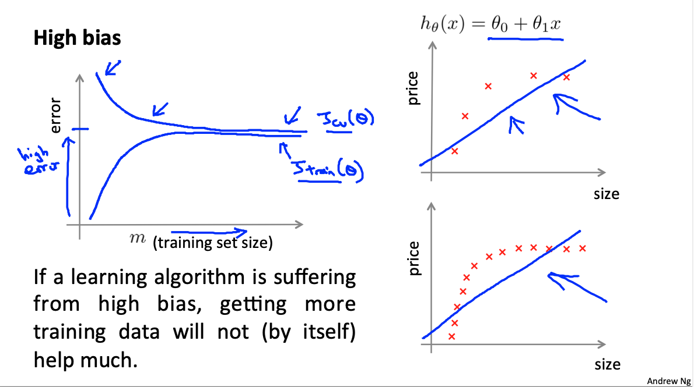
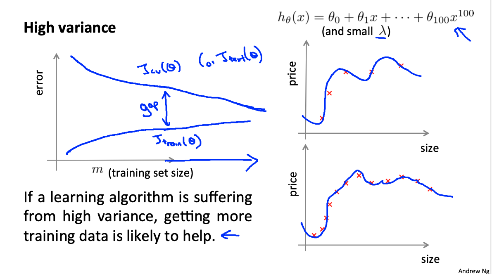

# Mechine Learning: Application Advice and System Design

These are my notes on the Coursera course by Andrew Ng ["Machine Learning"](https://www.coursera.org/learn/machine-learning).

For setup and general information, please look at `../README.md`.

This file my notes related to the topics of **application advice** and **system design**.

Note that Latex formulae are not always rendered in Markdown readers; for instance, they are not rendered on Github, but they are on VS Code with the Markup All In One plugin.
Therefore, I provide a pseudocode of the most important equations.
An alternative would be to use Asciidoc, but rendering of equations is not straightforward either.

Overview of contents:

1. Evaluating a Learning Algorithm: Train / Test / Cross-Validation Splits
   - 1.1 Evaluating a Hypothesis: Train/Test Splits
   - 1.2 Model Selection: Train/Validation/Test Splits
2. Bias vs. Variance

## 1. Evaluating a Learning Algorithm: Train / Test / Cross-Validation Splits

Let's consider a ML model/algorithm with its hyperparameters, e.g., linear regression. Imagine we that when we test our hypothesis on a new set of houses we get unacceptably large errors. What should we tray next? There are several options available; we should use techniques that help us which one we should choose and rule out, not just follow our gut feeling. Those techniques might be time consuming to implement, but they really pay off.

List of possible actions to consider in order to improve our model:

- Get more training examples; however, that not always helps, and it is in any case very expensive
- Try smaller sets of features
- Try getting additional features? That is not always correct.
- Try adding polynomial features?
- Try changing the regularization parameter `lambda`: increase/decrease?

**Machine Learning Diagnostics** helps choosing the actions that would work: we get insight on what is/isn't working on our model and how to improve performance.

### 1.1 Evaluating a Hypothesis: Train/Test Splits

Overfitting and underfitting are common issues in the model or hypothesis function. In particular, overfitting happens when we learn the noise and even though the loss or error of our cost function is small, we cannot generalize, because the model has learnt nonsensical holes and curves to better with the data.

Unfortunately, we have often too many features to plot the model and see whether we have too much holes and curves which are overfitting the data.

To overcome that, we split the dataset in two sets: **training** and **test**; usual proportions are training `70%` & test `30%`, and te examples must be randomly selected (e.g., shuffle the examples and select first 70%). We note:

- `m` is decreased to the `70%` of its original value.
- `m_test`: new number for all samples taken for testing.

The training & testing procedure happens in parallel as follows:
- Learn the parameters `theta` for the train split minimizing `J`
- Compute test split error `J_test` with the learned parameter `theta`
- Repeat

Note that the formulas are basically the same, only the examples are different. However:

- Regularization is used on the train split for training, not on the test split for evaluating; in general, note that the regularization term makes sense only for the computation of the gradient, not for the evaluation of the cost/error.
- For classification cases, instead of `J_test`, the **accuracy** can be computed: `Accuracy = percentage of correct predictions`.

If we have overfitting, when `J` decreases, `J_test` will increase and `Accuracy` will decrease, because we fail to generalize!

### 1.2 Model Selection: Train/Validation/Test Splits

Model Selection consists in hyperparameter definition. Some examples:
- Regularization factor `lambda`
- Degree of model polynomial `d`

Let's consider the model polynomial degree in linear regression:

$h(x) = \theta_0 + \theta_1 x + \theta_2 x^{2} + ... \theta_d x^{d}$

Which degree $d$ yields the best results?

To answer those type of questions, the dataset is split in three parts:

- Traning (typically 60%)
- Cross-Validation (typically 20%)
- Test (typically 20%)

Then, for each split we compute the error `J`, following the same notes as in the train/test split. The procedure is as follows:

- We train/fit our models with different degrees `d`: a parameter vector `theta` is obtained for each `d`.
- We compute the cross-validation error `J_cv` for each `theta` vector associated with a `d`. We select the model with the `d` that leads to the lowest `J_cv`
- We compute the test error of that model: `J_test`

Having a separate split for model (hyper) parameter selection is essential. We cannot use the test split for doing that: we would take the model with the lowest test error and of course it would have the lowest test error; we want to select the best model (hyper) parameter and evaluate its test error!

If we are selecting model (hyper) parameters, do not use the test split for that, use the cross-validation set! **Note that we are fitting the selected (hyper) parameter (`d`, in our example) to the cross-validation set. We cannot use the same split we use for fitting for evaluating! Additionally, since we are fitting the model (hyper) parameter to the cross-validation split, we expect `J_cv < J_test` with the selected final model.**

## 2. Bias vs. Variance = Underfitting vs. Overfitting

Definition of bias and variance:

- **High bias happens when we are underfitting.**
- **High variance happens when we are overfitting.**

So don't get confused; use them as synonims! high bias = underfitting, high variance = overfitting.
### 2.1 Diagnosing Bias vs. Variance = Underfitting vs. Overfitting

Let's consider the same example as before: we are trying to choose the best degree of the linear regression polynomial: `d`. We have these two extremes:

- For low values of `d` we expect underfitting, i.e., high bias. This is linked
  - high `J`
  - and high `J_cv` or `J_test`.
- For high values of `d` we expect overfitting, i.e., high variance. This is linked to
  - low `J`
  - high `J_cv` or `J_test`.

Where is the sweet spot? We just plot both as we increase `d`

In other words, by computing `J` and `J_cv` for different model (hyper) parameters, we know whether:

- We are underfitting (`J` high, `J_cv` high)
- We are overfitting (`J` low, `J_cv` high)
- We are just doing right (`J` low, `J_cv` low)

### 2.2 Regularization and Bias/Variance

Regularization prevents overfitting. How does it affect the bias & variance?

- High values of `lambda` cause the parameters to become very small: we fit a horizontal line = underfitting = high bias.
  - High `J_train`
  - High `J_cv`
- Low values of `lambda` do not penalize the parameters enough, so we end up with large terms of high degrees, yielding curvy models = overfitting = high variance.
  - Low `J_train`
  - High `J_cv`

This example is equivalent to the model selection relative to the degree `d`. However, with regularization, the following changes:

- We define `J_train` as an evaluation measurement, which is `J` without the regularization term; `J_train` is computed with the training split, `J_cv` with the cross-validation split and `J_test` with the test split.
- The diagrams and the low/high cases change, but they can be derived following the same logic.

The procedure for the optimal `lambda` selection is the same:

- Optimize the model with different values of `lambda` using `J`; we obtain `theta` for each `lambda`. Suggested `lambda = 0.01, 0.01*2, 0.01*2^2, 0.01*2^3`: 12 values approximately.
- Compute `J_train` and `J_cv` for each `lambda`. Pick the `lambda` with smallest `J_cv`. We have fitted `lambda` to the cross-validation test
- Compute `J_test` for the final selected model. That is our test error.
- Optionally, we can plot `J_train`, `J_cv` as function of `lambda`.

### 2.3 Learning Curves

We should always plot learning curves: `J_train` and `J_cv` as function of `m` or training examples. Basically, we train/fit our model for different numbers of examples and compute the `J_train` and `J_cv`. That is in practice very similar mini-batch gradient descent, as I understand; in that case, we'd plot the `J_train` and `J_cv` as function of the number of trained batches.

In general:

- For low numbers of `m`:
  - `J_train` will be low, because the model perfectly fits the few examples
  - `J_cv`will be large, because we completely lack of generalization
- For large values of `m`, `J` should decrease with larger values of `m`.
  - `J_train` will be larger, because the model tries to fit more (diverse) examples; generalization has a cost
  - `J_cv` will be smaller, because we are starting to have a more generalizable model

However, the diagrams differ in each of these cases:

- When underfitting (high bias), `J_train` & `J_cv` converge very fast in a high value; the desired error would be below their convergence asymptote. **It does not matter if we add more examples, the model is too simplistic!** Note that both curves should converge, but not very fast; very fast converging is a sign of underfitting.
- When overfitting (high variance), `J_train` & `J_cv` converge very slowly, it seems as if there is a large gap between them. **If we add more examples, errors will decrease, but we cannot generalize properly.**

### 2.4 What Should We Do?

