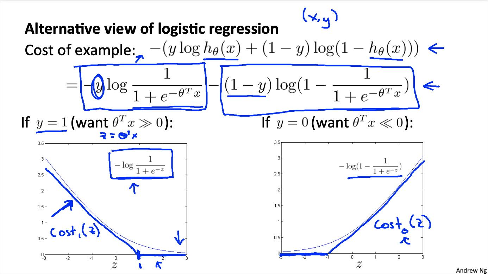

# Machine Learning: Support Vector Machines

These are my notes on the Coursera course by Andrew Ng ["Machine Learning"](https://www.coursera.org/learn/machine-learning).

For setup and general information, please look at `../README.md`.

This file my notes related to **support vector machines**.

Note that Latex formulae are not always rendered in Markdown readers; for instance, they are not rendered on Github, but they are on VS Code with the Markup All In One plugin.
Therefore, I provide a pseudocode of the most important equations.
An alternative would be to use Asciidoc, but rendering of equations is not straightforward either.

Overview of contents:

1. Large Margin Classification
   - 1.1 Optimization Objective
   - 1.2 Large Margin Classifier
     - 1.2.1 Re-Writing the Cost Function
2. Kernels: Non-Linear Complex Classifier

## 1. Large Margin Classification

Support Vector Machines (SVM) are widely used. They provide a clean answer in supervised learning.
SVMs can be used for classification and regression.

### 1.1 Optimization Objective

The cost function of the SVMs is similar to the one in logistic regression, but some changes are applied:

1. Instead of using the continuous `-log(h(x))`, a rectified linear function is used which resembles the decaying cost; that function is called
   - `cost_1`, for the case $y = 1$, i.e., `-log(h(x))` and
   - `cost_0`, for the case $y = 0$, i.e., `-log(1-h(x))`;
   - later on we will see how this function is defined more precisely.
2. The normalizing factor $m$ is removed for later simplifications; i.e., that is equivalent as to multiplying the minimization function by $m$, which does not change the minimum point.
3. The regularization happens by scaling the real cost, not the weight term; thus, we multiply the cost term/part with the factor `C`, and the weight term/part with nothing. In practice, this is the same as multiplying the complete function with `C = 1 / lambda`.
   - For logistic regression, we had: `A + lambda*B`;
   - Now we have: `C*A + B`, with `C = 1 / labmda`.

So:

The **logistic regression cost minimization function**:

$J(\theta) = - \frac{1}{m} \sum_{i=1}^{m} y^{(i)}\log ( h(x^{(i)}) ) + (1 - y^{(i)}) \log (1 - h(x^{(i)})) + \frac{\lambda}{2 m} \sum_{j = 1}^{n}{\theta_{j}^{2}}$

$h(x) = g(\theta^{T}x) = \frac{1}{1 + e^{-\theta^T x}}$


```
J = -(1/m) * sum(y*log(h(x)) + (1 - y)*log(1 - h(x))) + (lambda/(2m)) * sum(j=1:n,theta_j^2)
```
```
h(x) = g(t * x) = 1 / (1 + exp(-t * x))
```

The **support vector machine cost minimization function**:

$J(\theta) = - C \sum_{i=1}^{m} y^{(i)}\textrm{cost}_1(\theta^{T}x^{(i)}) + (1 - y^{(i)}) \textrm{cost}_0(\theta^{T}x^{(i)}) + \frac{1}{2} \sum_{j = 1}^{n}{\theta_{j}^{2}}$

$\textrm{cost}_1(z) = \max (0,-m_1 z -1)$, $m_1$ unimportant, e.g.  $m_1 = 1$

$\textrm{cost}_0(z) = \max (0,m_0 z + 1)$, $m_0$ unimportant, e.g.  $m_0 = 1$

```
J = -C * sum(y*cost_1(t*x) + (1 - y)*cost_0(t*x)) + (1/2) * sum(j=1:n,theta_j^2)
```

For both logistic regression and SVM, the hypothesis or model function should yield:

```
h(x) = {1 if theta*x >= 0, 0 otherwise}
```



### 1.2 Large Margin Classifier

Sometimes SVMs are called large margin classifiers. The reason for that is that we do the following with them:

- We have a classification problem in a feature space with examples of different classes.
- With SVM decision boundaries are defined such that the margin or distance from the decision boundary to the cluster of feature points is maximized.


In the following, it is shown how that can be achieved.

#### 1.2.1 Re-Writing the Cost Function

Note that the `cost(z = theta*x) = 0` if `theta*x` is beyond a threshold:

$\textrm{cost}_1(\theta^{T}x) = \max (0, \theta^{T}x -1)$, $m_1 = 1$ (unimportant the value, since we'll use only the case it yields 0)

$\textrm{cost}_0(\theta^{T}x) = \max (0, \theta^{T}x + 1)$, $m_0 = 1$ (unimportant the value, since we'll use only the case it yields 0)

In other words:

$\theta^{T}x \geq 1$ if $y = 1$

$\theta^{T}x \leq 1$ if $y = 0$


By choosing a very large `C` constant value (recall `C` can be understood as `1/lambda`), we force the term in `J` related to the cost to become very small, or more precisely, to be `0` due to the properties or definition of the `cost(z)` functions:

$\sum_{i=1}^{m} y^{(i)}\textrm{cost}_1(\theta^{T}x^{(i)}) + (1 - y^{(i)}) \textrm{cost}_0(\theta^{T}x^{(i)}) = 0$


Thus, the **minimization function can be rewritten as a constrained minimization**:


$\min \frac{1}{2} \sum_{j = 1}^{n}{\theta_{j}^{2}}$
$\textrm{s.t.}$
$\theta^{T}x^{(i)} \geq 1$ if $y^{(i)} = 1$
$\theta^{T}x^{(i)} \leq 1$ if $y^{(i)} = 0$

```
min( 0.5 * sum(theta_j^2) )
theta*x_i >= 1 if y_i = 1
theta*x_i <= 1 if y_i = 0
```

Now, consider these observations:

- A scalar product is the projection of a vectors.
- The boundary $\theta^{T}x = 0$ has the perpendicular vector $\theta$.
- If $\theta_0 = 0$, the boundary passes through 0

With these observations, **the cost minimization function can be rewritten again to contain the projection margins**:


$\min \frac{1}{2} \Vert \theta \Vert ^{2}$
$\textrm{s.t.}$
$p^{(i)} \Vert \theta \Vert \geq 1$ if $y^{(i)} = 1$
$p^{(i)} \Vert \theta \Vert \leq 1$ if $y^{(i)} = 0$

being $p$ is the projection of $x$ on $\theta$: $\theta^{T}x^{(i)} = p^{(i)} \Vert \theta \Vert$


```
min( 0.5 * length(theta)^2 )
p_i * length(theta) >= 1 if y_i = 1
p_i * length(theta) <= 1 if y_i = 0
```

Now we see the **core idea** of SVM and the reason why it is called the large margin classifier:

- The $p$ projections are the margin distance from the $x$ vector to the decision boundary: $p$ is $x$ projected on $\theta$, and $\theta$ is perpendicular to the decision boundary.
- Since the length of $\theta$ needs to be minimized, the projection margin needs to be maximized so as to meet the constraints.


In the figure slide, everything is simplified to have $\theta_0 = 0$, so that the decision boundary passes through the origin; however, we can extend it to have non-zero values.

Note that all that was possible by assuming that $C$ is very large. In practice, the larger $C$, the more accurate is the decision boundary: larger margin and less outliers escape.

## 2. Kernels: Non-Linear Complex Classifier

Kernels allow to create non-linear classifiers for SVMs; it is generalization to using higher order polynomial terms.

Kernels are basically similarity functions between the original feature vector $x$ and landmarks $l^{(i)}$ located in the feature space: $k(x,l^{(i)})$.
We can have different types of kernels (e.g., Gaussian or exponential); in general, if the similarity is large $k = 1$, otherwise $k = 0$.
Similarity can be defined as the distance between $x$ and the landmark $l^{(i)}$.
We apply one kernel per landmark creating a new feature, which is added to the model: $f_i = k(x,l^{(i)})$.
The idea is that with kernels we create complex decision boundaries around the landmark points: points close to the landmarks have $y,h = 1$, points far away from the landmarks have $y,h = 0$.


The Gaussian kernel of a landmark $l^{(i)}$ which yields the feature $f_i$ is defined as:

$$f_i = k(x,l^{(i)}) = \exp ( \frac{\Vert x - l^{(i)} \Vert}{2 \sigma^2}), \,\,x, l^{(i)} \in \mathbf{R}^{n}$$

```
f_i = k(x,l_i) = exp(dist(x,l_i)/(2*sigma^2))
```

It is a Gaussian blob of dimension $n$ centered in $l^{(i)}$ and spread $\sigma$; the larger the spread, the wider the blob, so the further the boundary from the landmark.

Then, the model or hypothesis function would be:

$$h(x) = \theta_0 + \theta_1 f_1 + \theta_2 f_2 + \theta_3 f_3 + ... \geq 0 \,\,\mathrm{if}\,\, y = 1$$

### 2.1 Choosing the Landmarks and Feature Vectors

We create a landmark for each example! Thus, if we have $m$ examples $x^{(i)}$, we will have $m$ associated landmarks $l^{(i)}$. Additionally, since the model adds up kernel features $f_i$, we have $n = m$.

In summary, the example vectors are transformed into feature vectors. That is the process:

- We take all $m$ examples $x^{(i)}$ of dimension $n+1$.
- Each of these $x^{(i)}$ examples is used to build a feature variable with the chosen kernel function: $f_i = k(x,l^{(i)}=x^{(i)})$.
- The hypothesis model is now: $h(x) = \theta_0 + \theta_1 f_1 + \theta_2 f_2 + ... + \theta_m f_m$
- Note that $\theta$ is now of dimension $m + 1$! (Beforehand, it was of dimension $n+1$)
- Given an example vector $x$, we transform it into the feature vector $f$ using the $m$ kernels.
  - Note that $f = [f_0, f_1, f_2, ..., f_m]^{T}$, $f_0 = 1$
  - Given $x^{(i)}$, its feature vector $f^{(i)}$ results after applying the kernels; the element number $i$ will be exactly $f^{(i)}_i = 1$, because the $i$th kernel was built using it. The rest of the elements evaluate the similarity with respect to the rest of the landmarks (i.e., examples).


### 2.2 Cost Computation


### 2.3 Hyperparameters: `C` and `sigma` for Controlling Bias & Variance

