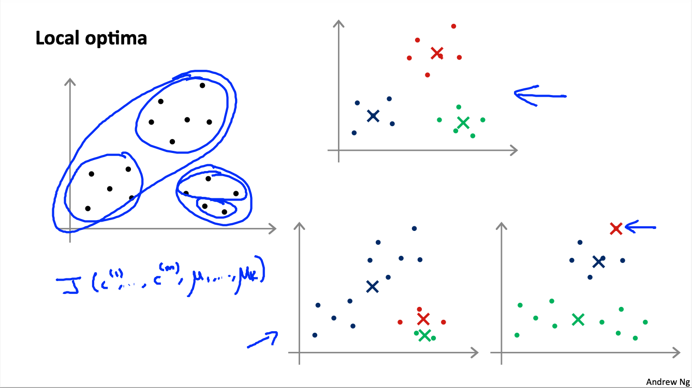
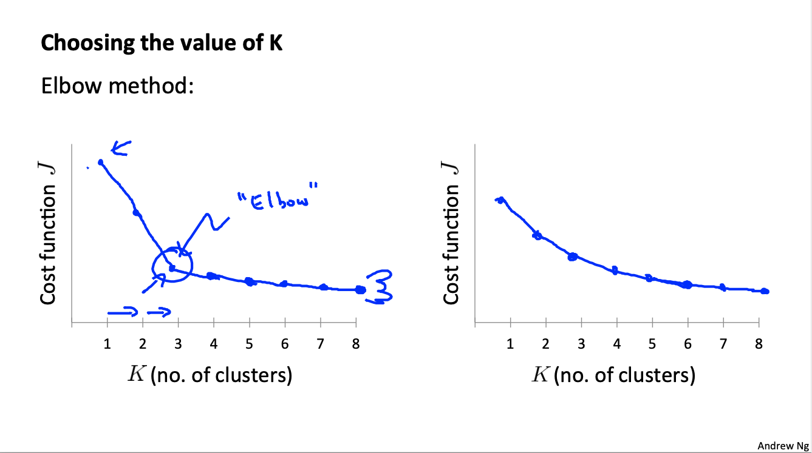
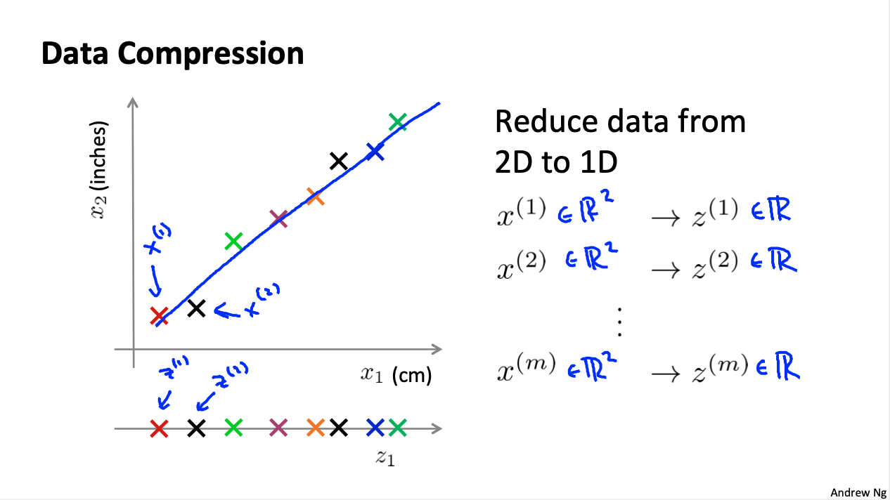
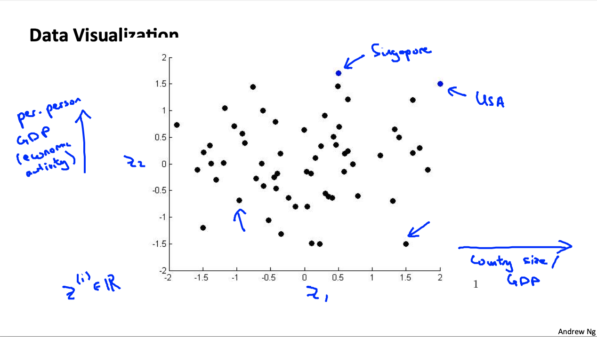
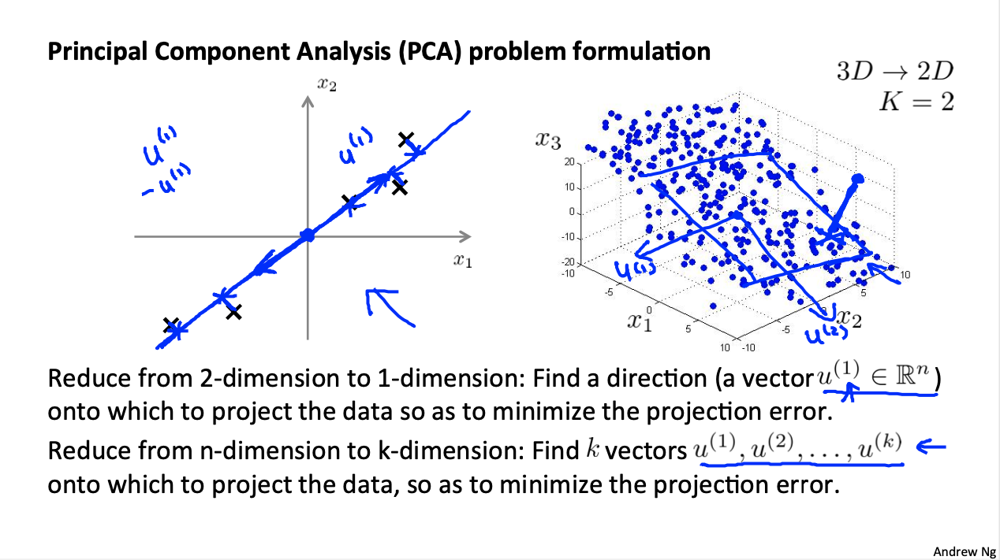
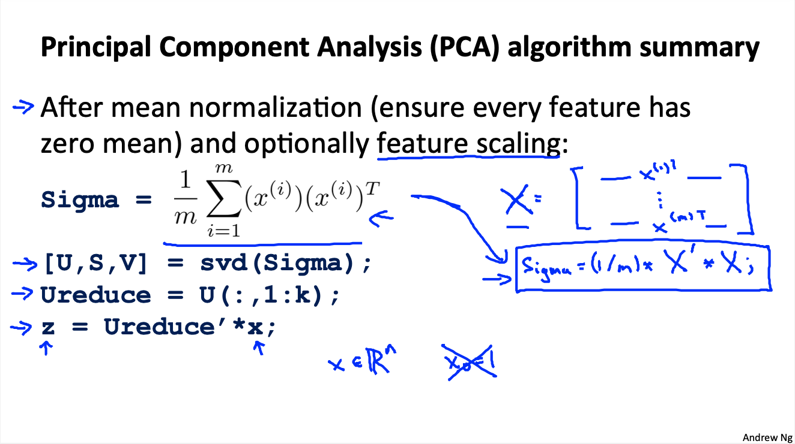
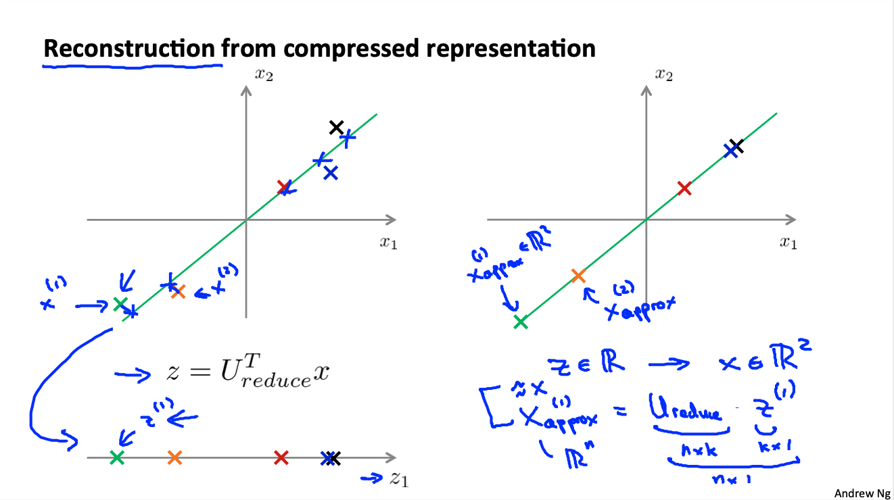

# Machine Learning: Unsupervised Learning

These are my notes on the Coursera course by Andrew Ng ["Machine Learning"](https://www.coursera.org/learn/machine-learning).

For setup and general information, please look at `../README.md`.

This file my notes related to **unsupervised learning**, which is divided in two major applications or domains: **clustering** and **dimensionality reduction**.

Note that Latex formulae are not always rendered in Markdown readers; for instance, they are not rendered on Github, but they are on VS Code with the Markup All In One plugin.
Therefore, I provide a pseudocode of the most important equations.
An alternative would be to use Asciidoc, but rendering of equations is not straightforward either.

Overview of contents:

1. Unsupervised Learning: Introduction
2. Clustering: K-Means Algorithm
   - 2.1 K-Means Algorithm
   - 2.2 Optimization Objective or Cost Function of the K-Means Algorithm
   - 2.3 Random Initialization and Local Optima
   - 2.4 Choosing the Number of Clusters
3. Dimensionality Reduction: Principal Component Analysis (PCA)
   - 3.1 Principal Component Analysis (PCA): Idea
   - 3.2 Principal Component Analysis (PCA): Algorithm
4. Applying Principal Component Analysis (PCA)
   - 4.1 Reconstruction from Compressed Representation
   - 4.2 Choosing the Number of Principal Components
   - 4.3 Advice for Applying PCA
5. Exercise 7: K-means Clustering and Principal Component Analysis

## 1. Unsupervised Learning: Introduction

In unsupervised learning we don't have labels for our data. Instead, we try to find structure in the dataset. Typical applications are:

- Clustering of similar data examples/points
- Dimensionality reduction: when we have many features, the most relevant ones can be chosen

## 2. Clustering: K-Means Algorithm

We have an unlabelled dataset and we would like to group the data examples/points in groups according to the similarity metric we define.

### 2.1 K-Means Algorithm

K-means is an iterative algorithm that works in two steps that are continuously repeated: (1) cluster centroids are **assigned** and (2) cluster centroids are **shifted/moved**. The algorithm is as follows:

0. Given a dataset `x_1, x_2, ..., x_m` with each point of dimension `n`, we want to group the `m` points/examples according t o similarity, defined by their distance in the feature space. Note that the dimension `0` of each `x` is dropped by convention.
1. We select the number of cluster centers we want to have `K`. Obviously, `K < m`, i.e., the number of clusters is expected to be smaller than the number of examples or data-points we have.
2. We set random centers `mu_1, ..., mu_K` in the feature space.

$$\mu_1, ..., \mu_k, ..., \mu_K \in \mathbf{R}^{n}$$

3. For each example `i = 1, ..., m` we compute which is is the closest centroid `k = 1, ..., K`; we **assign** or label each example to its closest centroid; those labels are `c_1, ..., c_m`, and they correspond to one index in `{1, ..., K}`.

$$c^{(i)} = \min_k \Vert x^{(i)} - \mu_{k} \Vert $$

4. We recompute the centroid `mu_k` of each group/cluster `k` of the data-points by averaging all data-points in a cluster/group, and **shift/move** the centroid to that average; all data-points are traversed for that.

$$\mu_k \leftarrow \frac{1}{q} \sum_{q\,:\, i | c^{(i)} = k} x^{(i)}$$

5. We repeat steps 3 & 4 until there is a convergence.

If in the process a cluster centroid ends being being assigned to no points, we either (1) remove it or (2) re-initialize it randomly somewhere else.

K-means creates clusters even though data-points do not seem to be clearly separable; that is not really an issue always: we are just segmenting the dataset according to the number of groups we'd like. For instance, T-Shirt size ranges S, M, L mapped to a continuum dataset containing height-width as values.

### 2.2 Optimization Objective or Cost Function of the K-Means Algorithm

The cost function of the k-means algorithm is also called the **distortion function**, and it is simply the sum sum of all the distances from each data-point to its associated cluster centroid. We want to minimize that.

$$J(c,\mu) = \frac{1}{m} \sum_{i = 1}^{m} \Vert x^{(i)} - \mu_{c^{(i)}} \Vert^2$$

```
J(c,mu) = (1/m) * sum(dist(x_i - mu(c_i)))
```

It can be proven that the two major steps in the algorithm minimize that cost:

1. the **assign** step minimizes `J` with respect to the labels `c` while maintaining the centroids `mu` constant;
2. the **move** step minimizes `J` with respect to `mu` while maintaining the labels `c` constant.

Thus, we can use the distortion or cost function `J` to debug how the algorithm is running; there is no need to differentiate it, since the minimization is already in the algorithm itself.

**Important feature of `J`: it always decreases with the iterations**; however, different initializations of the centroids might lead to higher `J` values.

### 2.3 Random Initialization and Local Optima

K-means can end up with a different solution depending on the initialization. **The best approach is to select `K` random data-points from our dataset as initial centroids.**

In fact, k-means is prone to falling into local optima of the `J` minimization; the only way to deal with that is to perform several random initializations as suggested: choosing `K` random points from the dataset as initial centroids. Thus:

- we run k-means 50-1000 ties with different random initializations,
- we compute the cost function `J` at the end of each,
- and we pick the run with the smallest `J`.

However, note that multiple random initializations are effective if the number of clusters is relatively slow, e.g., `K = 2-10`; if we have many clusters, the results won't change so much.

Examples of local optima:



### 2.4 Choosing the Number of Clusters

Often the number of clusters is given by the problem, or it can be visually identified in a scatterplot. However, sometimes it is not clear which number to choose: in that case, the **elbow method** is used.

With the elbow method, we plot the distortion/cost function for ach value of `K`. As `K` increases, `J` will decrease, because centroids are closer to the data-points; if the contrary happens, the higher `K` landed in a local optimum and the algorithm needs to be re-run.
By observing the final curve `J-vs-K`, we choose the `K` value that bends or changes the slope of the decreasing curve: the elbow.

However, sometimes there is no elbow: the curve decreases smoothly; in that case, we need to think about the meaning of the different values of `K`.



## 3. Dimensionality Reduction: Principal Component Analysis (PCA)

Dimensionality reduction consists in finding the hyperplane structure in feature space onto which we can project our examples loosing the least amount of information. With that operation, we basically remove one dimension to all examples, or equivalently, to our variable:

- in 2D we project the points to a line and work later on in 1D;
- in 3D we project the points onto a plane and work in 2D later on;
- etc.

$$x^{(i)} \in \mathbf{R}^{D} \rightarrow z^{(i)} \in \mathbf{R}^{D-1}$$

So that this dimensionality reduction works, we consider there might be some high correlation somewhere between the variables; if not, we loose information; if that correlation exists, the tasks consists in finding the hyperplane that reflects that relationship.

Usual applications consist in reducing from `1000-D` to `100-D`; having redundant/correlated features or dimensions is common, because often, when defining the problem, we don't know how correlated they are - thus, we are conservative and collect too many types of measurements.

The **motivations for dimensionality reduction** are mainly two:

1. We can **compress** our data.
2. We **simplify** our data, so that we can be able **to visualize** it better.



Data visualization requires to reduce the dimensionality to 2D or 3D; displaying our dataset might provide us valuable insights. However, the reduced dimensions have not always a clear definition, or they might be a linear combination of some original variables.

Example: world countries with 50 features each (GDP, population, Gini index, etc.). These 50 variables can be reduced to 2 variables $z_1, z_2$, and we can see in a scatterplot how similar countries are among each other.



### 3.1 Principal Component Analysis (PCA): Idea

We use Principal Component Analysis (PCA) to find the structures or hyperplanes onto which we project our data-points loosing the least information as possible. That is achieved by minimizing the sum of orthogonal distances from the data-points to the parametrized hyperplane.

Note that this is related to linear regression, but it is different, and it ultimately yields a different solution, and a different algorithm: 

- in linear regression, the squared distance in $y$ between the hyperplane and the data-points is minimized: $\Delta y$;
- in PCA, the orthogonal distance between the hyperplane and the data-points is minimized. That implies that we project the $\Delta y$ in the normal vector of the hyperplane.

With PCA, we reduce from $n$-dimension to $k$-dimension by finding $k$ vectors $u^{(1)}, u^{(2)}, ..., u^{(k)}$
onto which to project the data, so as to minimize the projection error.

In other words: **we are trying to find a lower dimensional base frame that minimizes the distances from the data-points to its axes**.



### 3.2 Principal Component Analysis (PCA): Algorithm

First, we need to **normalize or scale** our data!

One typical approach is mean normalization with range scaling, if the ranges of the features differ:

$x_j^{(i)} \leftarrow \frac{x_j^{(i)} - \mu_j}{s_j}$

$\mu_j = \frac{1}{m} \sum_{i = 1}^{m} x_j^{(i)}$

$s_j$: standard deviation $\sigma_j$ or range $\max{x_j}-\min{x_j}$ of feature $x_j$.

Then, the **principal components of the covariance matrix** are found; that leads to:

- the direction vectors $u_1, u_2,..., u_k$
- the projected data-points with a lower dimensionality: $z^{(1))}, ..., z^{(m)}$, $z \in \mathbf{R}^{k}$

The **covariance matrix** is

$$ \Sigma = \frac{1}{m} \sum_{i=1}^{n}(x^{(i)})(x^{(i)})^{T}$$

```
X = [x1'; x2'; ...; xm']; % xi': 1 x n, x_0 not used!
Sigma = (1/m) * X' * X; % n x n

x : n x 1
x' : 1 x n
```

The principal components and directions are the eigenvectors and eigenvalues, which can be found with the singular-value decomposition:

```
[U, S, V] = svd(Sigma)

U : n x n -> eigen-vectors of Sigma are columns: u_1, u_2, ..., u_n
S : diagonal matrix with eigen-values of Sigma: S = diag(s_1, s_2, ..., s_n)
V: m x m
U*U': I
V*V': I
Sigma = U * S * V'
```

Then:

- If we want to reduce from $n$ dimensions to $k$, we simply take the first $k$ $u$ vectors: `U_reduced = [u_1, u_2, ..., u_k]`.
- The transformed or reduced data-points $z$ are: `z = (U_reduced)' * x`. Note the dimensions: `(k x n) x (n x 1) = k x 1`.

Summary, in Octave:

```octave
X = [x1'; x2'; ...; xm']; % xi': 1 x n, x_0 not used!
Sigma = (1/m) * X' * X; % n x n
[U, S, V] = svd(Sigma);
Ureduce = U(:,1:k);
z = Ureduce'*x; % x_0 not used!
```

Note that an alternative to `svd(Sigma)` is `eig(Sigma)`, which would produce the same values, but it is less robust/stable numerically.

Have in mind or draw the shape and contents of `U, Ureduced, X, xi, z, ...`.
Note that `U` and `V` are two rotation matrices, while `S` is a scaling matrix.




## 4. Applying Principal Component Analysis (PCA)
### 4.1 Reconstruction from Compressed Representation

We can go back from the compressed representation `z` to the original dimension `x` with `Ureduce`. We obtain the projected data-points, but we represent them in the higher dimensional feature space (`n`), not in the reduced hyperplane (`k`). Of course, the reconstructed points are an approximation.

```
X = [x1'; x2'; ...; xm']; % xi': 1 x n, x_0 not used!
Sigma = (1/m) * X' * X;
[U, S, V] = svd(Sigma);
Ureduce = U(:,1:k);
z = Ureduce'*x; % x_0 not used!

x_approx = Ureduce * z; % n x 1 = (n x k) x (k x 1)
```



### 4.2 Choosing the Number of Principal Components

The number of principal components `k` is the parameter we need to choose. That number is chosen according to the variance that is preserved when reducing the dimensionality.

Since we have normalized/scaled the data, all vectors are centered in 0, so the **total variance** of the data is:

$$S = \frac{1}{m} \sum_{i = 1}^{m} \Vert x^{(i)} \Vert ^2$$

`L = (1/m) * sum(length(x)^2)`

Additionally, the average squared projection error is:

$$S_p = \frac{1}{m} \sum_{i = 1}^{m} \Vert x^{(i)} - x_{approx}^{(i)} \Vert ^2$$

`Lp = (1/m) * sum(length(x - x_approx)^2)`

Note that the PCA algorithm tries to minimize $L_p$.

Typically, $k$ is chosen so that 

$$\frac{L_p}{L} \leq \alpha$$,

with $\alpha \in [0.01, 0.1]$.

If `alpha = 0.01`, `99% = 1 - 0.01` of the variance is retained, i.e., we loose `1%` of the information.

In practice, it is possible to significantly reduce the dimensionality or compress the dataset with that small `alpha`, because the features tend to be very correlated!

Now, instead of computing the $L_p$ values for different $k$ values, we can use the singular values obtained after calling `svd()`. These are the eigenvalues of the decomposition, contained in the diagonal matrix `S = diag(S_11, S_22, ..., S_nn)`. It turns out that the fraction summed of the chosen $k$ eigenvalues is the retained variability:

$$ \frac{\sum_{i = 1}^{k} S_{ii}}{\sum_{i = 1}^{n} S_{ii}} = 1 - \alpha$$

```
sum(S_ii, i = 1:k) / sum(S_ii, i = 1:n) = 1 - alpha
```

Thus: we run `svd()` and choose the `k` value that yields a ratio above the desired percentage.

Note that in the first fraction ($L$), the sum is over $m$ (number of data-points), whereas in the second fraction the sum is over $n$ (number of features or dimensions).

Important: **If we apply PCA, always report the fraction of variance retained!**

### 4.3 Advice for Applying PCA

We have seen the two major motivations for PCA:

1. Compression
2. Visualization, with `k = 2, 3`

Compression is related to two sub-motivations:

- We reduce the disk storage
- We can speed up the supervised learning algorithm.

Indeed, we can follow this approach to speed up a supervised learning algorithm:

- Take the independent variables `x` from the **training** split of the labelled dataset, forgetting the dependent variables `y`
- Compute PCA for our desired retained variance: we get  `Ureduced`
- Transform our `x` variables to be `z`: we have compressed the dimension, e.g. from 1000 to 100
- Perform the supervised learning training: since we have `10x` less features, the training is much faster!
- When we have a new `x`, we get `z = Ureduced' * x`

Note that the PCA should be performed only with the training split, not the cross-validation or test splits; however, since the model is in `z`-space, we do need to map the examples from the cross-validation and test splits to the `z`-space.

However, note that:

- First, we should try the supervised learning algorithm without PCA! Only when it does not work as expected, should we consider using PCA.
- Even though PCA reduces the number of features, using PCA to prevent overfitting is a bad idea, it is much better to use regularization! The reason is that PCA does not consider the `y` values, and by reducing the dimensions, we might be loosing relevant information; it might work or not.

## 5. Exercise 7: K-means Clustering and Principal Component Analysis
