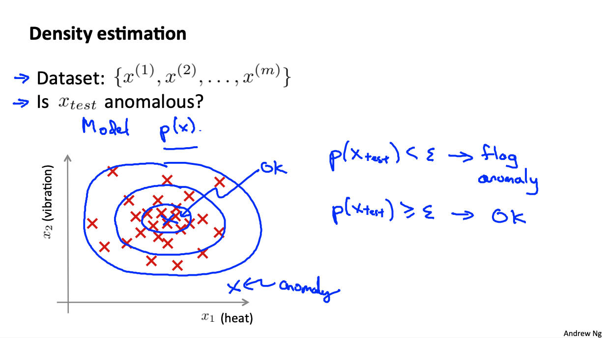

# Machine Learning: Anomaly Detection and Recommender Systems

These are my notes on the Coursera course by Andrew Ng ["Machine Learning"](https://www.coursera.org/learn/machine-learning).

For setup and general information, please look at `../README.md`.

This file my notes related to **anomaly detection** and **recommender systems**.

Note that Latex formulae are not always rendered in Markdown readers; for instance, they are not rendered on Github, but they are on VS Code with the Markup All In One plugin.
Therefore, I provide a pseudocode of the most important equations.
An alternative would be to use Asciidoc, but rendering of equations is not straightforward either.

Overview of contents:

1. Anomaly Detection

## 1. Anomaly Detection

### 1.1 Problem Motivation

In **Anomaly Detection**, given a dataset of unit measurements $X = x^{(1)}, ..., x^{(m)}$, we model the probability of a new examples to belong to the dataset: $p(x \in X)$:

- If `p(x_test) < epsilon`, `x_test` does not belong to the distribution of the dataset: ANOMALY!
- If `p(x_test) > epsilon`, `x_test` belong to the distribution of the dataset.

Typical applications:

- Fraud detection: several features or normal activities are recorded to build the distribution of the dataset (e.g., number of clicks, time with window open, etc.); if a new data point arises which is an outlier, then a red flag is raised.
- Manufacturing: features of machines are recorded (e.g., heat vibrations, etc.) to predict anomalous functioning.
- Data centers: features of computers and network are recorded to detect anomalous situations that might be associated to something not working properly (e.g., CPU load, network traffic, memory use, etc.).

### 1.2 Gaussian Distribution

