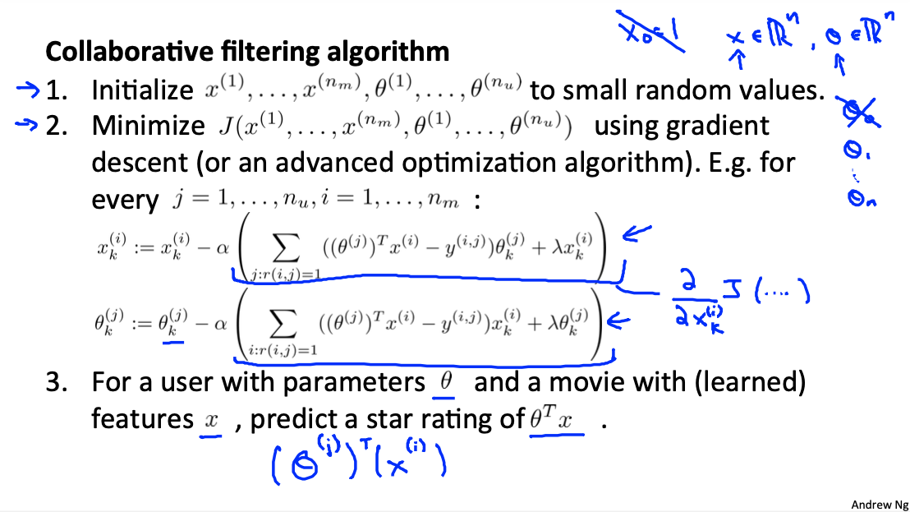

# Machine Learning: Anomaly Detection and Recommender Systems

These are my notes on the Coursera course by Andrew Ng ["Machine Learning"](https://www.coursera.org/learn/machine-learning).

For setup and general information, please look at `../README.md`.

This file my notes related to **anomaly detection** and **recommender systems**.

Note that Latex formulae are not always rendered in Markdown readers; for instance, they are not rendered on Github, but they are on VS Code with the Markup All In One plugin.
Therefore, I provide a pseudocode of the most important equations.
An alternative would be to use Asciidoc, but rendering of equations is not straightforward either.

Overview of contents:

1. Anomaly Detection
   - 1.1 Problem Motivation
   - 1.2 (Univariate) Gaussian Distribution
   - 1.3 Anomaly Detection Algorithm Based on the Gaussian Distribution
   - 1.4 Developing and Evaluating an Anomaly Detection System
   - 1.5 Anomaly Detection vs. Supervised Learning
   - 1.6 Choosing Features in Anomaly Detection
   - 1.7 Multivariate Gaussian Distribution
   - 1.8 Anomaly Detection using the Multivariate Gaussian Distribution
   - 1.9 Univariate vs. Multivariate Gaussians
2. Recommender Systems
   - 2.1 Problem Formulation
   - 2.2 Content-Based Recommendations
   - 2.3 Collaborative Filtering
   - 2.4 Collaborative Filtering Algorithm: Low Rank Matrix Factorization
   - 2.5 Finding Related Movies
   - 2.6 Missing Columns & Rows in `Y`: Mean Normalization
   - 2.7 Week 9 Forum Questions
3. Exercise 8: Anomaly Detection and Recommender Systems


## 1. Anomaly Detection

### 1.1 Problem Motivation

In **Anomaly Detection**, given a dataset of unit measurements $X = x^{(1)}, ..., x^{(m)}$, we model the probability of a new examples to belong to the dataset: $p(x \in X)$:

- If `p(x_test) < epsilon`, `x_test` does not belong to the distribution of the dataset: ANOMALY!
- If `p(x_test) > epsilon`, `x_test` belong to the distribution of the dataset.


Typical applications:

- Fraud detection: several features or normal activities are recorded to build the distribution of the dataset (e.g., number of clicks, time with window open, etc.); if a new data point arises which is an outlier, then a red flag is raised.
- Manufacturing: features of machines are recorded (e.g., heat vibrations, etc.) to predict anomalous functioning.
- Data centers: features of computers and network are recorded to detect anomalous situations that might be associated to something not working properly (e.g., CPU load, network traffic, memory use, etc.).

### 1.2 (Univariate) Gaussian Distribution

A variable that follows the Gaussian or Normal distribution with mean $\mu$ and variance $\sigma^2$:

$$x \sim N(\mu, \sigma^2)$$

```
x ~ N(mu, sigma^2)
```

The probability of $x$ of belonging tp the Gaussian distribution:

$$p(x; \mu, \sigma^2) = \frac{1}{\sqrt{2\pi} \sigma} \exp{(- \frac{(x-\mu)^2}{2\sigma^2})}$$

```
p(x; mu, sigma^2) = (1 / (sqrt(2*pi)*sigma)) * exp(-(x-mu)^2/(2*sigma^2))
```

Note:

- Bell-shaped distribution.
- $\mu$ is the center.
- $\sigma$ is the width/spread.
- Area below curve is 1.

Parameter estimation (mean and standard deviation squared):

$$\mu = \frac{1}{m}\sum_{i=1}^{m}x^{(i)}$$ 

$$\sigma^2 = \frac{1}{m}\sum_{i=1}^{m}(x^{(i)}-\mu)^2$$ 

### 1.3 Anomaly Detection Algorithm Based on the Gaussian Distribution

Our goal is to model the probability `p(x)`. The probability function is the product of the Gaussian probability functions of all the features. Given a feature space of $n$ features:

$$p(x) = p(x_1, \mu_1, \sigma_1^2) p(x_2; \mu_2, \sigma_2^2) ... p(x_n; \mu_n, \sigma_n^2)$$

$$p(x) = \prod_{j=1}^{n} p(x_j, \mu_j, \sigma_j^2)$$

That formula assumes that features are independent from each other; in practice, the algorithm works even when that assumption is not really fulfilled.

Thus, the algorithm is very simple:

- Get all `m` examples, each of dimension `n` (i.e., `n` features).
- Compute the mean and the standard deviation in each dimension: `m_j`, `s_j`. That can be done ina vectorized way.
- The probability model `p(x)` is the product of all `n` Gaussians of each feature.
- Evaluate `p()` given a new `x_test`: if `p(x_test) < epsilon`, ANOMALY.

If we look at an `n = 2` example, `p(x)` is a bell-shaped surface that emerges from the feature space. All possible data-points from the feature space that evaluate a large enough `p` height (`p > epsilon`) belong to region of NORMALITY, the ones outside are ANOMALIES.


### 1.4 Developing and Evaluating an Anomaly Detection System

Anomaly Detection is an unsupervised learning technique because we simply need *normal* data (unlabelled). However, we typically use labelled data, or in other words, a small set of *anomaly examples* to choose the value of `epsilon`; therefore, the algorithm is somewhere between supervised and unsupervised learning.

A typical setting should work like this:

- We get around `m = 10,000` normal examples; additionally, we need `20` *anomalies*. That is the typical proportion we could expect. Note that we have much more *normal* examples than *anomalies*, so the dataset is not balanced.
- We split the dataset in:
  - Training: 6,000 normal; no anomalies are used to train/fit the model.
  - Cross Validation: 2,000 normal; 10 anomalies.
  - Test: 2,000 normal; 10 anomalies.
- We build the model `p(x)` as explained: `m,s` for each of the `n` features.
- Our model looks like this:
  - `y = 1 if p(x) < epsilon`: ANOMALY
  - `y = 0 if p(x) >= epsilon`: NORMAL
- We vary `epsilon` and for each epsilon we compute the `F1` score on the cross validation set. We pick the `epsilon` that yields the best `F1`. We use as metric the `F1` and never the accuracy, because the dataset is skewed! We have also alternative metrics, but `F1` is just one number, which makes the choice of `epsilon` easier; alternative metric:
  - Confusion matrix: TP, TN, FP, FN
  - Precision & Recall
- With all parameters chosen, we evaluate the `F1` of our final model on the test split.

### 1.5 Anomaly Detection vs. Supervised Learning

In theory, we could use a supervised learning algorithm (e.g., logistic regression) instead of the unsupervised learning algorithm for anomaly detection. However, anomaly detection is very well suited for these cases:

- We have few anomaly examples (`y = 1`), in contrast to normal examples (`y = 0`)
- We don't have all possible anomaly cases to model; e.g., we might not know all possible ways a machine can fail, but we know when a machine is not failing.

### 1.6 Choosing Features in Anomaly Detection

In order to improve our anomaly detection algorithm, we can:

1. Normalize non-normal features applying transformations.
2. Look for features that clearly distinguish anomalies.

The **first approach** relies on the fact that we assume each feature is normally distributed. Even though the algorithm works when the assumption is broken, we can improve its performace if we guarantee it. To that end, we should **always plot histograms of the features** and try these families of transformations if their distributions don't look normal:

`x_j -> log(x_j + a)`; `a` is any constant we can try manually: `0, 1, 2.5, ...`

`x_j -> (x_j)^b`; `b` is often a fraction we can try manuall: `1/2, 1/3, 1/10, ...`

We iteratively try different transformations and plot them until we achieve bell-shaped distributions.


The **second approach** consists is performing **error analysis**, i.e., we pick errors and analyze which are their unique properties that distinguish them from the normal data points. The effect is that we extend the dimensionality of the feature space; while in the previous reduced space the anomaly examples that produced errors where close to the normal ones, with the new dimension, they are far away.


Sometimes **new features can be a combination of available ones, so that the combined feature takes unusually large or small values in the event of an anomaly**!

For example: let's image that in a data-center a computer can get unresponsive due to a bad program that blocks the CPU, without using the network (e.g., a "while-true" case); then, if we already have the features `cpu_load` and `network_traffic`, a reasonable new feature to distinguish cases like the aforementioned would be `cpu_load / network_traffic`. The reason is that high values of that new feature indicate the anomaly in question.

### 1.7 Multivariate Gaussian Distribution

The univariate model built until now assumes that the features are independent from one another. However, when correlations between features are not negligible (which is usually the case), the model does not capture correctly the multi-dimensional distribution, and thus, the predicted `p` values are not correct.

What is happening is that instead of having skewed, rotated and stretched bell-shapes, as we should, we have blobby and round curves, which do not capture the underlying distribution.


In such cases, instead of using a univariate Gaussian distribution obtained after multiplying supposedly independent Gaussians, it is better to use the **Mulivariate Gaussian** distribution, which is not a product, but a multivariate function:

$x \in \mathbf{R}^n \rightarrow p(x) \in \mathbf{R}$

Parameters: 

- Vectorial mean: $\mu \in \mathbf{R}^n$
- Covariance matrix: $\Sigma \in \mathbf{R}^{n\times n}$

$$p(x; \mu, \Sigma) = \frac{1}{(2\pi)^{n/2} \vert\Sigma\vert^{1/2}} \exp{(- \frac{1}{2} (x-\mu)^T \Sigma^{-1}(x-\mu) )}$$

```
p(x; mu, Sigma) = (1 / ((2*pi)^(n/2)*sqrt(det(Sigma)))) * exp(-(x-mu)^T * inv(Sigma)^2 * (x-mu))
```

Note that the **covariance matrix** $\Sigma \in \mathbf{R}^{n \times n}$ is symmetric. As examples, with `n = 2`, it has this form:

```
Sigma = [s_11 s_12; s_21 s_22]
s_11: variance of feature x_1
s_22: variance of feature x_2
s_12 = s_21: covariance of features x_1 & x_2

x = [x_1 x_2]' (column)
Sigma = sum(x * x', i = 1:m)
```

The covariance matrix has these properties:

- It is symmetric, i.e. `s_ij = s_ji if i != j`.
- Only if two features `x_i` and `x_j` are correlated is `s_ij !=0`, otherwise, Sigma is diagonal.
- It must be invertible to use it in our model, i.e., it must have non-zero determinant; a requirement for that is `m > n`.
- The mean vector `mu` is the point around which the Gaussiean is centered
- The diagonal values `s_jj` denote the stretch of the Gaussian in each axis `j`; the biggest value yields proportionally the biggest stretch.
- The non-diagonal values `s_ij` denote the stretch in the direction/axis which is combination of both `i & j`; the sign denotes the sign of the slope.
- The non-diagonal values `s_ij` are related to the correlation between variables `x_i` and `x_j`:

`corr(x_1, x_2) = s_12 / sqrt(s_11*s_22)`


### 1.8 Anomaly Detection using the Multivariate Gaussian Distribution

The algorithm is basically the same:

- Get all `m` examples, each of dimension `n` (i.e., `n` features).
- Compute the mean vector `mu` and the covariance matrix `Sigma`.
- The probability model `p(x)` is aforementioned formula.
- Evaluate `p()` given a new `x_test`: if `p(x_test) < epsilon`, ANOMALY.

### 1.9 Univariate vs. Multivariate Gaussians

It can be shown that **the Univariate Gaussian is the Multivariate Gaussian when the latter is axis aligned, i.e., the covariance matrix diagonal.**

Therefore, if we have correlations between features, the univariate Gaussian will not capture them, unless we introduce them as new features, e.g., `x_3 = x_1 / x2`.

However, the univariate Gaussian is more frequently used, because it is computationally much less expensive and, thus, it scales much better (we don't need to compute the inverse, etc.).

Summary of differences and practical advise:

- `n`: If we have many features (`n > 10,000`), we can use the univariate version, because it is mucch less computationally expensive.
- Correlations: In the univariate version, we should add manually combinations of features is we see there is a string correlation between them, e.g., `x_3 = x_1 / x2`; otherwise, that correlation won't be captured. In the multivariate version, there is no need for that.
- `m`: In the multivariate version, we need to have `m > n` - recommended: `m >= 10*n`; in the univariate version, `m` can be small!
- Redundant features: the inverse of the covariance won't exist (`det(Sigma) = 0`) if a variable is a linear combination of others or itself; thus, we need to detect those redundant variables and erase them. The univariate option does not have this issue.


## 2. Recommender Systems

Even though recommender systems are not that popular in the academia, they are very popular in the industry, because they bring a lot of money (e.g., Amazon, Netflix, etc.). The key idea is to predict missing values based on similar profiles.

### 2.1 Problem Formulation

The following slide defines very well problem and the goal of a recommender system:


We have a matrix formed by `items of interest vs. user profiles` (e.g., movies vs. users), and in each cell we have a rating given by each user to the corresponding item. Now, some notions:

- Each user has not rated all the items.
- An item doesn't need to be been rated by all users.
- We can expect that similarities between users and between items: for instance, people who like romantic movies, or movies which have romantic content.
- Thus, we should be able to predict the missing values in the matrix!

Notation:

- `n_u`: number of users (profiles)
- `n_m`: number of movies (items)
- `r(i,j)`: `1`, if user `j` has rated movie `i`, `0` otherwise
- `y^(i,j)`: rating given by user `j` to movie `i`, only if `r(i,j) = 1`

The **goal: estimate missing `y^(i,j)` values**.

In the slide above, we see that we have two clusters of users and movies:

- Users who like romance vs. action.
- Movies with romance vs. action content.

### 2.2 Content-Based Recommendations

One approach to estimate missing values are the *content-based* recommendations. This assumes we have feature vectors of the items/movies, related to their content, e.g., degree of romance, action, etc. That is the major disadvantage of the approach: we need to have feature vectors!

Given those feature vectors, linear regression is performed across all movies and all users so that each user gets a parameter vector `theta`. Thus, given a movie with a feature vector `x`, the estimated rating of a user of that movie is `theta*x`.


The key concepts are:
- Each movie `i` has its own feature vector `x^(i)`, with `n` features and `x_0 = 1`, so size `n + 1`. Each element in `x` is how much the movie is aligned with a feature (e.g., it has romance, action, etc.).
- Each user `j` gets a parameter vector `theta^(j)`. Each element of `theta` is the importance given by the user to each feature (e.g., it has romance, action, etc.).
- `r(i,j) = 1` when a user `j` has rated movie `i` with `y^(i,j)`; the total movies rated by a user is `m^(j)`.

The estimation of a movie `i` rating by user `j` will be:

```
y_hat = (theta^(j))' *

theta^(j): (n + 1) x 1; one for each user j = 1:n_u
x^(i): (n + 1) x 1; one for ach movie i = 1:n_m
```

While the real rating is:

```
y^(i,j), if r(i,j) = 1
```

With that, usual linear regression can be applied, even regularized, and an optimization algorithm of any kind (e.g., gradient descent) can be used, because the cost function `J` and its derivative are known. 

The cost function is the sum of squared differences `y_hat - y` over all movies `i` and users `j` if `r(i,j) = 1`. In a regular linear regression, we would have normalized the sum with `m^(j)`, but here we drop it.

Then, the cost function and the optimization with gradient descent is defined in the following slides:


Note that with the parameters `theta` we all all necessary information to estimate the missing values `y^(i,j)`.

Important notation note: **`i:r(i,j) = 1` means over all values of `i` where `r(i,j) = 1`, in other words, over all movies, taking all ratings.**

### 2.3 Collaborative Filtering

From the content-based approach, we can see we have three main components:

- The matrix: user ratings of movies: `y^(i,j)`
- Movie feature vectors: `x^(i)`
- The parameter vector of each user: `theta^(j)`

Then, the estimation/prediction of a movie rating is:

`y_hat = theta^(j)' * x^(i) ~ y^(i,j)`.

In the content-based approach:

- given the movies feature vectors `x^(i)`, 
- we obtained the user parameter vector `theta^(j)`.

Now, we do it the other way around: If all users fill in a form with their genre preferences, we have `theta^(j)`, thus we can optimize the cost function (difference between `y` and its estimation) to obtain the movies feature vectors `x^(i)`!

Then, the cost minimization is transformed as if `x` were the parameter to be learned, instead of `theta`:


Solving that minimization function with gradient descent leads to `x`.

Again, we end up having all information to estimate all missing `y^(i,j)`.

However, **collaborative filtering** goes one step beyond: we work only with the incomplete matrix of ratings `y^(i,j)` and without `x^(i)` or `theta^(j)`. User parameters and movie feature vectors are obtained in the process.

One naive approach for collaborative filtering would be:

1. Guess `theta^(j)`
2. Obtain `x^(i)` by minimizing the cost function above: `theta^(j)` and `y^(i,j)` are used
3. Re-compute `theta^(j)` according to the cost function in the content-based approach: `x^(i)` and `y^(i,j)` are used.
4. Repeat steps 2 and 3 until we converge.

It is called collaborative filtering because all user-movie ratings help collaborative creating a model.

### 2.4 Collaborative Filtering Algorithm: Low Rank Matrix Factorization

Instead of iteratively computing `theta` and `x` until convergence, we combine both minimization functions a minimize them together. Thus, we end up having a cost function which is the sum of both functions and all parameters `theta` and `x` need to be optimized together so that the estimation of the `y` ratings differs as few as possible from the known values. The optimization algorithm is analog to the previous ones:





By doing that, we obtain all `theta` and `x` vectors, which can be stacked as rows in `T` and `X`. Then, we know that the approximation of the matrix `Y` is their multiplication!

```
T = [theta^(1)'; ...; theta^(n_u)']: n_u x n
theta^(j): n x 1

X = [x^(1)'; ...; x^(n_m)']: n_m x n
theta^(j): n x 1

y^(i,j) ~ y_hat^(i,j) = theta^(i)' * x^(j)

Y_hat = X * T': n_m x n_u
this is the estimation of user-movie rating matrix!
```

We see that the original matrix `Y` has been factorized to a multiplication of two matrices of lower rank, which multiplied yield something optimally close to `Y`. Thus, this method is called **low rank matrix factorization**. Basically, `X` and `T` are obtained so that the difference between `Y` and `Y_hat` is minimum.


Note: in this approach, `x_0 = 0` and `theta_0 = 0`, in other words: they are not considered; the algorithm itself learns whether any parameter/feature `= 1` is necessary.

### 2.5 Finding Related Movies

Once the `x^(i)` and `theta^(j)` vectors for the minimum cost have been found, we know all the feature vectors of all movies.

Thus, given a movie, we can find its most similar ones simply by taking the closest movies to it in the `n`-dimensional feature space: Finding the 5 most similar movies consits basically in finding the `x^(k)` vectors that give the smallest value

$$\Vert x^{(i)} - x^{(k)}\Vert$$

I understand that something similar could be done with users: we can find similar users!

### 2.6 Missing Columns & Rows in `Y`: Mean Normalization

What happens if a new user appears or if a user has not rated any movies yet? We need to initialize his/her `theta` parameter values somehow:

- One approach would be to set them all equal to 0; however, given the minimization problem, they will remain stuck at 0.
- Another approach is to set them so that the ratings by that person are the mean ratings per movie.

That is achieved by **mean normalization**:

- We substract to each rating the mean rating of the movie (average row-wise): `mu^(i) -> x^(i) = x^(i) - mu^(i)`
- Then, the rating estimation becomes: `theta^(j)' * x^(i) + mu^(i)`
- If we initialize the `theta^(j)` of the new person `j` to `0`, the rating formula is not `0` anymore, but the average! That makes possible for the optimization algorithm to update the `theta` values which otherwise would have remained stuck at `0`.


Note that

- After the mean substraction the rating mean in the `Y` matrix row-wise is `0` for each movie.
- Unknown ratings (denoted with `?`) remain unchanged always.
- The `theta` parameter is of dimension `n`; in the slide: `n = 2`.
- We don't divide by the standard deviation or the range because all values are assumed to be in the same range!
- I understand we should not initialize `theta` or `x` values with `0`; instead, with small random values? Is that so?

Something similar can be done with a new movie which has not been rated yet; however, it does not make much sense to recommend a movie that was not rated yet, so we can leave it to be populated; meanwhile, its feature vector would be `0` and it would not be recommended -- as I understand.

### 2.7 Week 9 Forum Questions

#### Question 1

##### Title

Collaborative filtering: How do we select the size of the feature & parameter vector learned automatically?

##### Question

In the collaborative filtering section of the recommender systems, w​hen using the low rank matrix factorization approach for obtaining the user parameters (theta) and movie features (x), we assume tha both are of size n x 1; however, no typical range of values is suggested for n. Certainly, it could be something related to n_u (number of users) and n_m (number of movies), but these values are expected to change over time.

Which is the rule of thumb for n? Are there any methods to optimize it? I can image one could choose a large value of n and then apply PCA to the x vectors to find the minimum number of latent parameters necessary for a variance capturing threshold. Then, we would re-compute the parameters of the recommender system with the low rank matrix factorization approach. Is that sensible?

##### Answer

No rule of thumb, just experimentation. Try it and report.

#### Question 2

##### Title

Initialisation of User Parameters and Movie Features

##### Question

M​ean normalization seems to prevent the fact that if user parameters (theta) or movie features (x) are initialized to 0, they get stuck and no optimization updates occur. However, is it a good practice to initialize them to 0? Isn't it instead a better practice to initialize them to small random values? If so, how necessary is mean normalization?

##### Answer

No useful answer provided. They though I was mixing normalization and random initialization.

## 3. Exercise 8: Anomaly Detection and Recommender Systems

In this exercise, has two major parts:
1. Anomaly detection to detect failing servers on a network.
2. Recommender system based on collaborative filtering to predict a movie ratings.

Files provided by Coursera, located under `../exercises/ex1-ex8-octave/ex8`

- `ex8.m` - Octave/MATLAB script for first part of exercise
- `ex8_cofi.m` - Octave/MATLAB script for second part of exercise
- `ex8data1.mat` - First example Dataset for anomaly detection
- `ex8data2.mat` - Second example Dataset for anomaly detection
- `ex8_movies.mat` - Movie Review Dataset
- `ex8_movieParams.mat` - Parameters provided for debugging
- `multivariateGaussian.m` - Computes the probability density function for a Gaussian distribution
- `visualizeFit.m` - 2D plot of a Gaussian distribution and a dataset
- `checkCostFunction.m` - Gradient checking for collaborative filtering
- `computeNumericalGradient.m` - Numerically compute gradients
- `fmincg.m` - Function minimization routine (similar to fminunc)
- `loadMovieList.m` - Loads the list of movies into a cell-array
- `movie_ids.txt` - List of movies
- `normalizeRatings.m` - Mean normalization for collaborative filtering
- `submit.m` - Submission script that sends your solutions to our servers

Files to complete:

- `estimateGaussian.m` - Estimate the parameters of a Gaussian ditribution with a diagonal covariance matrix
- `selectThreshold.m` - Find a threshold for anomaly detection
- `cofiCostFunc.m` - Implement the cost function for collaborative filtering

Workflow:

- Download latest Octave version of exercise from Coursera
- Complete code in exercise files following `ex8.pdf`
- Whenever an exercise part is finished
  - Check it with `ex8` and `ex8_cofi` in Octave terminal
  - Create a submission token on Coursera (exercise submission page, it lasts 30 minutes)
  - Execute `submit` in Octave terminal
  - Introduce email and token
  - Results appear

**Overview of contents:**

0. Setup: `gnuplot`
1. Dataset Loading & Visualization
2. Anomaly Detection - `ex8.m`
    - 2.1 Gaussian Distribution: Parameters - `estimateGaussian.m`
    - 2.2 Selecting the Threshold `epsilon` - `selectThreshold.m`
3. Recommender Systems - `ex8_cofi.m`
   - 3.1 Collaborative Filtering - `cofiCostFunc.m`
     - 3.1.1 Cost Function without Regularization
     - 3.1.2 Cost Function Gradient without Regularization
     - 3.1.3 Cost Function with Regularization
     - 3.1.4 Cost Function Gradient with Regularization
   - 3.2 Train and Test the Model (Ungraded, Taken from `ex_cofi.m`)
     - Set Ratings
     - Load Data & Optimize Model Parameters
     - Estimate Ratings with Model

The anomaly detection exercise is very easy; the recommender system exercise is quite easy, but the computation of the cost gradient was a little bit tricky. Look at the exercise guide PDF and my notes:

`./RecommenderSystems_Notes.pdf`

Python implementation notes:

- The optimization performed by `fmincg` can be done with `scipy.optimize.minimize` in python; see previous exercises (e.g., linear regression, logistic regression).
- Finding the ids where `R(i,j) = 1` can be done with `idx = np.where(R[i, :] == 1)[0]; Theta_temp = Theta[idx, :]`.
- The unrolling of matrices can be done with `Theta.ravel()`.

In the following, the most important code pieces of the exercise are added. Interesting formulas and the application/tests of the exercises are in the notebook -- have a look if interested!

```octave

%%% --- 2. Anomaly Detection - `ex8.m`

function [mu sigma2] = estimateGaussian(X)
    % [mu sigma2] = estimateGaussian(X), 
    % The input X is the dataset with each n-dimensional data point in one row
    % The output is an n-dimensional vector mu, the mean of the data set
    % and the variances sigma^2, an n x 1 vector

    % Useful variables
    [m, n] = size(X);

    % You should return these values correctly
    mu = zeros(n, 1);
    sigma2 = zeros(n, 1);

    mu = mean(X)';
    sigma2 = var(X,1)'; % normalize using (m-1) instead of m
end

function [bestEpsilon bestF1] = selectThreshold(yval, pval)
    % [bestEpsilon bestF1] = SELECTTHRESHOLD(yval, pval) finds the best
    % threshold to use for selecting outliers based on the results from a
    % validation set (pval) and the ground truth (yval).

    bestEpsilon = 0;
    bestF1 = 0;
    F1 = 0;

    stepsize = (max(pval) - min(pval)) / 1000;
    for epsilon = min(pval):stepsize:max(pval)
    
        cvPredictions = (pval < epsilon); % 1 if anomaly: p < epsilon!

        tp = sum((cvPredictions == yval) & (yval == 1));
        tn = sum((cvPredictions == yval) & (yval == 0));
        fp = sum((cvPredictions != yval) & (yval == 0));
        fn = sum((cvPredictions != yval) & (yval == 1));

        precision = tp / (tp + fp);
        recall = tp / (tp + fn);
        F1 = 2*precision*recall / (precision+recall);

        if F1 > bestF1
           bestF1 = F1;
           bestEpsilon = epsilon;
        end
    end

end

% Compute the model
[mu sigma2] = estimateGaussian(X);
p = multivariateGaussian(X, mu, sigma2);

% Find the outliers in the training set and plot the
outliers = find(p < epsilon);
%outliers = find(p < 1.5e-2);

% Plot the ooutliers
visualizeFit(X,  mu, sigma2);
xlabel('Latency (ms)');
ylabel('Throughput (mb/s)');
hold on;
plot(X(outliers, 1), X(outliers, 2), 'ro', 'LineWidth', 2, 'MarkerSize', 10);
hold off;

%%% --- 3. Recommender Systems - `ex8_cofi.m`

function [J, grad] = cofiCostFunc_(params, Y, R, num_users, num_movies, ...
                                   num_features, lambda)
    % [J, grad] = COFICOSTFUNC(params, Y, R, num_users, num_movies, ...
    % num_features, lambda) returns the cost and gradient for the
    % collaborative filtering problem.

    % Unfold the U and W matrices from params
    X = reshape(params(1:num_movies*num_features), num_movies, num_features);
    Theta = reshape(params(num_movies*num_features+1:end), num_users, num_features);

    % You need to return the following values correctly
    J = 0;
    X_grad = zeros(size(X));
    Theta_grad = zeros(size(Theta));

    % We factorize Y to X and Theta:
    % X: movie features: num_movies x n
    % Theta: user weights for movie features: num_users x n
    % Y: num_movies x num_users: ratings
    % R: num_movies x num_users: R(i,j) = 1 if there is a rating in Y, 0 otherwise
    % n: number of features -> chosen to be 100
    % i: movie counter: 1:num_movies
    % j: user counter: 1:num_users

    Y_hat = X*Theta';
    % Option 1
    %D = Y_hat(R==1) - Y(R==1);
    %J = (1.0/2.0) * D'*D;
    % Option 2
    D = Y_hat.*R - Y.*R;
    J = (1.0/2.0) * sum(sum(D.*D));

    % X_grad: num_movies x n: dJ/dX, all elements of X
    % Theta_grad: num_users x n: dJ/dTheta, all elements of Theta
    
    % Notes on notation:
    % k = 1:n (features), num_features
    % x_k^{(i)}: row i and column k, i.e., movie i and feature k
    % theta_k^{(j)}: row j and column k, i.e., user j and feature k
    % j:r(i,j)=1: over all j values where r(i,j)=1
    
    # Gradients: dJ/dX, dJ/dTheta
    for i=1:num_movies
        idx = find(R(i,:)==1); % users that have rated movie i
        Theta_tmp = Theta(idx,:); % |idx:users-i| x n
        Y_tmp = Y(i,idx); % 1 x |idx:users-i|
        % (1 x n) x (n x |idx:users-i|) x (|idx:users-i| x n) = 1 x n
        X_grad(i,:) = (X(i,:)*Theta_tmp'-Y_tmp)*Theta_tmp;
    end

    for j=1:num_users
        idx = find(R(:,j)==1); % movies that user j has rated
        X_tmp = X(idx,:); % |idx:movies-j| x n
        Y_tmp = Y(idx,j); % |idx:movies-j| x 1
        % (|idx:movies-j| x n) x (n x 1) = |idx:movies-j| x 1 -> 1 x |idx:movies-j|
        Theta_grad(j,:) = (X_tmp*Theta(j,:)'-Y_tmp)'*X_tmp;
    end
    
    % Cost Regularization
    X_reg = 0.5*lambda*sum(sum(X.*X));
    Theta_reg = 0.5*lambda*sum(sum(Theta.*Theta));
    J = J + X_reg + Theta_reg;

    % Gradient: Regularization Terms
    % We could insert these in the loops above, 
    % but I leave them here for clarity
    % and to keep the chronology of additions
    for i=1:num_movies
        X_grad(i,:) = X_grad(i,:) + lambda*X(i,:);
    end
    for j=1:num_users
        Theta_grad(j,:) = Theta_grad(j,:) + lambda*Theta(j,:);
    end

    % Pack the results: unroll!
    grad = [X_grad(:); Theta_grad(:)];

end

%% Testing

%  Initialize my ratings
my_ratings = zeros(1682, 1);

% Check the file movie_idx.txt for id of each movie in our dataset
% For example, Toy Story (1995) has ID 1, so to rate it "4", you can set
my_ratings(1) = 4;

% Or suppose did not enjoy Silence of the Lambs (1991), you can set
my_ratings(98) = 2;

% We have selected a few movies we liked / did not like and the ratings we
% gave are as follows:
my_ratings(7) = 3;
my_ratings(12)= 5;
my_ratings(54) = 4;
my_ratings(64)= 5;
my_ratings(66)= 3;
my_ratings(69) = 5;
my_ratings(183) = 4;
my_ratings(226) = 5;
my_ratings(355)= 5;

% Load data
% Y is a 1682x943 matrix, containing ratings (1-5) of 1682 movies by 943 users
% R is a 1682x943 matrix, where R(i,j) = 1 if and only if user j gave a rating to movie i
load('ex8_movies.mat');

% Add our own ratings to the data matrix
Y = [my_ratings Y];
R = [(my_ratings ~= 0) R];

% Normalize Ratings
[Ynorm, Ymean] = normalizeRatings(Y, R);

% Useful Values
num_users = size(Y, 2);
num_movies = size(Y, 1);
num_features = 10;

% Set Initial Parameters (Theta, X)
X = randn(num_movies, num_features);
Theta = randn(num_users, num_features);

initial_parameters = [X(:); Theta(:)];

% Set options for fmincg
options = optimset('GradObj', 'on', 'MaxIter', 100);

% Set Regularization
lambda = 10;
theta = fmincg (@(t)(cofiCostFunc(t, Ynorm, R, num_users, num_movies, ...
                                num_features, lambda)), ...
                initial_parameters, options);

% Unfold the returned theta back into U and W
X = reshape(theta(1:num_movies*num_features), num_movies, num_features);
Theta = reshape(theta(num_movies*num_features+1:end), ...
                num_users, num_features);

p = X * Theta';
my_predictions = p(:,1) + Ymean;

movieList = loadMovieList();

[r, ix] = sort(my_predictions, 'descend');
fprintf('\nTop recommendations for you:\n');
for i=1:10
    j = ix(i);
    fprintf('Predicting rating %.1f for movie %s\n', my_predictions(j), ...
            movieList{j});
end

fprintf('\n\nOriginal ratings provided:\n');
for i = 1:length(my_ratings)
    if my_ratings(i) > 0 
        fprintf('Rated %d for %s\n', my_ratings(i), ...
                 movieList{i});
    end
end

```