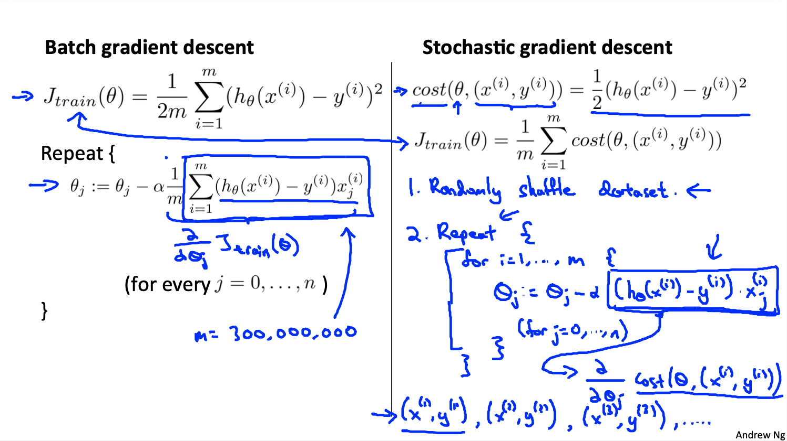
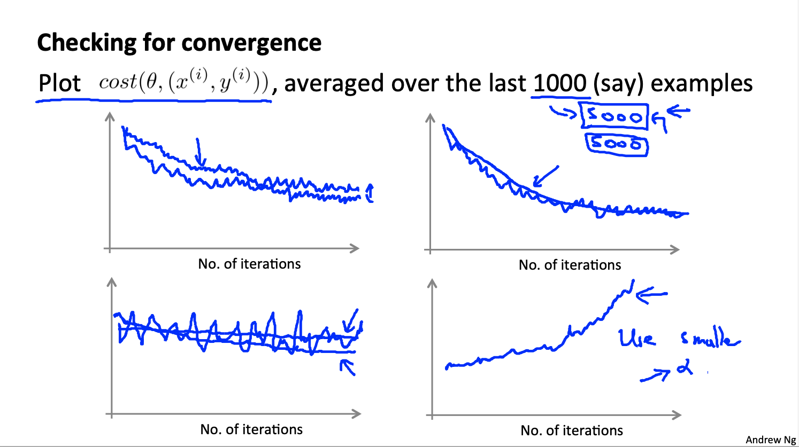

# Machine Learning: Large Scale Machine Learning

These are my notes on the Coursera course by Andrew Ng ["Machine Learning"](https://www.coursera.org/learn/machine-learning).

For setup and general information, please look at `../README.md`.

This file my notes related to **large scale machine learning**.

Note that Latex formulae are not always rendered in Markdown readers; for instance, they are not rendered on Github, but they are on VS Code with the Markup All In One plugin.
Therefore, I provide a pseudocode of the most important equations.
An alternative would be to use Asciidoc, but rendering of equations is not straightforward either.

Overview of contents:

1. Gradient Descent with Large Datasets
   - 1.1 Stochastic Gradient Descent
   - 1.2 Mini-Batch Gradient Descent
   - 1.3 Stochastic Gradient Descent Convergence
2. Advanced Topics

## 1. Gradient Descent with Large Datasets

Nowadays, it is becoming more and more usual to have large datasets, consisting of several millions of data points. However, before investing in acquiring more data points, we should however check whether it makes sense or not: that is done by testing if we have a high bias (simplistic) or higher variance model:

- If the model is simplistic, adding more examples won't be helpful; we need to add new features.
- If the model has higher variance, adding more example is helpful: the error is decreased.

In order to check in which case we are, we plot the `J_train` and `J_cv` as a function of used `m` examples:

- If their curves converge with few examples `m = 1,000`, we have a high bias problem; we need to add more features and test again before adding more examples.
- If their curves are quite separate but approach slowly, we have a high variance model, we can add more examples to improve it.

Note that this check is essential: we do it with few examples `m = 1,000` to test whether it makes sense to increase to `m = 100,000,000` examples, which is presumably very expensive (computationally and also in terms of effort to be done).

### 1.1 Stochastic Gradient Descent

Gradient descent is too expensive for large datasets, because we need to evaluate all examples for only an update of the parameters.

Ordinary gradient descent is in reality **batch gradient descent**: all examples are evaluated for every update. That is so, because the gradient necessary for the update step has the summation of all the example-related errors.

A more efficient alternative in the case of large datasets is **stochastic gradient descent**: an update is performed after evaluating each example, i.e., the error gradient is computed for each example. The algorithm works with these steps:

0. The cost function and its derivative are defined for a single example, not for all; thus, the summation over all `m` is dropped.
1. The dataset is randomly shuffled.
2. We compute the gradient of the example cost and update the parameters after every example is visited.
3. Repeat steps 1 & 2 `1-10x` (each repetition is an epoch).

Comparison of the stochastic gradient descent to the batch gradient descent:

- We don't walk in a clear straight line to the global minimum, we rather take random walks locally, but in general we move to the minimum. It's like adding noise.
- We have `m` small updates every epoch; in contrast, in batch gradient descent, we'd have only one update.
- Because of the previous point, much less epochs are necessary for stochastic gradient descent: the larger the number of examples `m`, the less; sometimes one epoch might be enough. Thus, **stochastic gradient descent is much faster for large datasets**.
- The cost function decreases in general, but not from step to step. We have noise in the curve.
- The algorithm does not end in the global minimum, but oscillates around it a bit.

### 1.2 Mini-Batch Gradient Descent

Mini-batch gradient descent is between (ordinary) batch gradient descent and stochastic gradient descent: examples are grouped in mini-batches, each consisting of `b` units, and gradient and update step are computed for each mini-batch. I assume shuffling happens also beforehand.

Mini-batch gradient descent is even faster than stochastic gradient descent if there is a good vectorized computation of the gradient.

Values of `b`:

- **`b = 10`, typical value.** The cost and gradient are summed and normalized with this value `b`.
- `b = m`: that would be batch or ordinary gradient descent.
- `b = 1`: that would be stochastic gradient descent.

Recall we are talking about large datasets.

I understand that most DL libraries have implemented stochastic mini-batch gradient descent, with `batch_size = b` as parameter of choice.

### 1.3 Stochastic Gradient Descent Convergence

In order to check the convergence in gradient descent, we need to plot the cost. To that end, in each gradient computation, we additionally compute the cost and accumulate and average it every `N` steps. `N = 1000 - 5000`.

The cost function is noisier, but it should decrease. Note the following:

- If we decrease the learning rate `alpha`, it will ddecrease slower, but it might end up in a lower cost, because the final oscillation around the optimum is smaller.
- If `N` larger, the cost function will be smoother, but it will output less frequently.
- If the cost increases, we are diverging: we need to decrease `alpha`.
- If we get large and noisy oscillations without general improvement trend, increase `N` to smoothen the cost curve and check whether there is a general trend that decreases the cost.

Usually the learning rate `alpha` is kept constant; however, it makes sense to decrease it with the number of iterations, because the wandering or small oscillations decrease. One way of doing it is defining a formula like `alpha = const1 / (iterations + const2)`.

## 2. Advanced Topics

### 2.1 Online Learning

Online learning algorithms are able to learn from streams of data that are incoming.

Typical examples:

- Web page in which users ask for a price & service for sending a package from A to B: `p(y = 1 | x; theta)`
  - `p`: probability of the user accepting the price offer given the features
  - `x`: the features of the service, including the price
  - `y = 1`: user accepts offer
- User searches a product and gets a list of 10 options (Amazon): probability of clicking on any of the 10 links (Click Through Rate = CTR).
- Choosing special offers/items to show to users

This can be done with an approach similar to stochastic gradient descent: instead of having a fixed dataset, we simply update the parameters with any new incoming data point generated by the user; then, the data point is not used again anymore. It is like having one never ending epoch for stochastic gradient descent.

That approach has the advantage of being able to adapt to social changes that might alter the user desires and thresholds for prices.

### 2.2 Map Reduce and Data Parallelism

Some machine learning problems are just too big to run on one computer. In those situations, **map reduce** can be used, in which clusters of `N` machines can be used.

That consists in splitting the main dataset of `m` examples in `N` sub-datasets and assigning each to a machine. Map-reduce or similar techniques can be applied when the processing involves large summations; in machine learning both the cost and cost-gradient computation involve summing all available examples after evaluation, thus it is well suited for parallelization. Note that each machine computes the cost and the gradient for a subset consisting of `m/N` examples. Then, all `N` costs and gradients are summed in a central machine. Thus, we would need to compute the forward and backward passes in each machine for each `m/N` split, and then combine the result sin the central machine.

Assuming small network latencies, we can speed up the computation almost `Nx`.

An implementation of map-reduce is **hadoop**.

Similarly to map-reduce, it is possible to perform data parallelization with different threads on multi-core CPUs. In that case, the idea is the same, but we no network latencies.

