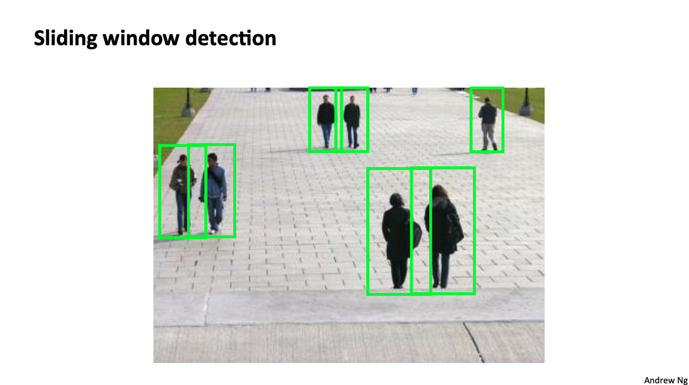
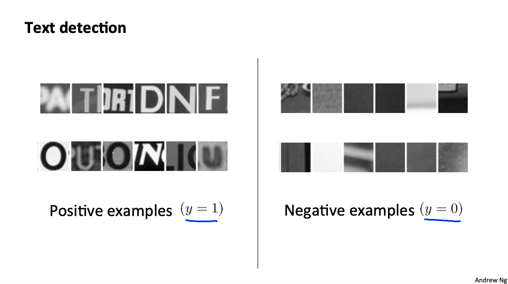
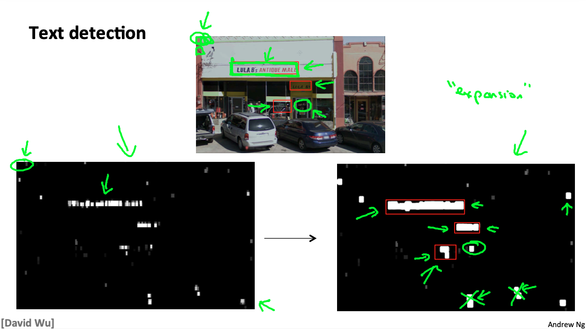
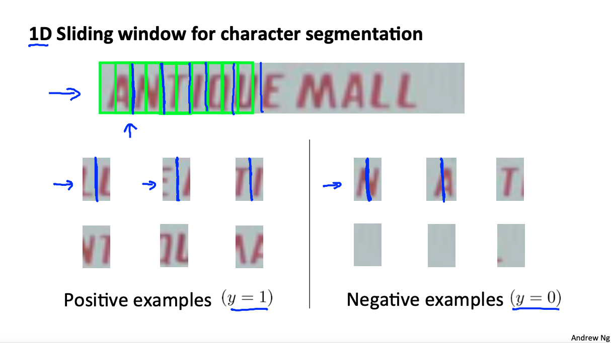

# Machine Learning: Photo OCR Application Example

These are my notes on the Coursera course by Andrew Ng ["Machine Learning"](https://www.coursera.org/learn/machine-learning).

For setup and general information, please look at `../README.md`.

This file my notes related to an **OCR application example***.

Note that Latex formulae are not always rendered in Markdown readers; for instance, they are not rendered on Github, but they are on VS Code with the Markup All In One plugin.
Therefore, I provide a pseudocode of the most important equations.
An alternative would be to use Asciidoc, but rendering of equations is not straightforward either.

Overview of contents:

1. Application Example: Photo OCR

## 1. Application Example: Photo OCR

In this chapter of the course, a complex application is reviewed from start to end to lay out all the steps to be taken in an industry use case.

### 1.1 Problem Description and Pipeline

Photo OCR = Photo Optical Character Recognition. The idea is to read the text  from images that we take; these pictures could be any pictures taken with our mobile phones, or by a car driving through the streets. Photo OCR is a difficult problem to perform robustly.

The photo OCR **pipeline** is composed of the following steps:

Given an image,

1. Detect where the text is.
2. Segment the characters in the text regions.
3. Classify (recognize) the segmented characters.
4. (Optionally) Grammar correction of detected text: `C1eaning -> Cleaning`

The pipeline is a sequence of modules that break down the general problem; each module solves a machine learning task or another type of technical task. Often, each module is worked by different sets of people.

Each module needs to be addressed.

### 1.2 Sliding Windows Classifiers

Sliding windows classifiers can be used to (1) detect text regions and (2) segment characters. Then, after characters are segmented, we apply a classification to recognize them.

The concept of sliding windows is easily understandable with pedestrian detection: we slide windows with an aspect ratio similar to a pedestrian through the image. We use different sizes and can vary the stride or step size in both X and Y directions. We have a classifier which is trained to yield `y = 1` if there is a pedestrian in the image patch contained in the window, `y = 0` otherwise.

With characters, something similar is done. This time, the text aspect ratio is not known, because we can have long strings; therefore, the aspect ratio of a wide character is chosen, i.e., a square. Similarly, several sizes can be slide.

As with pedestrians, a classifier is trained to yield `y = 1` if there is a text piece in the image patch contained in the window, `y = 0` otherwise.

That generates a heatmap of regions in the image which indicate regions that might contain text.

On that heatmap image, the following is carried out:

- The grayvalues are expanded: bright pixels which have bright pixels in a given distance are expanded, i.e., neighbor pixels are brightened.
- Connection components are computed.
- The bounding box is computed for each component.
- Bounding boxes are filtered according to their features: size, aspect ration, etc.

Once the bounding boxes of the text strings are defined, a sliding window is swept in them again. A classifier is trained to yield `y = 1` if a split should be applied in the middle of the image patch contained in the window, `y = 0` otherwise.

Thus, we get the location of text strings and segmented character patches. Now, we can apply a classifier on them.

### 1.3 Getting Lots of Data and Artificial Data